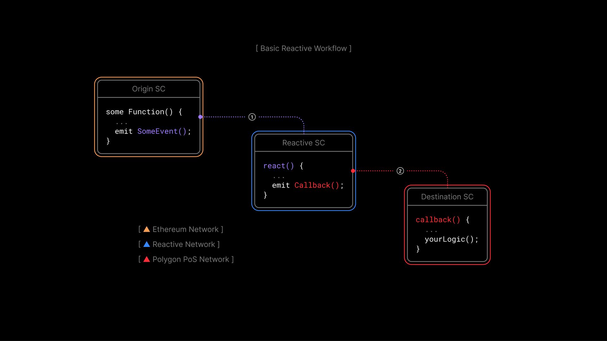

# What Are Reactive Contracts and Why Do They Matter

## What Are Reactive Contracts

Regular smart contracts sit idle until someone sends them a transaction. They can't watch what's happening on the blockchain and act on their own. They always need an external push, whether from a user or an automated script holding private keys.

Reactive contracts work differently. They monitor events across EVM-compatible chains and respond to them automatically, executing logic and triggering on-chain actions without anyone having to intervene. No manual transactions, no centralized bots, no private key management on your end.

## Why This Matters

Traditional smart contracts have a fundamental limitation: they can't initiate anything. If you want a contract to respond to something happening on-chain (say, a price change or a token transfer), you need an external service watching for that event and submitting a transaction to trigger the response. That service holds private keys, runs on centralized infrastructure, and becomes a single point of failure.

Reactive contracts remove that dependency. They can receive information from multiple chains and execute actions across different networks, all without centralized oversight. The logic lives entirely on-chain, and execution is decentralized.

## Advantages

**Decentralization.** Reactive contracts operate independently on the blockchain. There's no centralized service that can be manipulated, shut down, or fail. The contract handles everything on its own.

**Automation.** Contract logic executes automatically when the right on-chain event occurs. No one needs to monitor anything manually or keep a bot running around the clock.

**Cross-chain interoperability.** A single Reactive contract can monitor events on one chain and trigger actions on another, enabling workflows that span multiple networks without custom bridging infrastructure.

**Efficiency.** Because Reactive contracts respond to events in real time, they support use cases that depend on speed like reacting to price movements or processing transactions the moment they happen.

**New possibilities.** The combination of automation and cross-chain reach opens up applications that weren't practical before.

## About This Course

This course is designed to give you both the theory and the hands-on experience to start building with Reactive contracts. It includes detailed lectures, code examples on GitHub, and video workshops covering everything from basic concepts to real-world deployments.

Whether you want to understand how Reactive contracts work under the hood or jump straight into building, the course adapts to either path. Explore the [use cases](../use-cases/index.md) if you want to see what's possible, or start from Module 1 to build up from the fundamentals.

Join the [Telegram](https://t.me/reactivedevs) community if you have questions or want to connect with other developers working with Reactive contracts.

