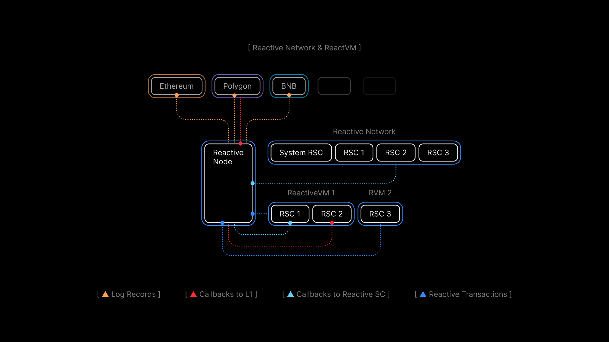

# Lesson 3: ReactVM and the Dual-State Environment

## Overview

Previous lessons covered how Reactive contracts respond to events and trigger actions through callbacks. This lesson focuses on something that's easy to overlook but important to understand: Reactive's dual-state environment.

This dual-state design affects how you write your contracts, which variables belong to which context, and how transactions are initiated. Getting this right is necessary for building Reactive contracts that work as expected.

By the end of this lesson, you'll understand:

- Why Reactive contracts have two instances and what each one does
- How to detect which environment your code is running in
- How to manage variables across both states
- How transactions are initiated and processed in each environment

## Reactive Network vs. ReactVM

Every deployed Reactive contract has two instances: one on Reactive Network and one in a dedicated ReactVM. Both instances are physically stored and executed on each network node. This separation is an architectural decision made to ensure high performance even with large volumes of events.



**Reactive Network** operates as a standard EVM blockchain with additional system contracts that handle subscribing and unsubscribing to events on origin chains like Ethereum, BNB, Polygon, or Optimism. Each deployer address has its own dedicated ReactVM.

**ReactVM** is a restricted virtual machine designed to process events in isolation. All contracts deployed from the same address run in the same ReactVM. They can interact with each other but not with other contracts on Reactive Network.

Contracts within a ReactVM interact with the outside world in two ways, both through Reactive Network:

- They receive events they've subscribed to and execute when those events occur.
- Based on the results of that execution, they send callback requests to Reactive Network, which submits the corresponding transactions on destination chains.

Since both instances share the same code but maintain separate states, you need a way to control which logic runs where. That starts with detecting the current execution context.

### Detecting the Execution Context

The execution context tells your contract whether it's running on Reactive Network or inside a ReactVM instance. This matters because different functions should only run in one environment or the other. Implement [AbstractReactive](https://github.com/Reactive-Network/reactive-lib/blob/main/src/abstract-base/AbstractReactive.sol) to get this functionality built in.

Detection works by checking whether the system contract exists at a known address. The address `0x0000000000000000000000000000000000fffFfF` only has deployed code on Reactive Network. If there's code at that address, you're on Reactive Network. If not, you're inside a ReactVM.

```solidity
function detectVm() internal {
    uint256 size;
    // solhint-disable-next-line no-inline-assembly
    assembly { size := extcodesize(0x0000000000000000000000000000000000fffFfF) }
    vm = size == 0;
}
```

If `size == 0`, there's no system contract so you're in a ReactVM instance, and `vm` is set to `true`. If `size > 0`, the system contract is present, confirming you're on Reactive Network, and `vm` stays `false`.

### Enforcing the Right Context

With the `vm` flag set, you can use modifiers to restrict functions to the correct environment:

```solidity
modifier rnOnly() {
    require(!vm, 'Reactive Network only');
    _;
}

modifier vmOnly() {
    require(vm, 'VM only');
    _;
}
```

`rnOnly()` ensures a function can only run on Reactive Network. Use it for subscription management, admin functions, and anything that interacts with the system contract. 

`vmOnly()` ensures a function only runs inside the ReactVM. Use it for event processing and callback logic.

## Managing Variables Across Both States

Since each instance maintains its own state, you effectively work with two sets of variables:

**Reactive Network state** handles subscription management. If your contract inherits from `AbstractReactive`, you get access to `service` (an `ISubscriptionService` for subscribing to events), the `vm` flag, and utility methods like `service.subscribe(...)`.

**ReactVM state** holds the business logic variables. Everything your contract needs to process events and decide when to act.

Here's how this looks in practice using the [Uniswap Stop Order](https://github.com/Reactive-Network/reactive-smart-contract-demos/blob/main/src/demos/uniswap-v2-stop-order/UniswapDemoStopOrderReactive.sol) contract. The constructor sets up both states:

```solidity
// State specific to ReactVM instance of the contract.

bool private triggered;
bool private done;
address private pair;
address private stop_order;
address private client;
bool private token0;
uint256 private coefficient;
uint256 private threshold;

constructor(
    address _pair,
    address _stop_order,
    address _client,
    bool _token0,
    uint256 _coefficient,
    uint256 _threshold
) payable {
    triggered = false;
    done = false;
    pair = _pair;
    stop_order = _stop_order;
    client = _client;
    token0 = _token0;
    coefficient = _coefficient;
    threshold = _threshold;

    if (!vm) {
        service.subscribe(
            SEPOLIA_CHAIN_ID,
            pair,
            UNISWAP_V2_SYNC_TOPIC_0,
            REACTIVE_IGNORE,
            REACTIVE_IGNORE,
            REACTIVE_IGNORE
        );
        service.subscribe(
            SEPOLIA_CHAIN_ID,
            stop_order,
            STOP_ORDER_STOP_TOPIC_0,
            REACTIVE_IGNORE,
            REACTIVE_IGNORE,
            REACTIVE_IGNORE
        );
    }
}
```

The `if (!vm)` check runs the subscription logic only on Reactive Network. The ReactVM instance skips it entirely and uses the same variables for its own event processing logic.

The `react()` function, marked `vmOnly`, handles what happens when events arrive:

```solidity
function react(LogRecord calldata log) external vmOnly {
    assert(!done);

    if (log._contract == stop_order) {
        if (
            triggered &&
            log.topic_0 == STOP_ORDER_STOP_TOPIC_0 &&
            log.topic_1 == uint256(uint160(pair)) &&
            log.topic_2 == uint256(uint160(client))
        ) {
            done = true;
            emit Done();
        }
    } else {
        Reserves memory sync = abi.decode(log.data, ( Reserves ));
        if (below_threshold(sync) && !triggered) {
            emit CallbackSent();
            bytes memory payload = abi.encodeWithSignature(
                "stop(address,address,address,bool,uint256,uint256)",
                address(0),
                pair,
                client,
                token0,
                coefficient,
                threshold
            );
            triggered = true;
            emit Callback(log.chain_id, stop_order, CALLBACK_GAS_LIMIT, payload);
        }
    }
}
```

The key variables here: `triggered` prevents duplicate callbacks once the threshold condition is met, `done` signals that the stop order has completed, and `pair`, `stop_order`, `client`, `token0`, `coefficient`, and `threshold` define the conditions for when and how to act. All of this logic runs exclusively in the ReactVM.

## How Transactions Work in Each Environment

Understanding which environment handles which transactions is important for reasoning about your contract's behavior. Code examples below are from [AbstractPausableReactive](https://github.com/Reactive-Network/reactive-lib/blob/main/src/abstract-base/AbstractPausableReactive.sol).

### Reactive Network Transactions

Transactions on Reactive Network are initiated in two ways:

**User-initiated transactions** let you call administrative functions directly. For example, pausing a contract's event subscriptions:

```solidity
function pause() external rnOnly onlyOwner {
    require(!paused, 'Already paused');
    Subscription[] memory subscriptions = getPausableSubscriptions();
    for (uint256 ix = 0; ix != subscriptions.length; ++ix) {
        service.unsubscribe(
            subscriptions[ix].chain_id,
            subscriptions[ix]._contract,
            subscriptions[ix].topic_0,
            subscriptions[ix].topic_1,
            subscriptions[ix].topic_2,
            subscriptions[ix].topic_3
        );
    }
    paused = true;
}
```

The `rnOnly` modifier ensures this only runs on Reactive Network, and `onlyOwner` restricts it to the contract owner. Calling `pause()` unsubscribes from all events, effectively stopping the contract from reacting until `resume()` is called:

```solidity
function resume() external rnOnly onlyOwner {
    require(paused, 'Not paused');
    Subscription[] memory subscriptions = getPausableSubscriptions();
    for (uint256 ix = 0; ix != subscriptions.length; ++ix) {
        service.subscribe(
            subscriptions[ix].chain_id,
            subscriptions[ix]._contract,
            subscriptions[ix].topic_0,
            subscriptions[ix].topic_1,
            subscriptions[ix].topic_2,
            subscriptions[ix].topic_3
        );
    }
    paused = false;
}
```

**Event-triggered dispatch** happens automatically. When an event of interest is emitted on an origin chain, Reactive detects it and forwards the event data to all matching ReactVM subscribers.

### ReactVM Transactions

Users can't call functions inside the ReactVM directly. All execution there is triggered by events forwarded from Reactive Network:

1. An event is emitted on an origin chain
2. Reactive Network matches it against active subscriptions and dispatches it
3. The ReactVM receives the event and calls `react()`

From there, `react()` can update internal state and emit callbacks that trigger transactions on destination chains. Everything that happens in the ReactVM is automatic, no manual intervention required.

Further examples of `react()` implementations for different use cases are covered in the upcoming lessons.

## About This Course

This course is designed to give you both the theory and the hands-on experience to start building with Reactive contracts. It includes detailed lectures, code examples on GitHub, and video workshops covering everything from basic concepts to real-world deployments.

Whether you want to understand how Reactive contracts work under the hood or jump straight into building, the course adapts to either path. Explore the [use cases](../use-cases/index.md) if you want to see what's possible, or start from Module 1 to build up from the fundamentals.

Join the [Telegram](https://t.me/reactivedevs) community if you have questions or want to connect with other developers working with Reactive contracts.
