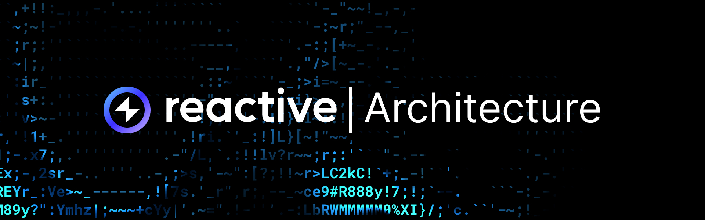
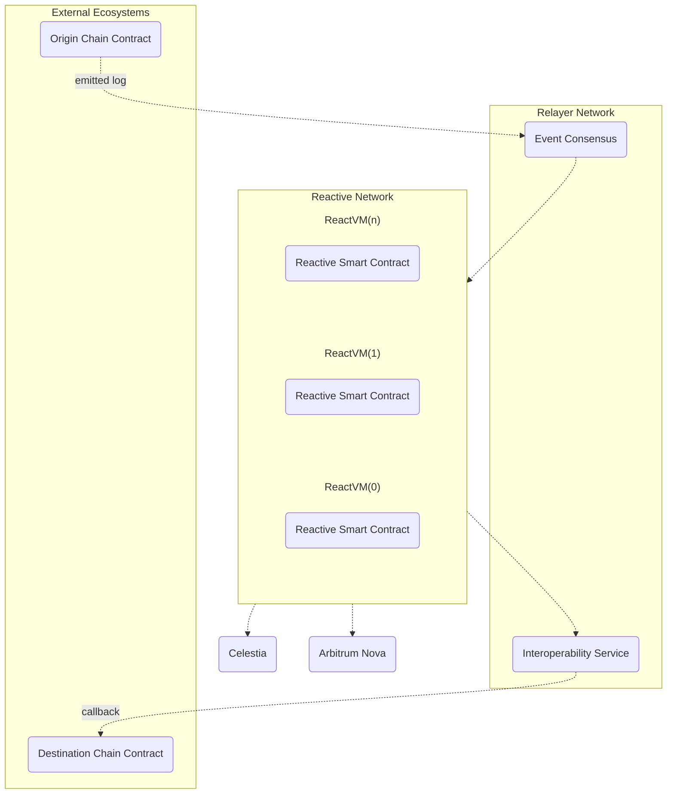

## Overview

This section focuses on the structure of the Reactive Network. It includes several elements, each with its own specific role:

- [Execution Layer (EVM-compatible transaction network)](https://www.gocrypto.com/blog/what-are-evm-compatible-blockchains)
- [ReactVM](../docs/architecture/react-vm.md)
- [Reactive Smart Contracts](../reactive-smart-contracts.mdd)
- [Relayer Network](./relayer-network.md)

The following flowchart illustrates the architecture of the Reactive Network, consisting of multiple ReactVM instances hosting the corresponding Reactive Smart Contracts. These contracts interact with the Relayer Network, which includes components like Event Consensus and the Interoperability Service. External ecosystems, represented by Origin Chain Contracts and Destination Chain Contracts, emit logs that are processed by the Event Consensus and subsequently influence the Reactive Network.

## Execution Layer

The Reactive Network is a fully EVM-compatible execution layer that supports Reactive Smart Contracts and facilitates event-based blockchain interactions. Unlike traditional Smart Contracts, a Reactive Smart Contract takes external events as input, rather than user transactions, and enables developers to execute arbitrary logic written in Solidity. Additionally, it allows posting callbacks (state changes) to the same or different destination network.

Developers can use their favorite Web3 tools when developing for the Reactive Network, including web3.js, ethers.js, truffle, hardhat, etc.

Reactive Network is built on the Arbitrum AnyTrust tech stack. Arbitrum provides the security guarantees of Ethereum while handling other inherent tasks of a modular blockchain, such as Consensus and Settlement. Data availability is assured by Celestia.

 
