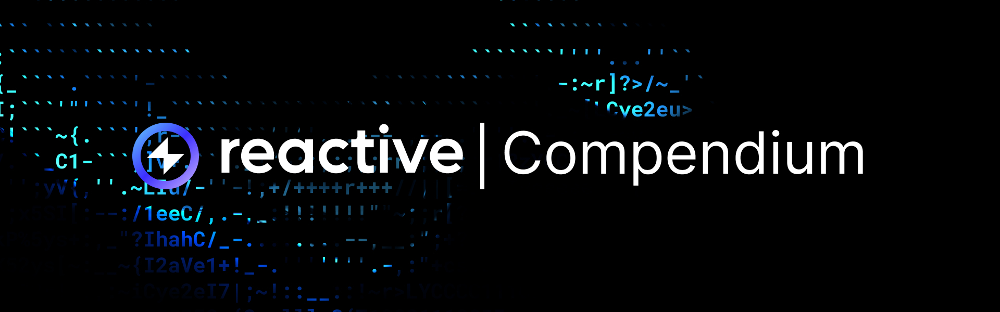

# Overview

The Compendium section provides details on the components necessary for working with reactive, origin, and destination smart contracts. It provides in-depth information on the interfaces, functions, and other key elements required to enable efficient interaction and event handling between these contracts.

[Interfaces](./interfaces/index.md): Explore the current two interfaces, [IReactive](./interfaces/ireactive.md) and [ISubscriptionService](./interfaces/isubscriptionservice.md) work together for handling and subscribing to specific blockchain events. These interfaces enable reactive contracts to receive notifications and manage event subscriptions dynamically.

[Functions](./functions/index.md): Walk through the native functions of the Reactive Network for [origin chain contracts](./functions/origin-functions.md), [reactive contracts](./functions/reactive-functions.md), and [destination chain contracts](./functions/destination-functions.md).