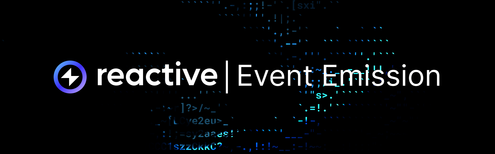
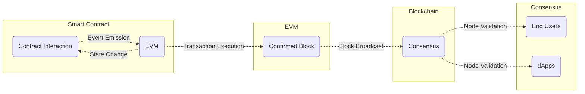

## Overview

In the Ethereum blockchain, events maintain communication between smart contracts and the external world. The following
information explains event emission and its importance for decentralized applications.



## Emitting Events

Events in Ethereum allow smart contracts to emit specific information onto the blockchain when certain conditions are 
met. Indexed by the EVM, these events provide a gas-efficient means to trigger and monitor occurrences without constant
blockchain polling.

When a smart contract emits an event, the event data is stored in the transaction's logs, attached to blockchain blocks.
These logs do not directly affect the blockchain state but facilitate recording and retrieval of event-based information.
Developers define events in smart contracts using the event keyword, specifying the event name and the data types of the
information to be logged. To emit an event, the `emit` keyword followed by the event name and relevant data is used.

## Listening for Events

External applications, such as dApps or backend services, can subscribe to events by specifying the event signature and
optional filtering parameters. This subscription enables real-time updates whenever the event is emitted, crucial for
creating responsive and interactive blockchain applications.

### Defining the Price Update Event

Here is an example demonstrating the integration of EVM events with Chainlink's price oracle. A smart contract might define
an event to log real-time price updates:

```solidity
event PriceUpdated(string symbol, uint256 newPrice);
```

This event declaration signifies that whenever a price update occurs, the symbol of the asset and its corresponding new
price will be logged.

### Emitting the Event

Upon receiving a price update from Chainlink's oracle, the smart contract emits the `PriceUpdated` event:

```solidity
emit PriceUpdated("ETH", newEthPrice);
```

Here, newEthPrice represents the updated price of Ethereum fetched from Chainlink, which the oracle updates periodically.

### Listening for the Price Update

External applications can listen for the `PriceUpdated` event to trigger actions such as portfolio rebalancing or loan
issuance.