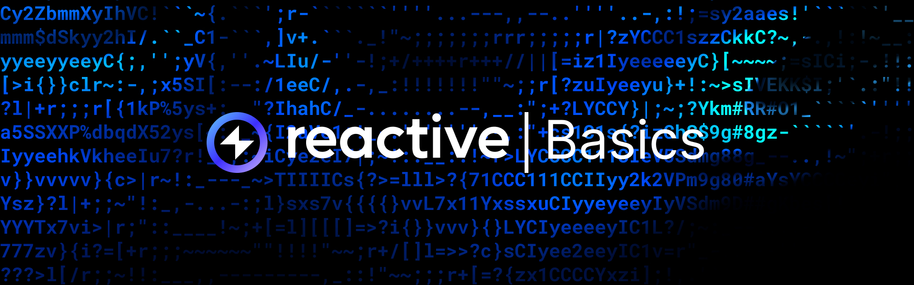

# Overview

The Basics section focuses on the main aspects of blockchain technology. This resource covers the following key topics:

[Prerequisites](prerequisites.md): All the technical knowledge and prerequisites you need to become
a Reactive Smart Contracts pro. Unleash the full potential of Reactive tech in your blockchain projects!

[Event Emission](event-emission.md): Ever wonder how smart contracts talk to the world outside? Find out about the concept of
event emission. It's like giving your smart contracts a megaphone to shout out important updates!

[Oracles](oracles.md): Meet the unsung heroes of blockchain — Oracles! Discover how they help smart contracts tap into
real-world data safely and reliably, being a trusty sidekick to fetch the data whenever you need it!

[Uniswap V2](uniswap.md): Ahh, decentralized exchanges! Uniswap V2 — a real game-changer in swapping tokens and providing
liquidity in the wild world of DeFi.
