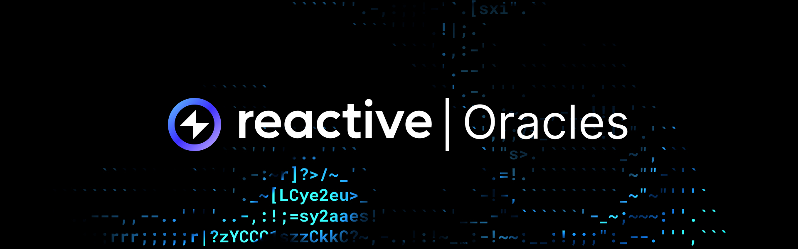
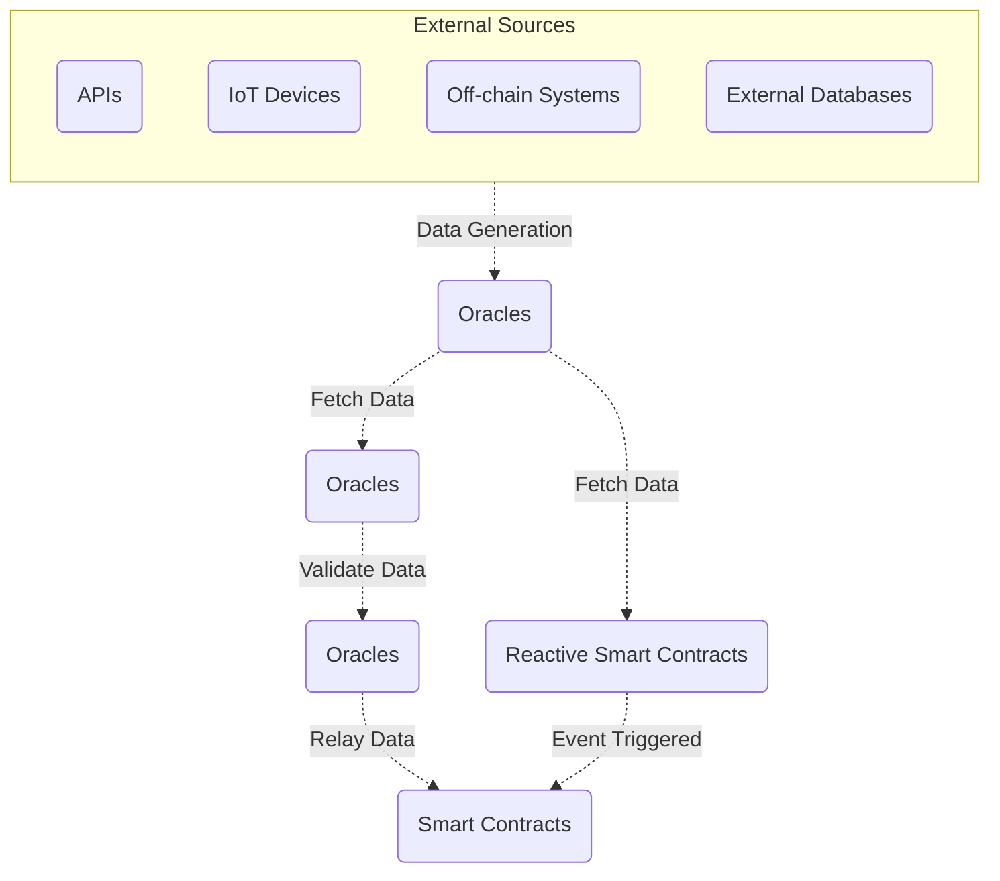

## Overview

Reactive Smart Contracts specialize in monitoring on-chain events and executing subsequent actions. Within the smart contract
ecosystem, oracles are responsible for importing off-chain data onto the blockchain. Smart contracts operate within a
deterministic environment, mandating verifiable and repeatable operations. Using their full potential often requires accessing
external data. Therefore, the challenge arises regarding fetching off-chain data onto the blockchain without compromising
decentralization and trustlessness.



## The Oracle Problem

Oracles bridge the blockchain with the external world, fetching data from various sources to feed into the blockchain. This
data could include price feeds from financial market APIs, public records from government databases, or
real-world physical data from IoT devices. Oracles validate and relay this data to smart contracts in a trust-minimized way.

Transactions for oracles to input data onto the blockchain are typically signed using the private keys of the oracle service
provider. To enhance security and mitigate risks, decentralized oracle networks often use multisig protocols, requiring multiple
signatures to authorize a transaction. Some popular examples of oracle providers are Chainlink and Band Protocol.

## Practical Applications

Oracles enable smart contracts to react to real-world events and data, leading to various applications such as:

* DeFi Platforms: Using price feed oracles for managing lending rates, liquidations, and asset swaps.

* Insurance: Triggering payouts based on verifiable events reported by trusted oracles.

* Online Betting: Employing smart contracts for trustless online betting, with oracles providing outcome data of sporting events.

## ChainLink Oracles

Here's an example of how a smart contract can use Chainlink to fetch a USD/ETH price feed:

```solidity
pragma solidity ^0.8.0;

import "@chainlink/contracts/src/v0.6/interfaces/AggregatorV3Interface.sol";

contract PriceConsumerV3 {

    AggregatorV3Interface internal priceFeed;

    /**
     * Network: Ethereum Mainnet
     * Aggregator: ETH/USD
     * Address: 0x... (Chainlink ETH/USD Price Feed Contract Address)
     */
    constructor() public {
        priceFeed = AggregatorV3Interface(0x...);
    }

    /**
     * Returns the latest price
     */
    function getLatestPrice() public view returns (int) {
        (
            /* uint80 roundID */,
            int price,
            /* uint startedAt */,
            /* uint timeStamp */,
            /* uint80 answeredInRound */
        ) = priceFeed.latestRoundData();
        return price;
    }
}
```

Let's break this code down to understand each step:

### Pragma Directive

This line specifies that the code should be compiled with a Solidity compiler version greater than or equal to 0.8.0.

```solidity
pragma solidity ^0.8.0;
```

### Import Statement

Here, we import the `AggregatorV3Interface` from the Chainlink contracts. The interface defines the functions that the price
feed contract must implement.

```solidity
import "@chainlink/contracts/src/v0.6/interfaces/AggregatorV3Interface.sol";
```

### Contract Definition

Then we define a new contract named `PriceConsumerV3`.

```solidity
contract PriceConsumerV3 {
```

### Internal Variable Declaration

Here, an internal variable `priceFeed` of type `AggregatorV3Interface` is declared to store the reference to the Chainlink price
feed contract.

```solidity
AggregatorV3Interface internal priceFeed;
```

### Constructor

This is the constructor function of the contract. It initializes the `priceFeed` variable with the address of the Chainlink
ETH/USD price feed contract.

```solidity
constructor() public {
priceFeed = AggregatorV3Interface(0x...);
}
```

### getLatestPrice Function

This function is used to fetch the latest price of USD/ETH. It's a public function, meaning anyone can call it,
and it's `view` because it doesn't modify the state of the contract. It calls the `latestRoundData()` function of the `priceFeed`
contract, which returns multiple values including the latest price. The returned tuple is immediately destructured into
individual variables, but only the price variable is used here. Finally, it returns the latest price as an `int`.

```solidity
function getLatestPrice() public view returns (int) {
(
/* uint80 roundID */,
int price,
/* uint startedAt */,
/* uint timeStamp */,
/* uint80 answeredInRound */
) = priceFeed.latestRoundData();
return price;
}
```

### Recap

The contract securely accesses off-chain data, demonstrating the reliability of oracles. Challenges arise in ensuring the
contract's data remains current, requiring periodic invocation of functions querying the oracle. However, this approach falls
short of enabling real-time responses to events. Reactive Smart Contracts respond to events across EVM-chains, integrating
oracles for predefined on-chain actions, enabling real-time interaction.
