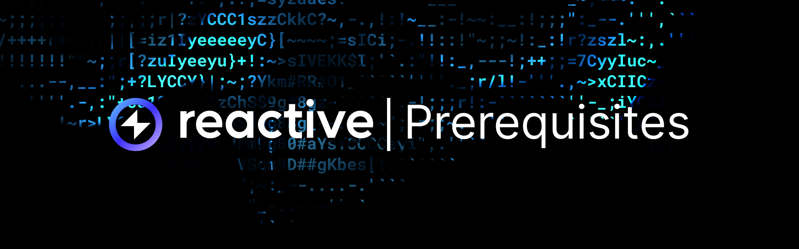

# Overview

The following technical knowledge and prerequisites are essential for mastering Reactive Smart Contracts and using their
potential in blockchain projects:

1.  **Solidity and Smart Contract Development**: Understanding Solidity syntax and functionalities is a must-know, including
familiarity with smart contracts and functions. Recommended resource: [Solidity by Example](https://solidity-by-example.org/).

2. **Ethereum Virtual Machine (EVM)**: A basic grasp of EVM operations is crucial since it's the runtime environment for smart
contracts. Recommended resource: [Ethereum EVM illustrated](https://takenobu-hs.github.io/downloads/ethereum_evm_illustrated.pdf).

3. **Git and Command Line**: Proficiency in basic Git commands and command line usage is necessary for effective code usage.
IDE familiarity, like Visual Studio Code, enhances the coding experience. Recommended resources: [Pro Git book](https://git-scm.com/book/en/v2)
and [Codecademy's Command Line course](https://www.codecademy.com/learn/learn-the-command-line).

4. **Ethereum Wallet and Test ETH**: To interact with Ethereum networks, an Ethereum wallet and test ETH on [Sepolia Faucet](https://www.alchemy.com/faucets/ethereum-sepolia)
are required for deploying and testing smart contracts. Transaction fees (gas) and interaction with deployed contracts
depend on this setup.

5. **Knowledge of EVM Events**: Understanding EVM events is important for Reactive Smart Contracts, as they serve as triggers
for reactive functionalities. [More on events →](event-emission.md)

6. **Decentralized Finance Concepts**: Familiarity with DeFi concepts, such as liquidity pools, yield farming, and
automated market makers (AMMs), could be useful for understanding real-world applications of Reactive Smart Contracts.
To get acquainted with some DeFi lexis, refer to our [Glossary →](../education/glossary.mdn/glossary.md)
