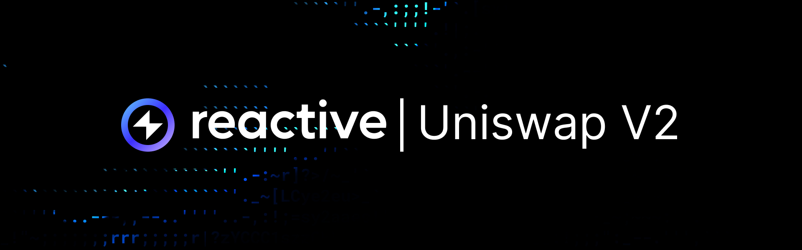
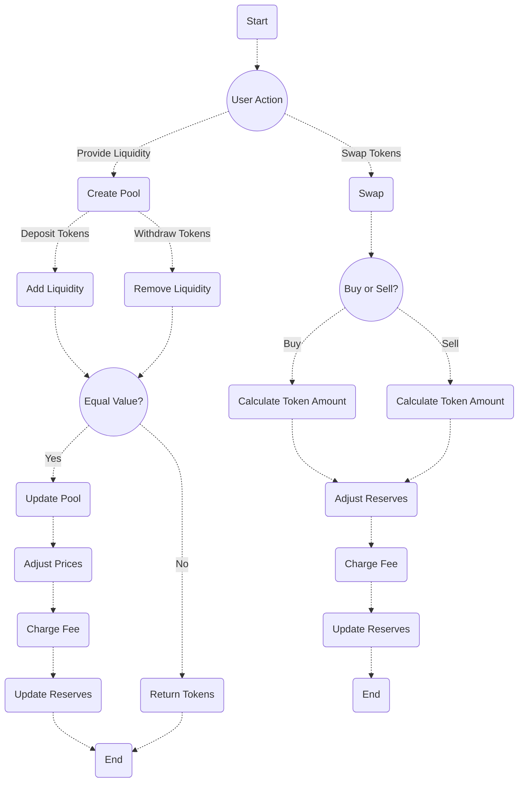

## Overview

Uniswap V2 is a decentralized exchange protocol on Ethereum that features a binary smart contract system with core and periphery
contracts. Core contracts (the factory and pairs) ensure safety and create unique token pair smart contracts. Periphery
contracts enable domain-specific interactions.

The factory contract generates token pair smart contracts, manages protocol fees, and indexes pairs. Pairs act as automated
market makers, recording token balances for decentralized price oracles. Periphery contracts, including libraries and routers,
support specific interactions with Uniswap V2. The router facilitates trading, liquidity management, multi-pair trades, and
meta-transactions for liquidity removal.

## Liquidity Pools



Liquidity pools in Uniswap V2 are reserves of two tokens forming a trading pair. These pools allow users to trade tokens
without traditional market makers. Each trade or liquidity provision occurs through transactions on Ethereum, publicly
viewable on Etherscan or similar block explorers. Users contribute liquidity to these pools by depositing an equivalent value
of both tokens in the pair they wish to support. For instance, providing liquidity for an ETH/DAI pair involves depositing an
equal value of ETH and DAI into the pool, establishing the initial reserves.

Once liquidity is deposited, the Uniswap V2 protocol automatically creates a market for the token pair based on the reserves.
This automated market-making mechanism enables users to swap one token for another at dynamically determined prices, which
adjust based on the ratio of tokens in the pool. The constant product formula `x * y = k` governs these adjustments, ensuring
that as one token is removed from the pool, the amount of the other token adjusts proportionally to maintain the constant
product of the reserves.

Uniswap V2 charges a small fee, typically 0.3%, on each trade, which is added to the pool's reserves. This fee incentivizes
liquidity providers to contribute to the pool by earning a portion of the fees generated from trades. Liquidity providers can
continuously add or remove liquidity from the pool at any time, allowing them to adjust their exposure to the token pair or
withdraw their share of the reserves based on their pool contribution.

## The Constant Product Formula

The Uniswap V2 smart contract uses the formula `x * y = k`, where `x` and `y` represent the quantities of the two tokens in the
liquidity pool, and `k` is a constant. This formula maintains total liquidity while allowing token prices to fluctuate based on
trading activity.

Here's a simplified code snippet of what a Uniswap V2 `swap()` function might look like. Basically, it handles output
amounts, checks pool reserves, calculates input amounts, ensures the constant product invariant, updates pool reserves, and
transfers tokens.

```solidity
function swap(uint amount0Out, uint amount1Out, address to, bytes calldata data) external {
    require(amount0Out > 0 || amount1Out > 0, "UniswapV2: INSUFFICIENT_OUTPUT_AMOUNT");
    (uint112 reserve0, uint112 reserve1,) = getReserves(); // fetches reserves of the pool
    require(amount0Out < reserve0 && amount1Out < reserve1, "UniswapV2: INSUFFICIENT_LIQUIDITY");

    uint balance0;
    uint balance1;
    {
        uint amount0In = reserve0 - (balance0 = reserve0 - amount0Out);
        uint amount1In = reserve1 - (balance1 = reserve1 - amount1Out);
        require(amount0In > 0 || amount1In > 0, "UniswapV2: INSUFFICIENT_INPUT_AMOUNT");

        uint balanceAdjusted0 = balance0 * 1000 - amount0In * 3;
        uint balanceAdjusted1 = balance1 * 1000 - amount1In * 3;
        require(balanceAdjusted0 * balanceAdjusted1 >= uint(reserve0) * uint(reserve1) * (1000**2), "UniswapV2: K");

        // Emit the Swap event
        emit Swap(msg.sender, amount0In, amount1In, amount0Out, amount1Out, to);
    }

    _update(balance0, balance1, reserve0, reserve1);

    if (amount0Out > 0) _safeTransfer(token0, to, amount0Out);
    if (amount1Out > 0) _safeTransfer(token1, to, amount1Out);

    if (data.length > 0) {
        IUniswapV2Callee(to).uniswapV2Call(msg.sender, amount0Out, amount1Out, data);
    }
}
```

Let's break this code down to understand each step:

### Function Declaration

This line declares a function named `swap` defined as external, meaning it can be called from outside the contract. It takes four
parameters:

* `amount0Out` - the amount of the first token (token0) that the caller wants to receive.
* `amount1Out` - the amount of the second token (token1) that the caller wants to receive.
* `to` - the address to which the swapped tokens will be sent.
* `data` - additional data to be passed to a callback function.

```solidity
function swap(uint amount0Out, uint amount1Out, address to, bytes calldata data) external {
```

### Input Validation

Here the function ensures that at least one of the output amounts requested by the caller is greater than zero; otherwise it will
revert with an error message.

```solidity
require(amount0Out > 0 || amount1Out > 0, "UniswapV2: INSUFFICIENT_OUTPUT_AMOUNT");
```

### Retrieve Reserves

Then the function fetches the reserves of `token0` and `token1` from the liquidity pool.

```solidity
(uint112 reserve0, uint112 reserve1,) = getReserves(); // fetches reserves of the pool
```

### Reserve Check

Here it ensures that the requested output amounts are less than the available reserves in the pool. If not, it reverts with
an error.

```solidity
require(amount0Out < reserve0 && amount1Out < reserve1, "UniswapV2: INSUFFICIENT_LIQUIDITY");
```

### Balance Calculation

Then it calculates the input amounts (`amount0In` and `amount1In`) based on the requested output amounts. It also updates the
balances (`balance0` and `balance1`) accordingly.

```solidity
uint balance0;
uint balance1;
{
uint amount0In = reserve0 - (balance0 = reserve0 - amount0Out);
uint amount1In = reserve1 - (balance1 = reserve1 - amount1Out);
```

### Invariant Check

This line checks whether the invariant of Uniswap V2 is maintained after the swap operation. The invariant ensures that the
product of the reserves for both tokens remains constant.

```solidity
require(balanceAdjusted0 * balanceAdjusted1 >= uint(reserve0) * uint(reserve1) * (1000**2), "UniswapV2: K");
```

### Emit Swap Event

Here the function emits a `Swap` event indicating the swap operation, including details like who initiated the swap, input and
output amounts, and the recipient address.

```solidity
emit Swap(msg.sender, amount0In, amount1In, amount0Out, amount1Out, to);
```

### Update Reserves

Then the function updates the reserves based on the new balances.

```solidity
_update(balance0, balance1, reserve0, reserve1);
```

### Token Transfer

Then it transfers the output amounts of tokens to the recipient address.

```solidity
if (amount0Out > 0) _safeTransfer(token0, to, amount0Out);
if (amount1Out > 0) _safeTransfer(token1, to, amount1Out);
```

### Callback

If additional data is provided, the function calls a callback function `uniswapV2Call` on the recipient address. This callback
function is part of the `UniswapV2Callee` interface and allows external contracts to execute custom logic after a swap.

```solidity
if (data.length > 0) {
IUniswapV2Callee(to).uniswapV2Call(msg.sender, amount0Out, amount1Out, data);
}
```

## Events in Uniswap V2

### Swap

The `Swap` event is emitted with every trade in a Uniswap V2 pool, providing important transaction information, such as the
amounts of tokens involved in the swap and the addresses of the sender and recipient.

Here's a `Swap` event example, which can also be found on [Etherscan](https://etherscan.io/tx/0x7b969e8a74ae9891e322311ca5fe6e5d7bcb53ac3412b4189d84683961043503#eventlog):

* `sender` - the address initiates the swap.
* `amount0In` and `amount1In` - the amounts of the respective tokens sent to the pool.
* `amount0Out` and `amount1Out` - the amounts of the respective tokens sent from the pool.
* `to` - the address that receives the output tokens.

```solidity
event Swap(
address indexed sender,
uint amount0In,
uint amount1In,
uint amount0Out,
uint amount1Out,
address indexed to
);
```

### Sync

The `Sync` event is emitted whenever the reserves of a Uniswap V2 pool are updated. This can happen after a swap, when liquidity
is added or removed, or due to a direct token transfer into or out of the pool. The `Sync` event helps monitor the current state
of the pool's reserves. The updated information regarding the pool's liquidity influences trading prices and slippage.

Here's a `Sync` event example, which can also be found on [Etherscan](https://etherscan.io/tx/0x7b969e8a74ae9891e322311ca5fe6e5d7bcb53ac3412b4189d84683961043503#eventlog):

* `reserve0` and `reserve1` - the updated reserves of the pool's two tokens.

```solidity
event Sync(uint112 reserve0, uint112 reserve1);
```
This event logs updated reserve amounts for both tokens.