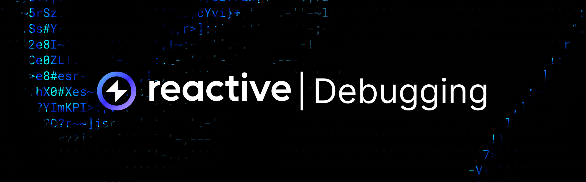
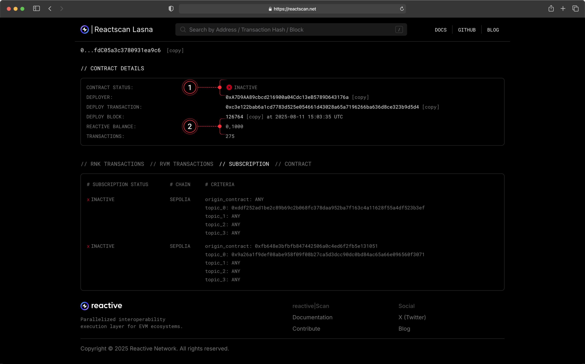

## Overview

The debugging page is dedicated to key operational and troubleshooting details for Reactive Network and beyond. Use it as a quick reference when setting up or troubleshooting your deployments.

## Callback Structure

Callbacks **must include at least one argument** — the first slot **must always be left for an RVM address**. Omitting it will cause the call to fail. Reactive automatically overwrites the first 160 bits of the payload with the relevant **RVM ID** (the deployer’s address).

Callback payload example:

```solidity
bytes memory payload = abi.encodeWithSignature(
    "stop(address,address,address,bool,uint256,uint256)",
    address(0),
    pair,
    client,
    token0,
    coefficient,
    threshold
);
emit Callback(chain_id, stop_order, CALLBACK_GAS_LIMIT, payload);
```

[More on Callbacks →](../docs/events-and-callbacks.md#callbacks-to-destination-chains)

## Contract Inactive

If you see `Contract Status: Inactive` on Reactscan, it means the contract doesn’t have enough funds to cover gas for reactive transactions. Both **destination** and **reactive contracts** must hold sufficient balance to stay active.



You can either fund the relevant contract on deployment:

```bash
forge create --broadcast --rpc-url $RPC_URL --private-key $PRIVATE_KEY $CONTRACT_PATH --value $VALUE --constructor-args $ARG1 $ARG2 ...
```

Or transfer funds manually after deployment, calling `coverDebt()` afterward:

```bash
cast send $CONTRACT_ADDR --rpc-url $RPC_URL --private-key $PRIVATE_KEY --value $VALUE
```

```bash
cast send --rpc-url $RPC_URL --private-key $PRIVATE_KEY $CONTRACT_ADDR "coverDebt()"
```

You can verify a contract’s balance anytime on Reactscan or via Foundry cast command:

```bash
cast balance $CONTRACT_ADDR --rpc-url $RPC_URL
```

To check the outstanding debt, query the relevant proxy contract (`0x0000000000000000000000000000000000fffFfF` on Reactive):

```bash
cast call $PROXY_ADDR "debts(address)" $CONTRACT_ADDR --rpc-url $RPC_URL | cast to-dec
```

[More on Reactive Economy →](../docs/economy.md)

## Getting Testnet lREACT

### Reactive Faucet

To obtain testnet **lREACT**, send **ETH** to one of the Reactive faucet contracts:

```json
Ethereum Sepolia: 0x9b9BB25f1A81078C544C829c5EB7822d747Cf434

Base Sepolia: 0x2afaFD298b23b62760711756088F75B7409f5967
```

The exchange rate is **1:100** — for each **ETH** sent, you receive **100 lREACT**. You can make the transfer using **MetaMask** or any Ethereum-compatible wallet.

:::info[Important]
**Do not** send more than **5 ETH** in a single transaction. Any excess will be **lost**. Maximum per request: **5 ETH → 500 lREACT**.
:::

### ReacDEFI Swap

You can also swap ETH for lREACT directly using [ReacDEFI](https://reacdefi.app/markets). Select the desired lREACT amount, and the app will calculate the required ETH. An Ethereum/Base Sepolia wallet (MetaMask or Coinbase) must be connected.

### Terminal Request

You can also request lREACT by calling `request()` on one of the faucet contracts:

```bash
cast send 0x9b9BB25f1A81078C544C829c5EB7822d747Cf434 \
  --rpc-url $ETHEREUM_SEPOLIA_RPC \
  --private-key $ETHEREUM_SEPOLIA_PRIVATE_KEY \
  "request(address)" $CONTRACT_ADDR \
  --value 0.1ether
```

```bash
cast send 0x2afaFD298b23b62760711756088F75B7409f5967 \
  --rpc-url $BASE_SEPOLIA_RPC \
  --private-key $BASE_SEPOLIA_PRIVATE_KEY \
  "request(address)" $CONTRACT_ADDR \
  --value 0.1ether
```

[More on Reactive Faucet →](../docs/reactive-mainnet.mdx#get-testnet-react)

## Reactive Faucet Issue

If you’ve sent **ETH** to the Reactive Faucet at `0x9b9BB25f1A81078C544C829c5EB7822d747Cf434` (Ethereum Sepolia) or `0x2afaFD298b23b62760711756088F75B7409f5967` (Base Sepolia) but haven’t received **lREACT** within a few minutes, the faucet might be experiencing a temporary issue. Report it in our [General Telegram channel](https://t.me/reactivedevs/1). You will receive your test lREACT once the issue is resolved.

## Nonce & Gas Price Issue

When encountering the `Replacement transaction underpriced` error, it means a new transaction is trying to replace a pending one with an equal or lower gas price. To fix this, first check your current **nonce**:

```bash
cast nonce --rpc-url $REACTIVE_RPC $CONTRACT_ADDR
```

Then resend the transaction with the same nonce, but specify higher gas prices using the `--priority-gas-price` and `--gas-price` flags:

```bash
cast send --rpc-url $REACTIVE_RPC --private-key $PRIVATE_KEY --priority-gas-price $VALUE --gas-price $VALUE --nonce $VALUE $CONTRACT_ADDR …
```

## MetaMask Smart Transactions Issue

When trying to perform a transaction on Reactive Network, a bridge transfer or faucet claim, MetaMask may show a message like `Smart Transaction interrupted — this transaction was going to fail` or the transaction may never appear on-chain.

MetaMask has a feature called **Smart Transactions**, which routes transactions through a special **“smart address”** instead of your regular wallet address.
These smart contracts are not deployed on the **Reactive Network**, so any operations relying on direct wallet transactions (like our bridge or faucet) will fail.

You will need to disable Smart Transactions in MetaMask:

1. Open MetaMask.
2. Tap the **menu icon** (☰) in the top-right corner.
3. Go to **Settings → Advanced.**
4. Find **Smart Transactions.**
5. Toggle it **OFF.**

After this, your transactions will go through the regular route and should work correctly.

[More on MetaMask's Smart Transactions →](https://support.metamask.io/manage-crypto/transactions/smart-transactions/)

## Getting Testnet lReact