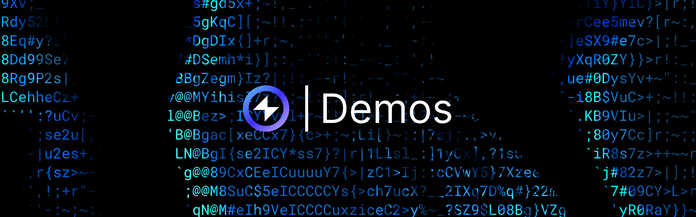

## Overview

This section is dedicated to practical demonstrations explaining the capabilities of the Reactive Network.

## Reactive Network Demo

The [Reactive Network Demo](https://github.com/Reactive-Network/reactive-smart-contract-demos/tree/main/src/demos/basic) serves as an introduction, illustrating the Reactive Network's functionality in monitoring logs emitted by contracts in the L1 Network and initiating calls back to L1 contracts. It outlines the interaction between three smart contracts: the Origin chain contract [BasicDemoL1Contract.sol](https://github.com/Reactive-Network/reactive-smart-contract-demos/blob/main/src/demos/basic/BasicDemoL1Contract.sol), the Destination chain contract [BasicDemoL1Callback.sol](https://github.com/Reactive-Network/reactive-smart-contract-demos/blob/main/src/demos/basic/BasicDemoL1Callback.sol), and the Reactive contract [BasicDemoReactiveContract.sol](https://github.com/Reactive-Network/reactive-smart-contract-demos/blob/main/src/demos/basic/BasicDemoReactiveContract.sol).

## Reactive Faucet App/Demo

The [Reactive Faucet App/Demo](https://github.com/Reactive-Network/kopli-faucet) facilitates fund transfers between Layer 1 and the Reactive Network. This is the same faucet that operates on our testnet. This system involves three following smart contracts: the Origin chain contract [ReactiveFaucetL1.sol](https://github.com/Reactive-Network/kopli-faucet/blob/main/src/faucet/ReactiveFaucetL1.sol), the Destination chain contract [ReactiveFaucet.sol](https://github.com/Reactive-Network/kopli-faucet/blob/main/src/faucet/ReactiveFaucet.sol), and the Reactive contract [ReactiveFaucetListener.sol](https://github.com/Reactive-Network/kopli-faucet/blob/main/src/faucet/ReactiveFaucetListener.sol). It explores areas for refinement, such as enhanced security measures and gas efficiency optimizations, while providing detailed deployment instructions for setting up the Reactive Faucet system.

## Uniswap V2 Stop Order Demo

The [Uniswap V2 Stop Order Demo](https://github.com/Reactive-Network/reactive-smart-contract-demos/tree/main/src/demos/uniswap-v2-stop-order) extends the functionality to implement stop orders for Uniswap V2 liquidity pools. It elaborates on three smart contracts: the Origin chain contract [UniswapDemoToken.sol](https://github.com/Reactive-Network/reactive-smart-contract-demos/blob/main/src/demos/uniswap-v2-stop-order/UniswapDemoToken.sol), the Destination chain contract [UniswapDemoStopOrderCallback.sol](https://github.com/Reactive-Network/reactive-smart-contract-demos/blob/main/src/demos/uniswap-v2-stop-order/UniswapDemoStopOrderCallback.sol), and the Reactive contract [UniswapDemoStopOrderReactive.sol](https://github.com/Reactive-Network/reactive-smart-contract-demos/blob/main/src/demos/uniswap-v2-stop-order/UniswapDemoStopOrderReactive.sol), executing stop orders based on exchange rate thresholds. It also ponders potential refinements and improvements for a production-grade stop order system.

## Uniswap V2 Exchange Rate History Demo

The [Uniswap V2 Exchange Rate History Demo](https://github.com/Reactive-Network/reactive-smart-contract-demos/tree/main/src/demos/uniswap-v2-history) captures and stores historical exchange rates from Uniswap V2 liquidity pools. It elaborates on two smart contracts: the Origin chain contract [UniswapHistoryDemoL1.sol](https://github.com/Reactive-Network/reactive-smart-contract-demos/blob/main/src/demos/uniswap-v2-history/UniswapHistoryDemoL1.sol), and the Reactive contract [UniswapHistoryDemoReactive.sol](https://github.com/Reactive-Network/reactive-smart-contract-demos/blob/main/src/demos/uniswap-v2-history/UniswapHistoryDemoReactive.sol), which collaborate to record exchange rate data based on specific block numbers. The purpose of this demo is to monitor sync events on all Uniswap V2 liquidity pools and provide historical exchange rate information upon request.

## ERC-20 Turnovers Demo

The [ERC-20 Turnovers Demo](https://github.com/Reactive-Network/reactive-smart-contract-demos/tree/main/src/demos/erc20-turnovers) records and reports the turnover of ERC-20 tokens. It details two smart contracts: the Origin chain contract [TokenTurnoverL1.sol](https://github.com/Reactive-Network/reactive-smart-contract-demos/blob/main/src/demos/erc20-turnovers/TokenTurnoverL1.sol), and the Reactive contract [TokenTurnoverReactive.sol](https://github.com/Reactive-Network/reactive-smart-contract-demos/blob/main/src/demos/erc20-turnovers/TokenTurnoverReactive.sol), which work together to calculate and report token turnovers based on specific events. The purpose of this demo is to monitor token turnovers on all ERC-20 contracts and provide this information upon request.

## ERC-721 Ownership Demo

The [ERC-721 Ownership Demo](https://github.com/Reactive-Network/reactive-smart-contract-demos/tree/main/src/demos/erc721-ownership) tracks and reports the ownership of ERC-721 tokens. It details two smart contracts: the Origin chain contract [NftOwnershipL1.sol](https://github.com/Reactive-Network/reactive-smart-contract-demos/blob/main/src/demos/erc721-ownership/NftOwnershipL1.sol), and the Reactive contract [NftOwnershipReactive.sol](https://github.com/Reactive-Network/reactive-smart-contract-demos/blob/main/src/demos/erc721-ownership/NftOwnershipReactive.sol), which work together to record and report token ownership changes. The purpose of this demo is to monitor token ownership changes on all ERC-721 contracts and provide this information upon request.