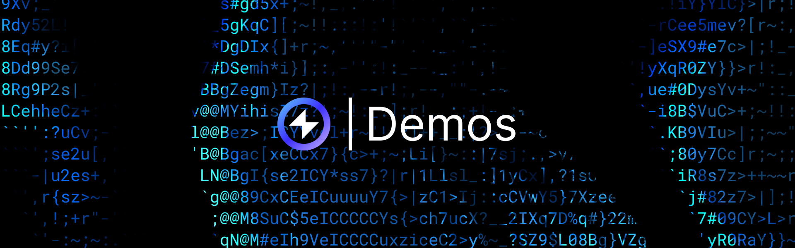

## Overview

This section contains practical demos of how Reactive Network enables event-driven, cross-chain smart contract automation. Each demo highlights a specific pattern from basic event callbacks to advanced DeFi protection mechanisms.

## Reactive Network Demo

The [Reactive Network Demo](https://github.com/Reactive-Network/reactive-smart-contract-demos/tree/main/src/demos/basic) is the starting point. It demonstrates the lifecycle of a Reactive Contract: an event emitted on an origin chain is detected by a Reactive Contract, which then triggers a callback on a destination chain. If you’re new to Reactive Network, begin here.

## Uniswap V2 Stop Order Demo

The [Uniswap V2 Stop Order Demo](https://github.com/Reactive-Network/reactive-smart-contract-demos/tree/main/src/demos/uniswap-v2-stop-order) implements automated stop orders on Uniswap V2 liquidity pools. A Reactive Contract subscribes to `Sync` events from a Uniswap pair. When the exchange rate crosses a user-defined threshold, it triggers a callback that executes the swap on the destination chain. This demo shows how price-based automation can run without off-chain bots.

## Uniswap V2 Stop-Loss & Take-Profit Orders Demo

The [Uniswap V2 Stop-Loss & Take-Profit Orders Demo](https://github.com/Reactive-Network/reactive-smart-contract-demos/tree/main/src/demos/uniswap-v2-stop-take-profit-order) expands on stop orders by supporting both stop-loss and take-profit strategies within a personal deployment. A user-owned Reactive Contract monitors pair reserve updates and triggers execution when thresholds are crossed. Each user deploys their own callback and Reactive Contracts, ensuring isolated order management and full control. This example demonstrates structured, event-driven trade automation directly tied to on-chain liquidity changes.

## Aave Liquidation Protection Demo

The [Aave Liquidation Protection Demo](https://github.com/Reactive-Network/reactive-smart-contract-demos/tree/main/src/demos/aave-liquidation-protection) shows how to automate position protection on Aave. A Reactive Contract subscribes to periodic CRON events and triggers health checks for a user’s lending position. If the health factor drops below a defined threshold, the callback contract executes protection actions — depositing collateral, repaying debt, or both. This demo illustrates time-based automation for DeFi risk management.

## Approval Magic Demo

The [Approval Magic Demo](https://github.com/Reactive-Network/reactive-smart-contract-demos/tree/main/src/demos/approval-magic) shows subscription-based automation triggered by ERC-20 approval events. A Reactive Contract monitors approval logs, while a service contract manages user registrations. When an approval is detected, the system can automatically initiate follow-up actions such as swaps or exchanges. This demo highlights how event-centric logic can simplify multi-step token workflows.

## Hyperlane Demo

The [Hyperlane Demo](https://github.com/Reactive-Network/reactive-smart-contract-demos/tree/main/src/demos/hyperlane) shows cross-chain communication using Hyperlane alongside Reactive Network. This example shows how Reactive Network can integrate with external messaging protocols for two-way cross-chain interaction.

## CRON Demo

The [Cron Demo](https://github.com/Reactive-Network/reactive-smart-contract-demos/tree/main/src/demos/cron) shows time-based automation using Reactive Network’s built-in CRON events. Instead of waiting for external transactions, the Reactive Contract subscribes to periodic system-emitted events and executes logic on a fixed schedule. This pattern is useful for recurring tasks such as scheduled updates, reward distributions, or regular DeFi position checks.