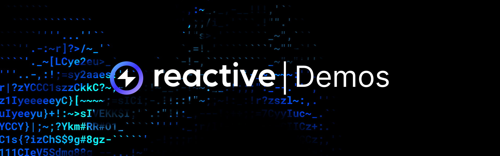

## Overview

This section contains practical demos of how Reactive Network enables event-driven, cross-chain smart contract automation. Each demo highlights a specific pattern from basic event callbacks to advanced DeFi protection mechanisms.

## Reactive Network Basic Demo

The [Reactive Network Basic Demo](https://github.com/Reactive-Network/reactive-smart-contract-demos/tree/main/src/demos/basic) is the starting point. It demonstrates the lifecycle of a reactive contract: an event emitted on an origin chain is detected by a reactive contract, which then triggers a callback on a destination chain. If you’re new to Reactive Network, begin here.

## Uniswap V2 Stop Order Demo

The [Uniswap V2 Stop Order Demo](https://github.com/Reactive-Network/reactive-smart-contract-demos/tree/main/src/demos/uniswap-v2-stop-order) implements automated stop orders on Uniswap V2 liquidity pools. A reactive contract subscribes to `Sync` events from a Uniswap pair. When the exchange rate crosses a user-defined threshold, it triggers a callback that executes the swap on the destination chain.

## Uniswap V2 Stop-Loss & Take-Profit Orders Demo

The [Uniswap V2 Stop-Loss & Take-Profit Orders Demo](https://github.com/Reactive-Network/reactive-smart-contract-demos/tree/main/src/demos/uniswap-v2-stop-take-profit-order) expands on stop orders by supporting both stop-loss and take-profit strategies within a personal deployment. A user-owned reactive contract monitors pair reserve updates and triggers execution when thresholds are crossed.

## Aave Liquidation Protection Demo

The [Aave Liquidation Protection Demo](https://github.com/Reactive-Network/reactive-smart-contract-demos/tree/main/src/demos/aave-liquidation-protection) shows how to automate position protection on Aave. A reactive Contract subscribes to periodic CRON events and triggers health checks for a user’s lending position. If the health factor drops below a defined threshold, the callback contract executes protection actions: depositing collateral, repaying debt, or both.

## Leverage Loop Demo

The [Leverage Loop Demo](https://github.com/Reactive-Network/reactive-smart-contract-demos/tree/main/src/demos/leverage-loop) automates leveraged looping on Aave V3. The user deposits collateral into a personal smart account, and a reactive contract detects the deposit and runs the loop automatically until the target health factor is reached or the maximum iteration count is hit.

## Automated Prediction Market Demo

The [Automated Prediction Market Demo](https://github.com/Reactive-Network/reactive-smart-contract-demos/tree/main/src/demos/automated-prediction-market) implements a prediction market with automated payouts. Users create questions, participants buy shares in outcomes, and a multisig resolves the result. Once the `PredictionResolved` event is emitted, a reactive contract detects it and triggers batch distribution of winnings.

## Gasless Cross-Chain Atomic Swap Demo

The [Gasless Cross-Chain Atomic Swap Demo](https://github.com/Reactive-Network/reactive-smart-contract-demos/tree/main/src/demos/gasless-cross-chain-atomic-swap) enables trustless token exchanges across two blockchains without bridges or custodians. Two users initiate and acknowledge a swap on their respective chains, deposit tokens, and a reactive contract orchestrates the rest — syncing state, confirming deposits, and completing the swap on both sides automatically. Users only pay gas on their own chain.

## Approval Magic Demo

The [Approval Magic Demo](https://github.com/Reactive-Network/reactive-smart-contract-demos/tree/main/src/demos/approval-magic) shows subscription-based automation triggered by ERC-20 approval events. A reactive contract monitors approval logs, while a service contract manages user registrations. When an approval is detected, the system can automatically initiate follow-up actions such as swaps or exchanges.

## Hyperlane Demo

The [Hyperlane Demo](https://github.com/Reactive-Network/reactive-smart-contract-demos/tree/main/src/demos/hyperlane) shows cross-chain communication using Hyperlane alongside Reactive Network. This example shows how Reactive can integrate with external messaging protocols for two-way cross-chain interaction.

## CRON Demo

The [Cron Demo](https://github.com/Reactive-Network/reactive-smart-contract-demos/tree/main/src/demos/cron) shows time-based automation using Reactive Network’s built-in CRON events. Instead of waiting for external transactions, a reactive contract subscribes to periodic system-emitted events and executes logic on a fixed schedule. This pattern is useful for recurring tasks such as scheduled updates, reward distributions, or regular DeFi position checks.