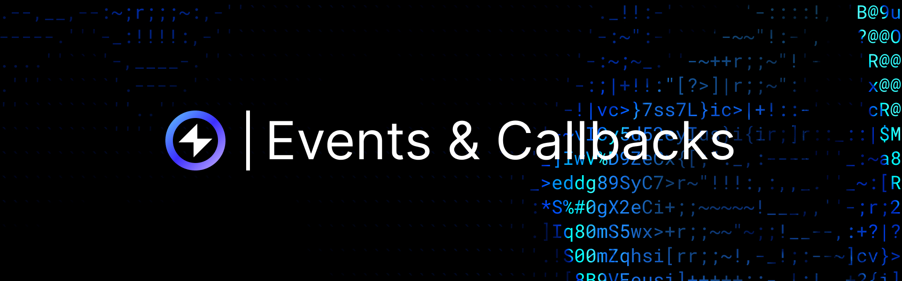

## Overview

## Event Processing

To process incoming events, a reactive smart contract must implement the `IReactive` interface with the following method:

```solidity
function react(
    uint256 chain_id,
    address _contract,
    uint256 topic_0,
    uint256 topic_1,
    uint256 topic_2,
    uint256 topic_3,
    bytes calldata data,
    uint256 block_number,
    uint256 op_code
) external;
```

The Reactive Network will feed events matching the reactive contract's subscriptions by initiating calls to this method.

Reactive smart contracts can use all the EVM capabilities normally. The only limitation is that reactive contracts are executed in the context of a private ReactVM associated with a specific deployer address, so they can't interact with contracts deployed by anyone else.

[More on Events →](../education/module-1/how-events-work)

## Calls to Destination Chain Contracts

Reactive smart contracts can create new transactions in destination networks by emitting log records of a predetermined format:

```solidity
event Callback(
    uint256 indexed chain_id,
    address indexed _contract,
    uint64 indexed gas_limit,
    bytes payload
);
```

Upon observing such a record in the traces, the Reactive Network will submit a new transaction with the desired payload to the destination network indicated by the chain ID (as long as it's on the supported list). Note that for authorization purposes, the first 160 bits of the call arguments will be replaced with the calling reactive contract's RVM ID, which is equal to the reactive contract's deployer address.

For example, the Uniswap Stop Order Demo uses this capability to initiate token sales through its destination chain contract:

```solidity
bytes memory payload = abi.encodeWithSignature(
    "stop(address,address,address,bool,uint256,uint256)",
    0,
    pair,
    client,
    token0,
    coefficient,
    threshold
);
emit Callback(chain_id, stop_order, CALLBACK_GAS_LIMIT, payload);
```

### Important Note on Authorization

For security and authorization purposes, the Reactive Network automatically replaces the first 160 bits of the call arguments within the `payload` with the RVM ID (equivalent to the ReactVM address) of the calling reactive contract. This RVM ID is identical to the contract deployer's address. As a result, the first argument in your callback will always be the ReactVM address (of type `address`), regardless of the variable name you use in your Solidity code.

[More on Callbacks →](../education/module-1/how-events-work#callbacks-to-destination-chains)