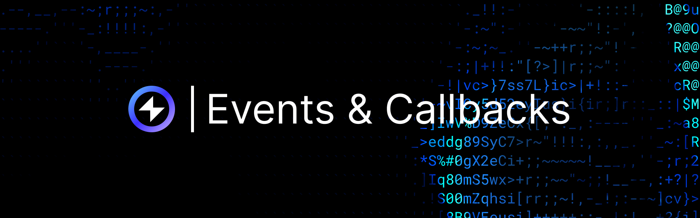

## Overview

Reactive Contracts process on-chain events and trigger transactions on destination chains through callbacks. Contracts run inside isolated environments called [ReactVMs](./reactvm.md), where incoming events are processed and callback transactions are generated when conditions are met.

## Event Processing

To process events, a Reactive Contract must implement the `react()` function defined in the [IReactive](https://github.com/Reactive-Network/reactive-lib/blob/main/src/interfaces/IReactive.sol) interface:

```solidity
// SPDX-License-Identifier: UNLICENSED

pragma solidity >=0.8.0;

import './IPayer.sol';

interface IReactive is IPayer {
    struct LogRecord {
        uint256 chain_id;
        address _contract;
        uint256 topic_0;
        uint256 topic_1;
        uint256 topic_2;
        uint256 topic_3;
        bytes data;
        uint256 block_number;
        uint256 op_code;
        uint256 block_hash;
        uint256 tx_hash;
        uint256 log_index;
    }
    ...
}
```

Reactive Network calls `react()` whenever a subscribed event is detected. The `LogRecord` structure contains the event metadata, including chain ID, contract address, topics, and event data.

Reactive Contracts execute inside a private ReactVM associated with the deployer's address. Contracts inside one ReactVM **can't** interact directly with contracts deployed by other users.

Below is an example `react()` function from the [Basic Reactive Demo](https://github.com/Reactive-Network/reactive-smart-contract-demos/blob/main/src/demos/basic/BasicDemoReactiveContract.sol):

```solidity
function react(LogRecord calldata log) external vmOnly {
    
    if (log.topic_3 >= 0.001 ether) {
        bytes memory payload = abi.encodeWithSignature("callback(address)", address(0));
        emit Callback(destinationChainId, callback, GAS_LIMIT, payload);
    }
}
```

[More on Events →](../education/module-1/how-events-work)

## Callbacks to Destination Chains

Reactive Contracts initiate transactions on destination chains by emitting `Callback` events, which are also part of the [IReactive](https://github.com/Reactive-Network/reactive-lib/blob/main/src/interfaces/IReactive.sol) interface:

```solidity
event Callback(
    uint256 indexed chain_id,
    address indexed _contract,
    uint64 indexed gas_limit,
    bytes payload
);
```

When this event appears in the transaction trace, Reactive Network submits a transaction to the specified destination chain.

- **chain_id** — destination network
- **_contract** — target contract
- **gas_limit** — execution gas limit
- **payload** — encoded function call

:::info[Callback Authorization]
Reactive Network automatically replaces the first 160 bits of the callback payload with the ReactVM ID (the deployer's address). As a result, the first callback argument is always the ReactVM address (`address` type), regardless of how it is named in Solidity. This ensures that callbacks are tied to the correct Reactive Contract.
:::

### Example: Uniswap Stop Order Demo

Example callback payload construction from the [Uniswap Stop Order Reactive Contract](https://github.com/Reactive-Network/reactive-smart-contract-demos/blob/main/src/demos/uniswap-v2-stop-order/UniswapDemoStopOrderReactive.sol):

```solidity
bytes memory payload = abi.encodeWithSignature(
    "stop(address,address,address,bool,uint256,uint256)",
    address(0),
    pair,
    client,
    token0,
    coefficient,
    threshold
);
triggered = true;
emit Callback(log.chain_id, stop_order, CALLBACK_GAS_LIMIT, payload);
```

The payload encodes the function call and parameters that will be executed on the destination chain.

[More on Callback Payment →](./economy#callback-payment)

[More on Callbacks →](../education/module-1/how-events-work#callbacks-to-destination-chains)