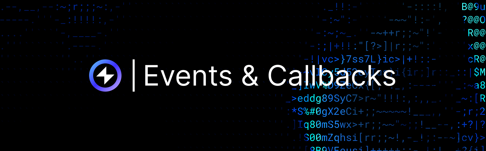

## Overview

Reactive contracts process on-chain events and trigger transactions on destination chains through callbacks. The system contract delivers event logs to the contract's `react()` function, and callback transactions are generated when conditions are met.

## Event Processing

To process events, a reactive contract must implement the `react()` function defined in the [IReactive](https://github.com/Reactive-Network/reactive-lib/blob/main/src/interfaces/IReactive.sol) interface:

```solidity
// SPDX-License-Identifier: UNLICENSED

pragma solidity >=0.8.0;

import './IPayer.sol';

interface IReactive is IPayer {
    struct LogRecord {
        uint256 chain_id;
        address _contract;
        uint256 topic_0;
        uint256 topic_1;
        uint256 topic_2;
        uint256 topic_3;
        bytes data;
        uint256 block_number;
        uint256 op_code;
        uint256 block_hash;
        uint256 tx_hash;
        uint256 log_index;
    }
    ...
}
```

The system contract calls `react()` via its `trigger()` method whenever a subscribed event is detected. The `LogRecord` structure contains the event metadata, including chain ID, contract address, topics, and event data.

Since `react()` is always called by the system contract, contracts only need to verify that `msg.sender` is the system contract address.

Below is an example `react()` function from the [Basic Reactive Demo](https://github.com/Reactive-Network/reactive-smart-contract-demos/blob/main/src/demos/basic/BasicDemoReactiveContract.sol):

```solidity
function react(LogRecord calldata log) external systemContractOnly {

    if (log.topic_3 >= 0.001 ether) {
        bytes memory payload = abi.encodeWithSignature("callback(address)", address(0));
        ISystemContract(SERVICE_ADDR).requestCallback(
            CallbackVersion.V_2_0_BASIC,
            abi.encode(CallbackConfiguration_V_2_0_BASIC({
                chain_id: destinationChainId,
                _contract: callback,
                gas_limit: GAS_LIMIT,
                payload: payload
            }))
        );
    }
}
```

## Callbacks to Destination Chains

Reactive contracts initiate transactions on destination chains by calling `requestCallback()` on the system contract. The method accepts a version identifier and an ABI-encoded configuration struct:

```solidity
function requestCallback(CallbackVersion version, bytes memory encodedConfiguration) external;
```

When `requestCallback()` is called during `react()` execution, Reactive Network submits a transaction to the specified destination chain.

The basic callback configuration (`V_2_0_BASIC`) uses the following struct:

```solidity
struct CallbackConfiguration_V_2_0_BASIC {
    uint256 chain_id;
    address _contract;
    uint64 gas_limit;
    bytes payload;
}
```

Where:

* `chain_id` — destination network
* `_contract` — target contract on the destination chain
* `gas_limit` — execution gas limit
* `payload` — ABI-encoded function call

:::info[Callback Authorization]
Reactive Network automatically replaces the first 160 bits of the callback payload with the ReactVM ID (the deployer's address). As a result, the first callback argument is always the ReactVM address (`address` type), regardless of how it is named in Solidity. This ensures that callbacks are tied to the correct Reactive contract.
:::

### Example: Uniswap Stop Order Demo

Example callback payload construction from the [Uniswap Stop Order Reactive Contract](https://github.com/Reactive-Network/reactive-smart-contract-demos/blob/main/src/demos/uniswap-v2-stop-order/UniswapDemoStopOrderReactive.sol):

```solidity
bytes memory payload = abi.encodeWithSignature(
    "stop(address,address,address,bool,uint256,uint256)",
    address(0),
    pair,
    client,
    token0,
    coefficient,
    threshold
);
triggered = true;
emit Callback(log.chain_id, stop_order, CALLBACK_GAS_LIMIT, payload);
```

The payload encodes the function call and parameters that will be executed on the destination chain.

[More on callback payment →](./economy#callback-payment)
