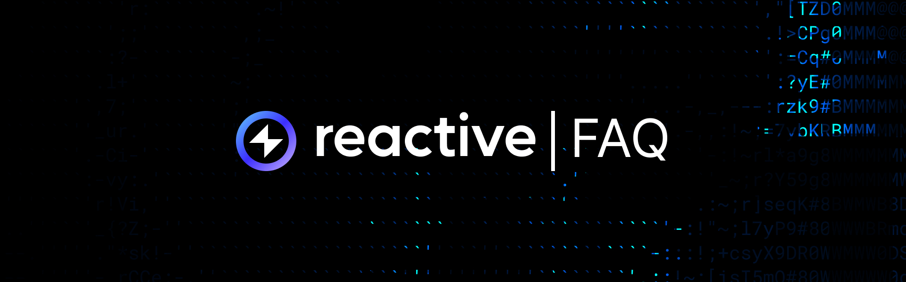

## General Questions

**What problem does the Reactive Network solve?**

It enables the execution of arbitrary Solidity logic without user intervention and provides reactive contracts that allow users to subscribe to remote ecosystem events. These contracts can affect protocols across chains based on incoming data.

**How is the Reactive Network different from other cross-chain relayers?**

Existing cross-chain relayers often need to be integrated into your infrastructure during development and may be specific to certain use cases. The Reactive Network generalizes this concept and can apply arbitrary EVM logic. Unlike many cross-chain relayers, the Reactive Network can execute arbitrary EVM logic, not limited to predefined use cases.

**What is the Reactive Network physically?**

The Reactive Network is a fork of Geth, compatible with the Ethereum Virtual Machine, and operates on a Proof of Stake protocol using Prism. It generates blocks approximately every 3 seconds. A Reactive Network node subscribes to other ecosystems' nodes via WebSocket and monitors the `newheads` event. When triggered, the node obtains transaction receipts, searches for subscribers within the Reactive Network, and propagates event logs to their reactVMs. The state of the Reactive Network is determined by the collective states of reactVMs and their connections to external blockchains.

**How is the Reactive Network different from Geth?**

The Reactive Network can listen to other blockchains by subscribing to their event logs. It uses event logs from different blockchains to identify reactive contracts subscribed to various topics, execute their logic, and propagate results. This computation occurs outside the main layer, making the process more cost-effective.

**Is there any nuance to the Reactive Network?**

Simply increasing the gas limit for blocks would compromise decentralization, leading to fewer validators. The Reactive Network includes an additional layer called reactVM to manage computations while maintaining decentralization.

**What is meant by a dual-state environment?**

Each reactive contract operates in a dual-state environment with two instances initialized in the constructor. The reactVM instance updates its state based on events, while the Reactive Network instance updates its state through manual function calls.

**Why do we always have two contract copies — in the Reactive Network and reactVM?**

The architecture enables parallel transaction execution. The Ethereum Virtual Machine (EVM) is single-threaded, processing commands one at a time. To overcome this limitation, the Reactive Network uses reactVMs which execute independently and in parallel. Each contract copy in this architecture handles its own state and execution context.

## Subscriptions

**Are subscriptions to one or multiple events from different chain IDs allowed?**

Yes, users can subscribe to events from all chains with a single subscription by specifying the chain ID as `uint256(0)`. Note: Use either `REACTIVE_IGNORE` for topics 0-3 or `uint256(0)` for the chain ID and `addres(0)` for contact address, but not altogether. Subscribing to events from all chains and all contracts simultaneously is not allowed, nor is subscribing to all events from only one chain, as it is considered unnecessary.

**Are identical subscriptions allowed. Why?**

Duplicate subscriptions are allowed but function as a single subscription. Users are charged for each transaction they send to the system contract. Preventing duplicate subscriptions in the system contract is costly due to EVM storage limitations. Therefore, to keep costs manageable, duplicate subscriptions are permitted.

## Technical Questions

**Why does the `subscribe()` function not work when used in a `react()` function to subscribe to another contract?**  

The `subscribe()` function will not work directly from the RVM because the system contract resides in the Reactive Network, not within the RVM. To subscribe or unsubscribe from the RVM, you should emit the `Callback` event, which will send a callback to the Reactive Network.

**The call `(bool subscription_result,) = address(service).call(payload);` is failing, resulting in `vm = false`. What could be the issue?**  

This failure occurs because a reactive contract exists in two instances: on the Reactive Network and within your reactVM. The call will fail in the RVM instance since the System Contract doesn't exist there, so `vm` will be true. It will succeed in the Reactive Network instance, so `vm` will be false.

**My deployed reactive contract doesn't seem to catch the emitted events. Running the `react()` function using a cast call doesn’t trigger any response either. What should I do?**  

If your cast calls the Reactive Network instance of the contract, the callback won’t be triggered because it can only be invoked by the RVM instance. To invoke a callback, you should run the transaction on the origin chain, which will trigger the reactive contract and the callback.

**How can I check if my reactive contract is listening to my origin contract events?**  

You can verify this by checking for a new transaction on [Reactive Scan](https://kopli.reactscan.net/) in the relevant RVM.

**What is received in `bytes calldata` in the `react()` function?**  

The `bytes calldata` contains the encoded data of all elements other than topics.

**What does the `REACTIVE_IGNORE` value for topics mean?**  

Setting a specific topic as `REACTIVE_IGNORE` means that reactive contracts will not filter events by this topic when subscribing to events. However, events with any value for this topic will still be accessible.
