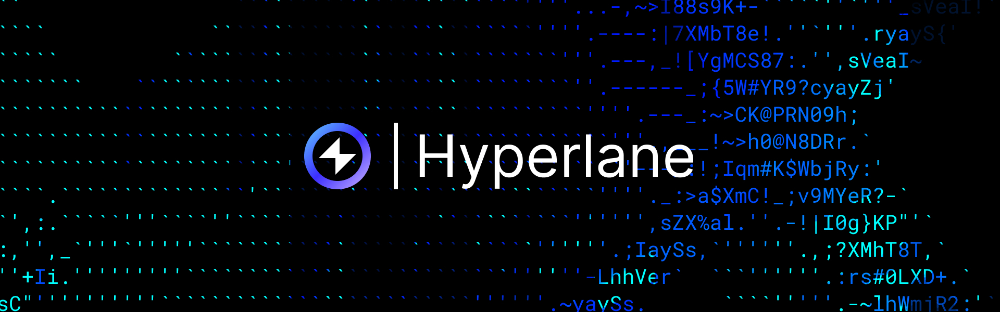

import MailboxAddressTable from "../../src/components/hyperlane-mailbox-table";

## Overview

## Hyperlane Mailbox

In addition to using callback senders, you can integrate Hyperlane Mailboxes. A Hyperlane Mailbox is a smart contract designed to send and receive verified cross-chain messages between blockchains, providing a secure and standardized mechanism for interchain communication.

See our [Hyperlane Demo](https://github.com/Reactive-Network/reactive-smart-contract-demos/tree/main/src/demos/hyperlane) to understand how to deploy contracts and send messages with Hyperlane mailboxes.

<MailboxAddressTable />