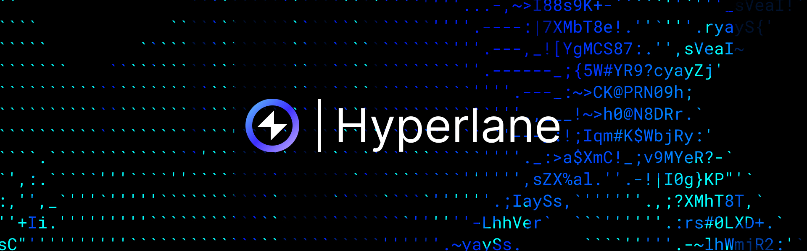

import MailboxAddressTable from "../../src/components/hyperlane-mailbox-table";

## Overview

Reactive contracts send cross-chain callback transactions to destination chains. By default, callbacks are delivered through callback proxies. Hyperlane mailboxes provide alternative transport for these callbacks. The mailbox contract on each supported chain acts as the entry and exit point for cross-chain messages.

Reactive contracts still listen to event logs and trigger actions in the same way, only the callback transport changes. Hyperlane transport is useful when a specific chain doesn't yet have its callback proxy deployed.

## Hyperlane Mailboxes

:::info[Hyperlane Demo]
See our [Hyperlane Demo](https://github.com/Reactive-Network/reactive-smart-contract-demos/tree/main/src/demos/hyperlane) to understand how to deploy contracts and send messages with Hyperlane mailboxes.
:::

<MailboxAddressTable />