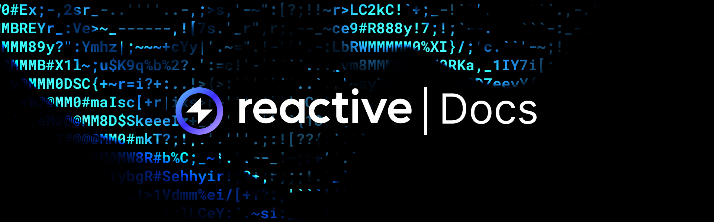

## Overview

Reactive Network is a fully EVM-compatible execution layer that allows developers to create the next wave of dApps using Reactive Smart Contracts. These contracts differ from traditional ones by using Inversion-of-Control for the transaction lifecycle, driven by data flows across blockchain ecosystems rather than user input.

Reactive Smart Contracts receive event logs from various chains, executing Solidity logic based on these events instead of user transactions. They can independently determine the need to transmit data to the destination chain, enabling conditional state changes. Reactive Network offers fast and cost-effective computation through a proprietary parallelized EVM implementation.

:::note

**Reactive Network** is currently undergoing intensive development. All statements in this documentation hold true as of the time of writing; however, given the dynamic nature of our development process, rapid changes may occur without any prior notice.

:::

## Reactive Hackathon

Check out the [Reactive Hackathon](https://reactive.network/hackathon?ref=blog.reactive.network). If you're fascinated with blockchain or developing, you're welcome to take part in the Hackathon and Booster Grants Program. The prize pool is $50,000, and it's an opportunity to work on and launch DApps using the Reactive Network.

## Get Kopli Testnet REACT

Acquire Kopli REACT tokens by simply interacting with the Reactive faucet contract on Sepolia. Follow the link below for the details.

[Get Kopli Testnet React →](./kopli-testnet#get-kopli-testnet-react)

## Deploy Your First Reactive Smart Contract

Read through a guide covering the deployment of a reactive contract, from setting up the environment and configuring variables to detailed insights on development and testing.

[Reactive Use Cases →](../education/use-cases/index.md)

## Reactive Demos 

Study practical demonstrations of the Reactive Network's capabilities, including monitoring logs from L1 contracts, facilitating fund transfers, implementing stop orders for Uniswap V2, and capturing historical exchange rates. The demos highlight the interaction between various smart contracts and explore areas for optimization, such as security and gas efficiency.

[Reactive Demos →](./demos.md)

## Reactive Education

Look into our educational materials with detailed lectures, GitHub code snippets, and video demonstrations, focusing on both theoretical knowledge and practical challenges like executing Uniswap stop orders, syncing NFT ownership across multiple chains, and auto-harvesting staking rewards.

[Educational Materials →](../education/introduction/index.md)