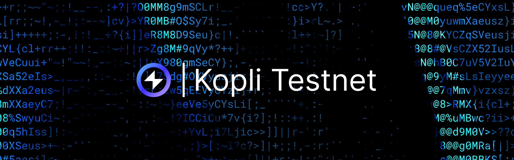

export const AddToWeb3Provider = async () => {
  const chainId = '0x512578';

  try {
    await window.ethereum.request({
      method: 'wallet_switchEthereumChain',
      params: [{chainId: chainId}],
    });
  } catch (e) {
    if (e.code === 4902) {
      try {
        await window.ethereum.request({
          method: "wallet_addEthereumChain",
          params: [{
            chainId: "0x512578",
            rpcUrls: ["https://kopli-rpc.reactive.network/"],
            chainName: "Reactive Kopli",
            nativeCurrency: {
              name: "REACT",
              symbol: "REACT",
              decimals: 18
            },
            blockExplorerUrls: ["https://kopli.reactscan.net/"]
          }]
        });
      } catch (e) {

      }
    }
  }
}



## Overview

Kopli Testnet is a proof-of-stake testnet, representing Reactive Network's pre-alpha / Proof-of-Concept era. This Testnet, neither trustless nor decentralized, is fully managed by Reactive Team. It is designed only for testing purposes. Further decentralization is assured and scheduled for implementation in later stages.

## Kopli Testnet Information

* Network Name — Kopli Testnet
* RPC URL — https://kopli-rpc.rkt.ink
* Chain ID — 5318008
* Currency Symbol — REACT
* Block Explorer URL — https://kopli.reactscan.net
* System Contract Address — 0x0000000000000000000000000000000000FFFFFF
* Reactive Faucet Address on Ethereum Sepolia — 0x9b9BB25f1A81078C544C829c5EB7822d747Cf434

Callback proxy addresses can be found in [Origins & Destinations](./origins-and-destinations.md).

<button onClick={AddToWeb3Provider}>Connect to Kopli Testnet</button>

## Callback Proxy Address

`CALLBACK_PROXY_ADDR` ensures the validity of a callback transaction by checking two key conditions:

1. **Reactive Network Signature**: Verifies that the callback is initiated by the Reactive Network by matching the sender address to `CALLBACK_PROXY_ADDR`.

2. **RVM ID Verification**: Confirms that the callback originates from the correct reactive contract by checking the RVM ID in the transaction payload.

In the [Uniswap Stop Order Demo](https://github.com/Reactive-Network/reactive-smart-contract-demos/tree/main/src/demos/uniswap-v2-stop-order), the contract already verifies callbacks, so `CALLBACK_PROXY_ADDR` can be omitted by using `0x0000000000000000000000000000000000000000`.

The `CALLBACK_PROXY_ADDR` differs between the Sepolia Testnet and the Reactive Faucet because callbacks are routed to different networks. For instance, Uniswap sends callbacks to Sepolia, whereas the Reactive Faucet sends callbacks to the Reactive Network. Despite this difference, the function of the `CALLBACK_PROXY_ADDR` remains the same across networks.

If an external caller initiates the function, they will either waste gas on a reverted transaction or on fulfilling someone else's stop order without any benefit.

## Get Kopli Testnet REACT

The first method is ideal for cases where the address initiating the transfer is also the recipient. Users can acquire REACT tokens on the Reactive Network (RN) by interacting with the Reactive faucet contract. Transfer SepETH directly to the faucet contract on the Sepolia Network. Upon completion, an equivalent number of REACT tokens will be transferred to the sender's address on the Reactive Network. This transfer is subject to a predefined limit (0.1 ETH by default) and assumes the faucet has available funds. The process can be executed using MetaMask or any other wallet.

Alternatively, users can call the payable method `request(address)` on the Reactive Faucet Contract on Sepolia to transfer REACT tokens directly to a specified RN address. In that case, users must provide the corresponding amount of SepETH when invoking this method. This approach is suitable for situations where the address initiating the transfer is not necessarily the recipient on the Reactive Network, allowing for flexible token transfers across different addresses.

```bash
cast send $REACTIVE_FAUCET_L1_ADDR "request(address)" $REACTIVE_TARGET_ADDR --value $WEI_AMOUNT --rpc-url $SEPOLIA_RPC --private-key $SEPOLIA_PRIVATE_KEY
```