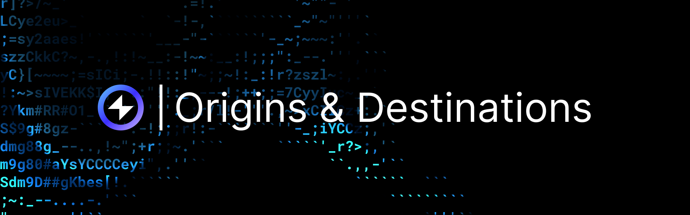

import MainnetChainTable from "../../src/components/origins-destinations";
import TestnetChainTable from "../../src/components/origins-destinations-testnet";

## Overview

Reactive contracts can listen to event logs on one chain and trigger actions on another. To describe that flow, we use two roles:

- **Origin:** the chain where events happen and event logs are read from (the event source).
- **Destination:** the chain where Reactive Network delivers a callback transaction (the chain where state changes occur).

Origins and destinations don’t have to be the same. A single reactive contract can subscribe to events from multiple origin chains, and it can send callbacks to one or more destination chains. Your Solidity logic can also choose the destination conditionally.

## Callback Proxy Address

Callbacks are delivered by Reactive Signer, which posts transactions to destination chains. These transactions pass through a callback proxy contract, which makes them verifiable and safe for destination-side contracts.

A destination contract can validate a callback by checking that `msg.sender` is the relevant callback proxy and the original sender from Reactive Network is Reactive Signer.

## Mainnet Chains

:::info[Origin/Destination]
Origin is the chain where events originate (and are read from). Destination is the chain where callbacks are delivered in response to those events. Mainnets and testnets must not be mixed: if the origin is a mainnet, the destination must also be a mainnet.
:::

<MainnetChainTable />

## Testnet Chains

:::info[Origin/Destination]
Origin is the chain where events originate (and are read from). Destination is the chain where callbacks are delivered in response to those events. Mainnets and testnets must not be mixed: if the origin is a testnet, the destination must also be a testnet.
:::

<TestnetChainTable />

[//]: # (emojis for status ✅ ➖ ⌛)

[//]: # (:::info[Callbacks])

[//]: # (Not all origin chains are compatible as destination chains. Please refer to the table below before implementing callbacks.)

[//]: # (:::)