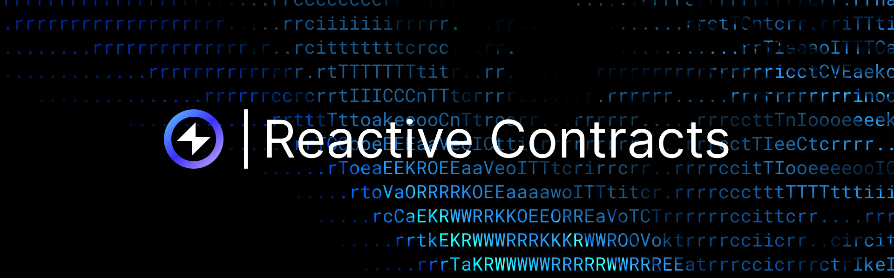
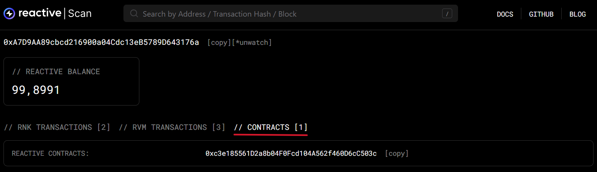
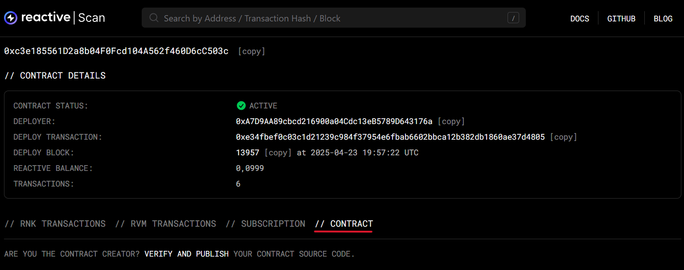
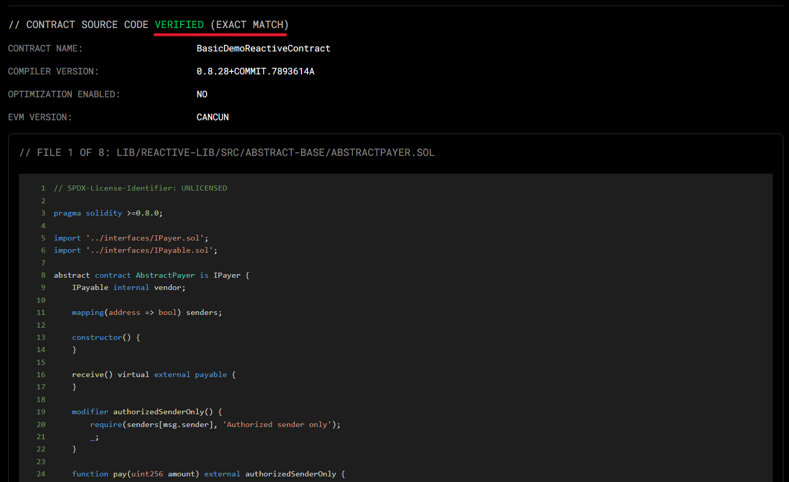

## Overview

Reactive Contracts (RCs) operate on a standard Ethereum Virtual Machine (EVM) and can be written in any EVM-compatible language, with Application Binary Interfaces (ABIs) particularly customized for Solidity. Their unique capabilities stem from Reactive nodes and a specialized pre-deployed system contract.

## Key Features

Reactive Contracts monitor blockchains for specific events and respond automatically, unlike traditional contracts that rely on EOAs to trigger actions. This reactivity and their use of Inversion of Control (IoC) — where contracts decide when to act — set them apart.

RCs define which blockchains, contracts, and events to watch. When a relevant event occurs, they execute logic, update state, and perform trustless transactions within the Reactive Network.

### Deployment

RCs deploy to both the main Reactive Network and a private [ReactVM](./reactvm.md). The main copy interacts with EOAs and manages subscriptions via the system contract. The ReactVM copy handles event processing but is not accessible to EOAs.

### State and Separation

The two copies are isolated and don’t share state. Since they use the same bytecode, use constructor flags or checks to distinguish the environment. You can detect if a contract is on ReactVM by calling the system contract — calls will revert outside ReactVMs. See [examples](./demos.md) for details.

### ReactVM Limitations

In [ReactVM](./reactvm.md), RCs can’t access external systems directly. They receive logs from the Reactive Network and can call destination chain contracts but nothing else.

## Contract Verification

Contracts can be verified either after or during deployment with the Sourcify endpoint. Sourcify is a decentralized verification service that stores and verifies source code for smart contracts. It allows anyone to match deployed bytecode with human-readable source code, making smart contracts auditable and transparent.

**Reactive Sourcify Endpoint**: https://sourcify.rnk.dev/

### Verify After Deployment

For contract verification after deployment, run the following command:

```bash
forge verify-contract \
--verifier sourcify \
--verifier-url https://sourcify.rnk.dev/ \
--chain-id $CHAIN_ID \
$CONTRACT_ADDR $CONTRACT_NAME
```

**Replace:**

- `$CHAIN_ID` with `1597` for Reactive Mainnet and `5318007` for Lasna Testnet
- `$CONTRACT_ADDR` with your deployed contract’s address
- `$CONTRACT_NAME` with the name of the contract (e.g., `MyContract`)

### Verify on Deployment

You can also verify the contract during deployment by appending the relevant flags to `forge create`. The following command submits your contract source to Sourcify right after deployment:

```bash
forge create \
--verifier sourcify \
--verifier-url https://sourcify.rnk.dev/ \
--verify \
--chain-id $CHAIN_ID \
--private-key $PRIVATE_KEY \
$PATH
```

**Replace:**

- `$CHAIN_ID` with `1597` for Reactive Mainnet and `5318007` for Lasna Testnet
- `$PATH` with something like `src/MyContract.sol:MyContract`
- `$PRIVATE_KEY` with your signer’s private key

An example of verifying on deployment could look like so: 

```bash
forge create \
  --broadcast \
  --rpc-url $REACTIVE_RPC_URL \
  --private-key $REACTIVE_PRIVATE_KEY \
  --chain-id $REACTIVE_CHAIN_ID \
  --value 0.01ether \
  --verify \
  --verifier sourcify \
  --verifier-url https://sourcify.rnk.dev/ \
  src/.../MyContract.sol:MyContract \
  --constructor-args \
    $ARGUMENT_1 \
    $ARGUMENT_2 \
    $ARGUMENT_3 \
    # ...add more as needed
```

:::warning[Broadcast Error]
If you encounter the error described below, it means your Foundry version (or local setup) does not expect the `--broadcast flag` for `forge create`. Simply remove `--broadcast` from your command and re-run it.

```go
error: unexpected argument '--broadcast' found
```
:::

### Verified Contracts on Reactscan

**Reactive Block Explorers:** [Mainnet](https://reactscan.net/) and [Lasna Testnet](https://lasna.reactscan.net/).

After verification, go to the relevant **Reactscan.** While in your RVM, navigate to **Contracts** and click the required contract address.



Open the “Contract” tab.



If successful, you’ll see the following:

```json
Contract Address: 0xc3e185561D2a8b04F0Fcd104A562f460D6cC503c
Status: VERIFIED (EXACT MATCH)
Compiler: 0.8.28
```



The source code will be publicly viewable, with full syntax highlighting and structure, helping others understand and trust the contract logic.

[More on Reactive Contracts →](../education/module-1/reactive-contracts)
