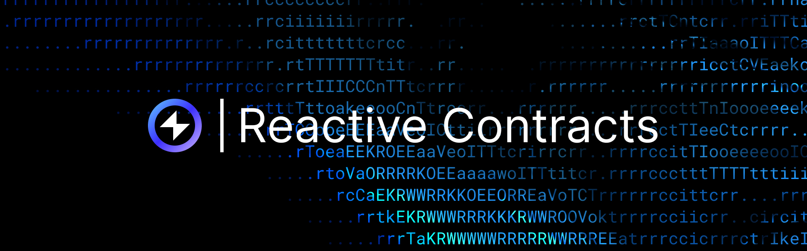

## Overview

Reactive contracts are event-driven smart contracts for cross-chain, on-chain automation. They monitor event logs across various chains, execute Solidity logic when subscribed events occur, and trigger cross-chain callback transactions.

## Deployment

Reactive contracts are deployed to Reactive Network (RNK) like any standard smart contract. Once deployed, the system contract delivers event logs to the contract's `react()` function and processes callback requests.

## Verifying Reactive Contracts

Contracts can be verified during or after deployment using the Sourcify endpoint. Sourcify is a decentralized verification service that matches deployed bytecode with source code, making contracts auditable and transparent.

## Verify After Deployment

```bash
forge verify-contract \
--verifier sourcify \
--chain-id $CHAIN_ID \
$CONTRACT_ADDR $CONTRACT_NAME
```

Replace:

- `$CHAIN_ID` → `1597` (Reactive Mainnet) or `5318007` (Lasna Testnet)
- `$CONTRACT_ADDR` → deployed contract address
- `$CONTRACT_NAME` → contract name (e.g. `MyContract`)

## Verify on Deployment

```bash
forge create \
--verifier sourcify \
--verify \
--chain-id $CHAIN_ID \
--private-key $PRIVATE_KEY \
$PATH
```

Replace:

- `$CHAIN_ID` → `1597` (Reactive Mainnet) or `5318007` (Lasna Testnet)
- `$PATH` → e.g. `src/MyContract.sol:MyContract`
- `$PRIVATE_KEY` → deployer key

Example: 

```bash
forge create \
  --broadcast \
  --rpc-url $REACTIVE_RPC_URL \
  --private-key $REACTIVE_PRIVATE_KEY \
  --chain-id $REACTIVE_CHAIN_ID \
  --value 0.01ether \
  --verify \
  --verifier sourcify \
  src/.../MyContract.sol:MyContract \
  --constructor-args \
    $ARGUMENT_1 \
    $ARGUMENT_2 \
    $ARGUMENT_3 \
    # ...add more as needed
```

:::warning[Broadcast Error]
If you encounter the error below, your Foundry version doesn't expect the `--broadcast` flag for `forge create`. Remove `--broadcast` and retry.

```go
error: unexpected argument '--broadcast' found
```
:::

[More on Reactive Contracts →](../education/module-1/reactive-contracts)
