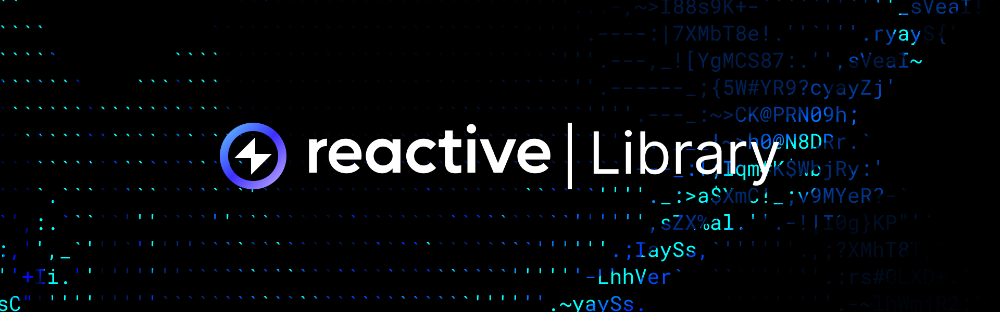

import CronTable from "../../src/components/cron-table";



## Overview

[Reactive Library](https://github.com/Reactive-Network/reactive-lib) is a set of abstract contracts and interfaces that reduce boilerplate by integrating common functionalities. Run the following command in your project to install the library: 

```bash
forge install Reactive-Network/reactive-lib
```

## Abstract Contracts

### AbstractCallback

[AbstractCallback](https://github.com/Reactive-Network/reactive-lib/blob/main/src/abstract-base/AbstractCallback.sol) extends `AbstractPayer` and provides a callback system. It initializes a specific `rvm_id` and a `vendor` in the constructor to enable callback functionality. The `rvm_id` ensures that only an authorized RVM ID can invoke certain functions, enforced by the `rvmIdOnly` modifier.

```solidity
 modifier rvmIdOnly(address _rvm_id) {
        require(rvm_id == address(0) || rvm_id == _rvm_id, 'Authorized RVM ID only');
        _;
}
```

The constructor accepts the Callback Proxy address (`_callback_sender`), which is assigned to the `vendor` variable. The `rvm_id` is initialized as the address deploying the contract (`msg.sender`). The constructor also authorizes the `_callback_sender` by interacting with `AbstractPayer`.

```solidity
constructor(address _callback_sender) {
    rvm_id = msg.sender;
    vendor = IPayable(payable(_callback_sender));
    addAuthorizedSender(_callback_sender);
}
```

### AbstractPausableReactive

[AbstractPausableReactive](https://github.com/Reactive-Network/reactive-lib/blob/main/src/abstract-base/AbstractPausableReactive.sol) combines functionalities from `IReactive` and `AbstractReactive` for managing pausable event subscriptions. It introduces a `Subscription` struct, which defines criteria for subscriptions, including chain ID, contract address, and event topics.

The contract includes mechanisms to pause and resume all active subscriptions. The `pause` function unsubscribes from all subscriptions retrieved through the `getPausableSubscriptions` function, while the `resume` function reactivates them. These operations are restricted to the contract owner, with access controlled by the `onlyOwner` modifier.

The constructor assigns the deploying address (`msg.sender`) as the owner and initializes the contract in an unpaused state.

```solidity
constructor() {
    owner = msg.sender;
}
```

The `pause` function ensures that only the owner can deactivate subscriptions when the contract is not already paused:

```solidity
function pause() external rnOnly onlyOwner {
    require(!paused, 'Already paused');
    Subscription[] memory subscriptions = getPausableSubscriptions();
    for (uint256 ix = 0; ix != subscriptions.length; ++ix) {
        service.unsubscribe(
            subscriptions[ix].chain_id,
            subscriptions[ix]._contract,
            subscriptions[ix].topic_0,
            subscriptions[ix].topic_1,
            subscriptions[ix].topic_2,
            subscriptions[ix].topic_3
        );
    }
    paused = true;
}
```

Similarly, the `resume` function reactivates subscriptions when the contract is paused:

```solidity
function resume() external rnOnly onlyOwner {
    require(paused, 'Not paused');
    Subscription[] memory subscriptions = getPausableSubscriptions();
    for (uint256 ix = 0; ix != subscriptions.length; ++ix) {
        service.subscribe(
            subscriptions[ix].chain_id,
            subscriptions[ix]._contract,
            subscriptions[ix].topic_0,
            subscriptions[ix].topic_1,
            subscriptions[ix].topic_2,
            subscriptions[ix].topic_3
        );
    }
    paused = false;
}
```

### AbstractPayer

[AbstractPayer](https://github.com/Reactive-Network/reactive-lib/blob/main/src/abstract-base/AbstractPayer.sol) provides payment-related functionality for smart contracts. It manages a mapping of authorized senders and defines mechanisms for initiating payments or covering vendor debts. The `authorizedSenderOnly` modifier restricts payment initiation to senders explicitly authorized by the contract.

```solidity
modifier authorizedSenderOnly() {
    require(senders[msg.sender], 'Authorized sender only');
    _;
}
```

The contract includes a `pay` function, which allows authorized senders to transfer a specified amount, and a `coverDebt` function, which retrieves the outstanding debt of the contract to the vendor and attempts to settle it.  The `vendor` is defined as an instance of the `IPayable` interface, enabling interactions with external systems for debt management. Payments are processed through an internal `_pay` function, which validates the contract's balance before executing a transfer.

```solidity
function pay(uint256 amount) external authorizedSenderOnly {
    _pay(payable(msg.sender), amount);
}

function coverDebt() external {
    uint256 amount = vendor.debt(address(this));
    _pay(payable(vendor), amount);
}

function _pay(address payable recipient, uint256 amount) internal {
    require(address(this).balance >= amount, 'Insufficient funds');
    if (amount > 0) {
        (bool success,) = payable(recipient).call{value: amount}(new bytes(0));
        require(success, 'Transfer failed');
    }
}
```

Authorized senders are managed through `addAuthorizedSender` and `removeAuthorizedSender` functions, ensuring control over who can initiate payments.

```solidity
function addAuthorizedSender(address sender) internal {
    senders[sender] = true;
}

function removeAuthorizedSender(address sender) internal {
    senders[sender] = false;
}
```

The contract also supports receiving Ether, using an empty `receive` function to handle direct transfers.

```solidity
receive() virtual external payable {
}
```

### AbstractReactive

[AbstractReactive](https://github.com/Reactive-Network/reactive-lib/blob/main/src/abstract-base/AbstractReactive.sol) extends `AbstractPayer` and implements `IReactive`, providing functionality for interacting with the Reactive Network and system contracts. It introduces two distinct operational modes: `vm` for reactVM and non-`vm` for the Reactive Network, ensuring that certain functions are executed in the appropriate mode. The `vmOnly` and `rnOnly` modifiers enforce these mode restrictions.

The contract uses an internal mechanism, `detectVm()`, to dynamically detect whether it is running in a ReactVM context or within the Reactive Network. This detection is based on the contract size of the `SERVICE_ADDR` system contract, which is predefined and used to assign the `vendor` and `service` variables automatically. The address of `SERVICE_ADDR` is set in the constructor and authorized as a sender for payment-related actions.

```solidity
constructor() {
    vendor = service = SERVICE_ADDR;
    addAuthorizedSender(address(SERVICE_ADDR));
    detectVm();
}
```

The `detectVm` function inspects the size of the `SERVICE_ADDR` contract to determine the current execution context, setting the `vm` flag accordingly:

```solidity
function detectVm() internal {
    uint256 size;
    // solhint-disable-next-line no-inline-assembly
    assembly { size := extcodesize(0x0000000000000000000000000000000000fffFfF) }
    vm = size == 0;
}
```

## Interfaces

### IPayable

The [IPayable](https://github.com/Reactive-Network/reactive-lib/blob/main/src/interfaces/IPayable.sol) interface defines functionalities for handling payments and debt management. The `receive` function enables contracts to accept Ether payments directly, allowing them to settle debts and resume subscriptions as necessary.

Additionally, the `debt` function provides a way for reactive contracts to query their outstanding debts. It takes the address of a reactive contract as input and returns the amount of debt owed, enabling precise debt tracking and efficient fund management.

```solidity
interface IPayable {
    receive() external payable;
    
    function debt(address _contract) external view returns (uint256);
}
```

### IPayer

The [IPayer](https://github.com/Reactive-Network/reactive-lib/blob/main/src/interfaces/IPayer.sol) interface defines a minimal contract for managing payments within the Reactive Network. It ensures that implementing contracts can both initiate payments and accept Ether directly.

The `pay()` function allows the calling contract to make a payment of the specified `amount`. This function is external and is designed to verify the `msg.sender` to ensure that only authorized entities can initiate payments. The `receive()` function allows the implementing contract to accept Ether transfers directly. The function is automatically invoked when the contract receives Ether with no accompanying calldata.

```solidity
interface IPayer {
    function pay(uint256 amount) external;

    receive() external payable;
}
```

### IReactive

The [IReactive](https://github.com/Reactive-Network/reactive-lib/blob/main/src/interfaces/IReactive.sol) interface extends the `IPayer` interface, enabling reactive contracts to integrate with the Reactive Network. It facilitates event-driven interactions by allowing contracts to subscribe to specific criteria and handle notifications for matching events. This interface defines core structures, events, and functions required for reactive contracts.

The `LogRecord` struct represents detailed information about an event notification. It includes metadata such as chain ID, contract address, topics, data, block details, and transaction identifiers, making it a container for event data.

```solidity
struct LogRecord {
   uint256 chain_id;
   address _contract;
   uint256 topic_0;
   uint256 topic_1;
   uint256 topic_2;
   uint256 topic_3;
   bytes data;
   uint256 block_number;
   uint256 op_code;
   uint256 block_hash;
   uint256 tx_hash;
   uint256 log_index;
}
```

The `Callback` event is emitted when a reactive contract is notified of a new event matching its subscription criteria. It provides key details about the event, such as the chain ID, the originating contract, the gas limit for processing the callback, and the payload data.

```solidity
event Callback(
   uint256 indexed chain_id,
   address indexed _contract,
   uint64 indexed gas_limit,
   bytes payload
);
```

The `react` function serves as the entry point for handling event notifications. It processes the `LogRecord` data associated with an event and executes the necessary logic within the contract.

```solidity
function react(LogRecord calldata log) external;
```

### ISubscriptionService

The [ISubscriptionService](https://github.com/Reactive-Network/reactive-lib/blob/main/src/interfaces/ISubscriptionService.sol) interface extends `IPayable` and provides methods for reactive contracts to create or remove subscriptions, specifying detailed criteria for the events they want to monitor.

The `subscribe()` function enables a contract to subscribe to receive events that match specified criteria.

```solidity
function subscribe(
    uint256 chain_id,
    address _contract,
    uint256 topic_0,
    uint256 topic_1,
    uint256 topic_2,
    uint256 topic_3
) external;
```

The `unsubscribe` function removes an existing subscription matching the specified criteria, if one exists.

```solidity
function unsubscribe(
    uint256 chain_id,
    address _contract,
    uint256 topic_0,
    uint256 topic_1,
    uint256 topic_2,
    uint256 topic_3
) external;
```

### ISystemContract

The [ISystemContract](https://github.com/Reactive-Network/reactive-lib/blob/main/src/interfaces/ISystemContract.sol) interface acts as an integrative contract that combines the functionalities of `IPayable` and `ISubscriptionService`. It represents a system-level abstraction within the Reactive Network, designed to handle payments and manage event subscriptions for reactive contracts.

```solidity
import './IPayable.sol';
import './ISubscriptionService.sol';

interface ISystemContract is IPayable, ISubscriptionService {
}
```

## System Contract

The Reactive Network’s key operations are managed by three core contracts:

[System Contract](https://github.com/Reactive-Network/system-smart-contracts/blob/main/src/SystemContract.sol) oversees:

- Payments: Handles service payments for reactive contracts.
- Access Control: Manages contract whitelisting/blacklisting.
- Cron Events: Triggers periodic block interval actions.

[Callback Proxy](https://github.com/Reactive-Network/system-smart-contracts/blob/main/src/CallbackProxy.sol) ensures interactions with:

- Callback Management: Restricted to authorized senders.
- Payment & Reserves: Manages deposits, reserves, and debts.
- Gas Adjustment & Kickbacks: Calculates gas prices and rewards originators.
- Access Control: Tracks authorized contracts, emitting whitelist/blacklist updates.

[AbstractSubscriptionService](https://github.com/Reactive-Network/system-smart-contracts/blob/main/src/AbstractSubscriptionService.sol) manages event subscriptions with:

- Flexible Criteria: Subscribes/unsubscribes based on chain ID, address, or topics.
- Recursive Tracking: Supports complex criteria structures.
- Wildcard Support: Uses `REACTIVE_IGNORE` for broader matches.
- Event Emissions: Tracks subscription updates, including deployer events.

### CRON Functionality

The `SystemContract` has a built-in cron mechanism that enables time-based automation by emitting events at fixed block intervals. Instead of running continuous on-chain checks, nodes listen for these predictable signals and create transactions to invoke the appropriate cron function when triggered. This native scheduling layer simplifies the creation of automated workflows, on-chain triggers, and off-chain watchers.

To maintain the reliability and predictability of this mechanism, only authorized validator root addresses are permitted to trigger the relevant functions.

Each call to `cron()` emits one or more `Cron` events based on the divisibility of the provided block number. This forms a pyramid of timing signals, growing less frequent as the interval increases. Each event includes a single parameter: `number`, representing the current block number.

<CronTable />
