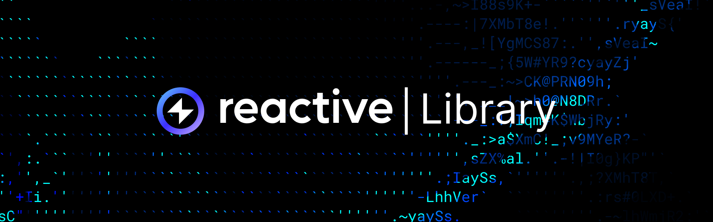

import CronTable from "../../src/components/cron-table";



## Overview

[Reactive library](https://github.com/Reactive-Network/reactive-lib-omni) provides abstract contracts and interfaces for building reactive contracts. The library includes components for subscriptions, callbacks, payments, and system contract interaction.

Install the library in your Foundry project:

```bash
forge install Reactive-Network/reactive-lib-omni
```

## Abstract Contracts

### AbstractReactive

[AbstractReactive](https://github.com/Reactive-Network/reactive-lib-omni/blob/main/src/abstract-base/AbstractReactive.sol) is the base contract for reactive contracts. It extends `AbstractPayer` and implements `IReactive`, providing access to the Reactive Network system contract and subscription service.

The contract defines:

- `SYSTEM` — the system contract address (`0x8888888888888888888888888888888888888888`)
- `REACTIVE_IGNORE` — wildcard topic value for event subscriptions

The `onlySystem` modifier restricts functions like `react()` to calls from the system contract.

```solidity
modifier onlySystem() {
    _onlyServiceProvider();
    _;
}
```

The constructor initializes the system contract as the service provider for payment operations.

```solidity
constructor() AbstractPayer(SYSTEM) {
}
```

### AbstractCallback

[AbstractCallback](https://github.com/Reactive-Network/reactive-lib-omni/blob/main/src/abstract-base/AbstractCallback.sol) extends `AbstractPayer` and provides callback authorization for destination-side contracts.

The contract initializes:

- `_CALLBACK_SENDER` — the reactive contract authorized to send callbacks

The `onlyCallbackSender` modifier restricts callback functions to the authorized sender.

```solidity
modifier onlyCallbackSender(address callbackSender_) {
    _onlyCallbackSender(callbackSender_);
    _;
}
```

The implementation reverts with `CallbackNotAuthorized` if the sender doesn't match.

```solidity
function _onlyCallbackSender(address callbackSender_) internal view {
    if (callbackSender_ != _CALLBACK_SENDER) {
        revert CallbackNotAuthorized(callbackSender_, _CALLBACK_SENDER);
    }
}
```

The constructor takes the callback proxy address (as the service provider for payments) and the authorized reactive contract address.

```solidity
constructor(IPayable callbackProxy_, address callbackSender_) AbstractPayer(callbackProxy_) {
    _CALLBACK_SENDER = callbackSender_;
}
```

### AbstractPayer

[AbstractPayer](https://github.com/Reactive-Network/reactive-lib-omni/blob/main/src/abstract-base/AbstractPayer.sol) provides payment and debt-settlement functionality for reactive contracts. It implements `IPayer`.

The contract defines:

- `_SERVICE_PROVIDER` — the system contract or callback proxy authorized to request payments

The `onlyServiceProvider` modifier restricts payment requests to the authorized provider.

```solidity
modifier onlyServiceProvider() {
    _onlyServiceProvider();
    _;
}

function _onlyServiceProvider() internal view {
    if (msg.sender != address(_SERVICE_PROVIDER)) {
        revert NotAuthorized(msg.sender, address(_SERVICE_PROVIDER));
    }
}
```

The `pay()` function handles payment requests from the service provider.

```solidity
function pay(uint256 amount_) external onlyServiceProvider {
    _pay(payable(msg.sender), amount_);
}
```

The `_coverDebt()` function settles any outstanding debt with the service provider.

```solidity
function _coverDebt() internal {
    uint256 amount = _SERVICE_PROVIDER.debt(address(this));
    _pay(payable(_SERVICE_PROVIDER), amount);
}
```

The internal `_pay()` function handles the actual transfer with proper error handling.

```solidity
function _pay(address payable recipient_, uint256 amount_) internal {
    if (address(this).balance < amount_) {
        revert InsufficientFunds(amount_, address(this).balance);
    }

    if (amount_ > 0) {
        (bool success,) = payable(recipient_).call{ value: amount_ }(new bytes(0));

        if (!success) {
            revert TransferFailed();
        }
    }
}
```

The contract accepts direct transfers for funding.

```solidity
receive() virtual external payable {
}
```

## Interfaces

### IReactive

[IReactive](https://github.com/Reactive-Network/reactive-lib-omni/blob/main/src/interfaces/IReactive.sol) defines the core interface for reactive contracts. It extends `IPayer` and provides event notifications and the execution entry point.

The `LogRecord` struct contains event data delivered to the contract.

```solidity
struct LogRecord {
    uint256 chainId;
    address contractAddress;
    uint256 topic0;
    uint256 topic1;
    uint256 topic2;
    uint256 topic3;
    bytes data;
    uint256 blockNumber;
    uint256 opCode;
    uint256 blockHash;
    uint256 txHash;
    uint256 logIndex;
}
```

The `Callback` event is deprecated. New contracts should use the system contract's `requestCallback()` or `requestCallbackV_1_0()` methods instead.

```solidity
/// @dev Deprecated. Use the system contract's requestCallback() and requestCallback_V_*_*() methods.
event Callback(
    uint256 indexed chainId_,
    address indexed contract_,
    uint64 indexed gasLimit_,
    bytes payload_
);
```

The `react()` function processes event notifications. It is called by the system contract.

```solidity
function react(LogRecord calldata log_) external;
```

### ISubscriptionService

[ISubscriptionService](https://github.com/Reactive-Network/reactive-lib-omni/blob/main/src/interfaces/ISubscriptionService.sol) defines functions for managing event subscriptions. Reactive contracts use it to subscribe to or unsubscribe from event logs.

The `subscribe()` function registers a subscription with the specified event criteria.

```solidity
function subscribe(
    uint256 chainId_,
    address contract_,
    uint256 topic0_,
    uint256 topic1_,
    uint256 topic2_,
    uint256 topic3_
) external;
```

The `unsubscribe()` function removes a subscription matching the specified criteria.

```solidity
function unsubscribe(
    uint256 chainId_,
    address contract_,
    uint256 topic0_,
    uint256 topic1_,
    uint256 topic2_,
    uint256 topic3_
) external;
```

### ISystemContract

[ISystemContract](https://github.com/Reactive-Network/reactive-lib-omni/blob/main/src/interfaces/ISystemContract.sol) combines the functionality of `IPayable` and `ISubscriptionService`, and provides callback request methods. It represents the Reactive Network system contract interface.

The `CallbackVersion` enum and `CallbackConfiguration_V_1_0` struct define the callback configuration format.

```solidity
enum CallbackVersion { V_1_0 }

struct CallbackConfiguration_V_1_0 {
    uint256 chainId;
    address recipient;
    uint64 gasLimit;
    bytes payload;
}
```

The `requestCallback()` method accepts a version and ABI-encoded configuration. The `requestCallbackV_1_0()` method provides a typed convenience wrapper for V1.0 callbacks.

```solidity
function requestCallback(CallbackVersion version_, bytes memory config_) external;

function requestCallbackV_1_0(CallbackConfiguration_V_1_0 memory config_) external;
```

### IPayable

[IPayable](https://github.com/Reactive-Network/reactive-lib-omni/blob/main/src/interfaces/IPayable.sol) defines payment and debt-query functionality for reactive contracts. It is the common interface for both the system contract and the callback proxy.

```solidity
interface IPayable {
    receive() external payable;

    function debt(address contract_) external view returns (uint256 debt_);
}
```

### IPayer

[IPayer](https://github.com/Reactive-Network/reactive-lib-omni/blob/main/src/interfaces/IPayer.sol) defines the interface for contracts that need to pay for system contract or proxy services.

```solidity
interface IPayer {
    function pay(uint256 amount_) external;

    receive() external payable;
}
```

### CRON Functionality

The legacy system contract `0x0000000000000000000000000000000000fffFfF` provides a cron mechanism for time-based automation by emitting events at fixed block intervals. reactive contracts can subscribe to these events to implement scheduled execution without polling or external automation.

Only authorized validator root addresses can call `cron()`. Each call to `cron()` emits one or more `Cron` events depending on the divisibility of the current block number. Larger intervals produce less frequent events.

Each `Cron` event contains a single parameter `number`, which is the current block number.

<CronTable />
