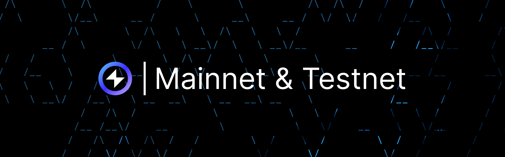

import MainnetButton from "../../src/components/mainnet-button";
import LasnaButton from "../../src/components/lasna-button";



## Overview

Reactive Mainnet is a proof-of-stake blockchain for the Reactive Network. Lasna Testnet serves as a testing environment, allowing developers to test and refine features before deploying them on the mainnet.

:::info[System Contract]
Reactive Mainnet and Lasna Testnet use the same system contract address: `0x0000000000000000000000000000000000fffFfF`
:::

## Reactive Mainnet

* Network Name — Reactive Mainnet
* RPC URL — https://mainnet-rpc.rnk.dev/
* Chain ID — 1597
* Currency Symbol — REACT
* Block Explorer URL — https://reactscan.net/

<MainnetButton />

<hr />

## Get Testnet REACT

To receive testnet REACT, send SepETH to the Reactive faucet contract on Ethereum Sepolia: `0x9b9BB25f1A81078C544C829c5EB7822d747Cf434`. The factor is 1/100, meaning you get 100 REACT for 1 SepETH sent. You can use MetaMask or any compatible wallet for the transfer.

You can exchange SepETH for lREACT using [ReacDEFI](https://reacdefi.app/markets), Reactive’s app. After selecting the desired amount of lREACT, the app automatically calculates the required SepETH. To complete the exchange, users must connect an Ethereum Sepolia wallet via MetaMask or Coinbase Wallet.

:::info[Important]
Do not send more than 5 SepETH per request, as doing so will cause you to lose the excess amount without receiving any additional REACT. The maximum that should be sent in a single transaction is 5 SepETH, which will yield 500 REACT.
:::

Alternatively, call the `request(address)` method on the Reactive faucet contract:

```bash
cast send 0x9b9BB25f1A81078C544C829c5EB7822d747Cf434 --rpc-url $SEPOLIA_RPC --private-key $SEPOLIA_PRIVATE_KEY "request(address)" $CONTRACT_ADDR --value 0.1ether
```

## Lasna Testnet

* Network Name — Reactive Lasna
* RPC URL — https://lasna-rpc.rnk.dev/
* Chain ID — 5318007
* Currency Symbol — REACT
* Block Explorer URL — https://lasna.reactscan.net

<LasnaButton />

