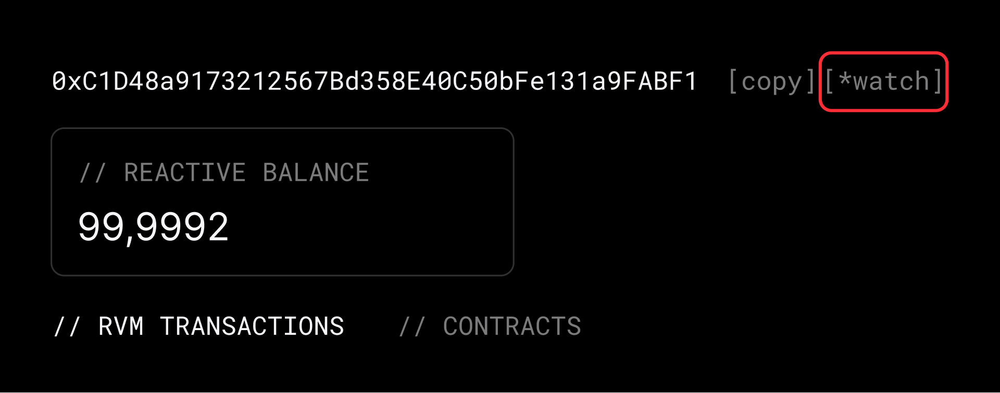

## Overview 

Reactscan is a tool that provides developers with an overview of the Reactive Network, including addresses, contracts, and transaction details.

Reactive Scan (Mainnet): TBA

Kopli Scan (Testnet): https://kopli.reactscan.net/

## My RVM Address

Your contracts and reactive transactions are located under your RVM address, which matches the deployment address.

[Learn more about ReactVM →](./reactvm.md)

## How to Find Your RVM Address

1. Navigate to the **Latest RVMs** section on the main page.
2. If your address doesn’t appear there, click the **View All RVMs** link to access the complete list of addresses.

3. Alternatively, use the search bar at the top of the page to locate your RVM address by entering it directly into the search field.
4. For direct access, you can open your RVM page by entering the following URL into your browser:  
   **https://reactscan-staging.prq-infra.net/rvm/ADDRESS**. Replace `ADDRESS` with your unique RVM address.

:::info[Good to Know]
Clicking the **[watch]** button on your RVM page moves your RVM address to the top of the list in the **Latest RVMs** section. This feature ensures quick and convenient access to your address directly from the main page. With your address pinned at the top, there's no need to manually search or enter it into the search bar — it will always be available.
:::

## RVM Page for Developers

On your RVM page, you can access a detailed view of the contracts you've deployed and the transactions you've initiated. Additionally, your balance in **REACT** is displayed for quick reference.

The **Main Transactions** page provides an overview of all transactions, organized into a table with the following columns: **Numb, Hash, Status, Time, Origin, Interacted With, Type,** and **Callbacks.** Here’s a detailed explanation of some key columns:

- **Type**: indicates the nature of the transaction. It can take two values - **DEPLOY** (transaction where a contract was deployed) and **REACT** (a transaction that reacts to an originating transaction).

- **Callbacks**: If a transaction generates callbacks, this column displays the exact number of callbacks triggered. For transactions with no callbacks, it simply shows **N/A**. You can click the transaction hash to open its details and view all associated callbacks.

- **Interacted With**: the contract initiating the transaction.

### Contracts

The **Contract** page provides a detailed view of all transactions related to a specific contract. Contract subscriptions can be viewed on this page, too.

:::info[Good to Know]
Your REACT balance is also visible on your RVM page for easy reference.
:::

The page displays the current **status** of your contract, either `Active` or `Inactive`. If your contract is inactive, you can follow the instructions on the [Debt Coverage](./economy.md#direct-transfers) page to activate it.

Similar to the **Main Transactions** page in your RVM, the contract page features a transaction table with the same columns: **Numb, Hash, Status, Time, Origin, Interacted With, Type,** and **Callbacks.** Here’s a breakdown of key columns:

- **Type** - it takes 2 values: DEPLOY, a transaction for your Contract deploy. REACT, a transaction reacting to the origin transaction

- **Callback -**  if the transaction did not generate any Callback - it will simply show N/A. However, if it did, it would show an exact number of callbacks. You can open the transaction (by clicking the number of transaction hash) and view them.

- **Interacted with** - you can quickly view what contract this transaction interacted with. Most of the time it will be the same as you contract.

### Subscriptions

Next to the transactions section, you can view the **subscriptions** associated with the contract. The subscription details include the following fields:

- **Subscription Status**: Active (The subscription is actively monitoring events on the origin chain) or Inactive (The subscription has stopped monitoring events).

- **Chain**: Specifies the origin chain where the subscription is monitoring events.

- **Criteria**: Origin Contract, topic_0, topic_1, topic_2, topic_3

[Learn more about Subscriptions →](./subscriptions.md)

## RVM Transaction

Each RVM displays a list of clickable, numbered transactions, with the most recent appearing at the top. Clicking on a transaction number or hash reveals detailed information.

At the top left, the **RVM address** is shown and can be copied. Below that, you’ll find the **contract status** and **timestamp**.

The **Transaction Overview** section includes:

* **Interacted With** – The contract address involved in the transaction.
* **Transaction Hash, Transaction Type, and Status** – Self-explanatory.
* **From** – The EOA associated with the RVM address.

Next, the **Gas Overview** displays gas consumption details.

If the transaction involves cross-chain activity (beyond contract deployment), two additional sections appear:

* **Destination Transaction** – Includes a clickable hash linking to the relevant chain.
* **Origin Transaction** – Shows the corresponding hash from the originating chain.

The **Origin Transaction Payload** contains: Origin Contract, Topic 0, Topic 1, Topic 2, Topic 3, Data, Block Number, OpCode.

Additionally, there may be log entries:

* **Log 1**: Event Signature Hash, Address, Topic 1, Topic 2, Topic 3, Log Data
* **Log 2**: Event Signature Hash, Callback Address, Chain ID, Contract, Gas Limit, Payload

## RNK Transactions

On the main page of Reactive Scan, the **\[Latest RNK Transactions\]** section is located at the bottom right. This section displays four key columns: transaction hash, transaction status, initiating contract, block timestamp.

Below this section, you'll find the **\[View All Transactions \>\>\]** button. Clicking it opens a real-time list of recent transactions, providing detailed information such as the transaction hash, status, timestamp, from (sender), and to (recipient).

To explore a specific transaction, either click on its hash in the list or add the transaction hash directly to the URL, like so: \`tx/0xea20f5cd4b2c01b549f58c2f109129987e95fc15560d56cab62f76262c571454\`. This will bring you to a detailed transaction view.

At the top left, the **transaction hash** is shown and can be copied. Below that, you’ll find the **transaction status**, **Transaction Type** (\`Legacy 0\`, \`AccessList 1\`, \`DynamicFee 2\`, \`Blob 3\`, and \`SetCode 4\`), and **Block Timestamp.**

The **Transaction Overview** section includes:

- **Interacted With**: The contract initiating the transaction.
- **Transaction Hash**, **Block Number**, **From (sender)** – Self-explanatory.
- **Value**: The amount transferred (if any).

Next, the **Gas Overview** displays gas consumption details.

- **Gas Used**: The amount of gas consumed by the transaction.
- **Gas Price**: The price paid per unit of gas.

If applicable, **logs** associated with the transaction may be displayed, containing: Event Signature Hash, Address, Topic 1, and Log Data. Logs may appear in two groups (Logs 1 and Logs 2\) if multiple events are triggered during the transaction.

