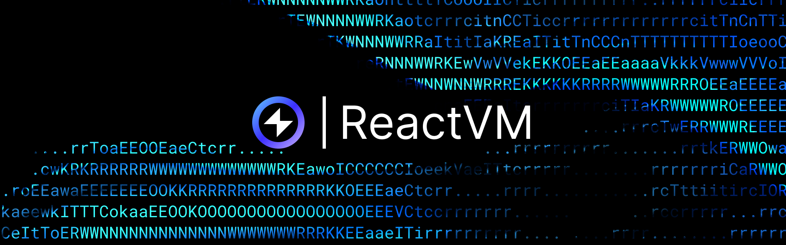
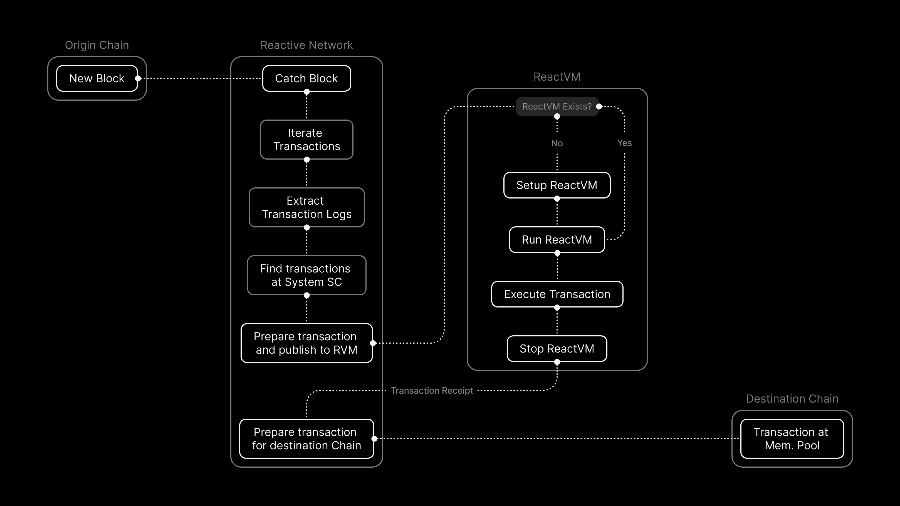

## Overview

ReactVM is a specialized type of EVM (Ethereum Virtual Machine) within the Reactive Network, designed to execute [Reactive Smart Contracts](./reactive-smart-contracts.md) (RSCs). It enables transactions within blocks to occur in random order across multiple threads, though the order is maintained within each ReactVM.

Technically, a ReactVM is an isolated execution environment within the Reactive Network. It activates when an event matches the RSC's subscription. While this approach adds some overhead, we have optimized it by separating the EVM from Geth, resulting in a ReactVM boot time of approximately 100μs, which is insignificant relative to the Network's processing capabilities.

## Reactive Network Processing Flow

The following diagram illustrates a process involving the interaction between an Origin Chain, the Reactive Network along with ReactVM, and a Destination Chain.

Here’s a step-by-step description of the process:

- **New Block in Origin Chain**: The process starts when a new block is created on the Origin Chain. This block contains multiple transactions.

- **Catch Block in Reactive Network**: The Reactive Network catches the newly created block from the Origin Chain.

- **Iterate Transactions**: The system iterates through all the transactions in the newly caught block.

- **Extract Transaction Logs**: Transaction logs are extracted from each transaction.

- **Find Transactions at System SC**: The system identifies specific transactions that need to be processed by the System Smart Contract (System SC).

- **Prepare Transaction and Publish to RVM**: The identified transactions are prepared and published to the ReactVM for further processing.

- **ReactVM Processing**:

  - **ReactVM Exists?**: The system checks if a ReactVM already exists.

  - **No**: If no ReactVM exists, the system sets up a new ReactVM.

  - **Run ReactVM**: The ReactVM is run to process the transaction.

  - **Execute Transaction**: The transaction is executed within the ReactVM.

  - **Stop ReactVM**: After executing the transaction, the ReactVM is stopped.

- **Transaction Receipt**: After the ReactVM completes processing the transaction, a transaction receipt is generated.

- **Prepare Transaction for Destination Chain**: Based on the transaction receipt, a new transaction is prepared for the Destination Chain.

- **Transaction at Mem. Pool in Destination Chain**: The prepared transaction is placed in the memory pool of the Destination Chain, ready to be included in a new block on that chain.

## Personal ReactVM

When you deploy a reactive smart contract, it will be assigned to a ReactVM. The ReactVM's address will match the EOA address used for the deployment. Every smart contract deployed to the reactive network will ultimately reside within your personal ReactVM. State can be shared within the ReactVM, allowing for interaction among contracts. While multiple RSCs can be deployed within a single ReactVM but generally discouraged.

## Calling subscribe()

Calling `subscribe()` or `unsubscribe()` from within an RVM will not produce any real effect. Use callbacks for interaction instead of directly invoking these functions within RVMs.

## State

The Reactive Network's state is determined by the collective states of individual ReactVMs and their connections to external blockchains. Each ReactVM's state is tied to specific block numbers and hashes from these chains, embedded within ReactVM blocks. This linkage is necessary for tracking and managing reorgs in the originating chains, enabling the network to respond to changes.

## Dual-State Environment

The Reactive Network features a dual-state environment to enable parallel transaction execution. While the EVM operates in a single-threaded manner, processing commands sequentially, the Reactive Network uses RVMs that can operate independently and in parallel on different cores or threads. This architecture supports the handling of various operations, including fund flows and token management, with each contract copy having its own state and execution context.

Each [Reactive Smart Contract](./reactive-smart-contracts.md) has two instances with different states, both initialized in the constructor. The ReactVM instance updates its state when an event occurs, while the Reactive Network instance updates its state when you manually call its functions.

As an example, in a governance contract, vote counts are maintained in the ReactVM state, whereas operational commands like `pause()` are part of the Reactive Network state. The primary logic resides within the ReactVM state.

[More on ReactVM →](../education/module-1/react-vm.md)
