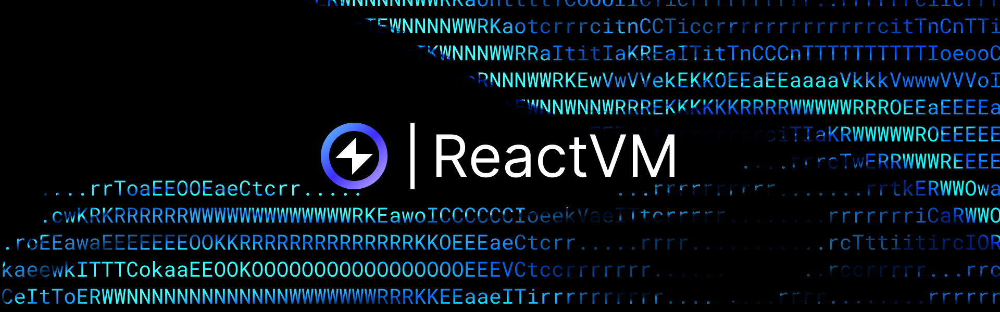
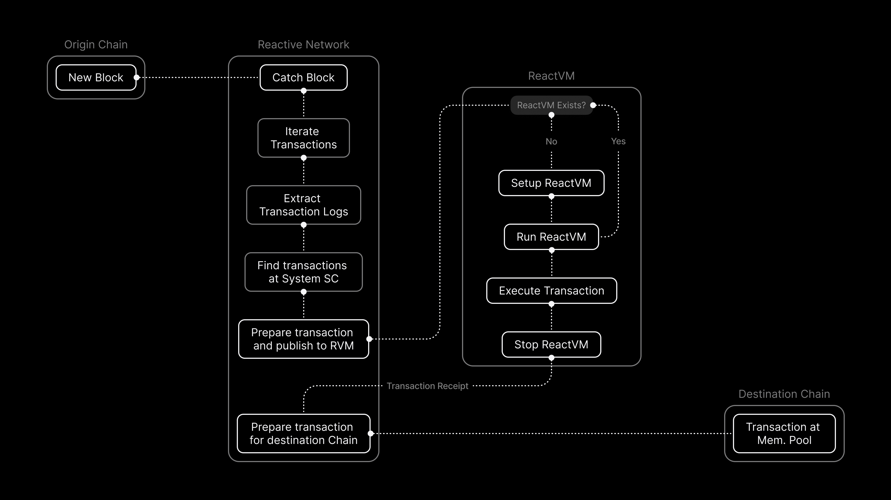

## Overview

ReactVM is a private execution environment within Reactive Network where [Reactive Contracts](./reactive-contracts) process events and execute logic. Each Reactive contract runs inside a dedicated ReactVM that activates when subscribed events occur. Event logs are delivered to the ReactVM, where the contract executes Solidity logic and determines whether callback transactions should be sent to destination chains. ReactVMs run independently and can execute in parallel, allowing Reactive contracts to process events while maintaining deterministic execution within each ReactVM.

## My ReactVM

Each deployed Reactive contract is assigned to a ReactVM derived from the deployer's address. Contracts deployed from the same EOA share the same ReactVM and can interact through shared state. Although multiple Reactive Contracts can be deployed within one ReactVM, separating contracts across ReactVMs is generally recommended.

### Calling subscribe()

Calling `subscribe()` or `unsubscribe()` inside ReactVM has no effect. Subscriptions must be managed through the Reactive Network instance of the contract. ReactVM contracts should communicate through callback transactions instead of direct subscription calls.

### Callback Identity

When a Reactive contract constructs a callback payload, the first argument must be reserved for the RVM ID. Developers pass `address(0)` as a placeholder in this slot, and Reactive Network automatically overwrites the first 160 bits with the deployer's address before the callback reaches the destination chain. This means callbacks always carry an authenticated origin that can't be forged by the contract itself.

The callback must include at least one argument, omitting the first slot entirely will cause the call to fail, since the system has no location to inject the RVM ID. Destination contracts can rely on this first argument to identify which ReactVM originated the callback.

Example from [Uniswap V2 Stop Order Demo](https://github.com/Reactive-Network/reactive-smart-contract-demos/blob/f1f85ab2a0a8f917b9b37a57c00be2ffc8ad5ad4/src/demos/uniswap-v2-stop-order/UniswapDemoStopOrderReactive.sol#L107):
  
```solidity
bytes memory payload = abi.encodeWithSignature(
    "stop(address,address,address,bool,uint256,uint256)",
    address(0), // Overwritten with the deployer's RVM ID
    pair,
    client,
    token0,
    coefficient,
    threshold
);
emit Callback(chain_id, stop_order, CALLBACK_GAS_LIMIT, payload);
```

## State

Each ReactVM maintains its own state based on processed events. ReactVM blocks include references to origin-chain block numbers and hashes, allowing Reactive Network to track and handle chain reorganizations. ReactVM states operate independently, and the overall Reactive Network state is the combination of all ReactVM states.

### Dual-State Environment

Each Reactive contract exists in two environments with separate state:

- **ReactVM State** — updated automatically when subscribed events occur
- **Reactive Network State** — updated when EOAs call contract functions

Both instances share the same bytecode but operate independently.

For example, in a governance contract:

- Vote counts may be maintained in ReactVM state
- Administrative actions such as `pause()` may exist in the Reactive Network state

Most automation logic runs inside ReactVM.

## Reactive Network Processing Flow

The diagram below shows how events from an origin chain are processed by Reactive Network and ReactVM, and how resulting actions are delivered to destination chains.



[More on ReactVM →](../education/module-1/react-vm.md)
