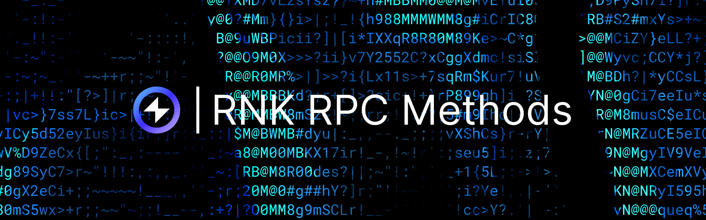

## Overview

This page documents **Reactive-specific JSON-RPC methods** available in Reactive Network’s (RNK) Geth version. Use them to inspect **ReactVM activity** (transactions, logs, code, storage), and to query network metadata like subscribers, filters, and origin-chain stats.

:::tip[Ethereum RPC Methods]
Reactive Network supports standard [Geth RPC methods](https://geth.ethereum.org/docs/interacting-with-geth/rpc). This page lists RNK extensions only.
:::

## rnk_getTransactionByHash

Returns a ReactVM transaction by RVM ID and transaction hash.

#### Parameters

1. **rvmId**: `DATA`, 20 Bytes — The ReactVM ID associated with the transaction.
2. **txHash**: `DATA`, 32 Bytes — The hash of the transaction to retrieve.

#### cURL

```bash
curl --location 'https://lasna-rpc.rnk.dev/' \
--header 'Content-Type: application/json' \
--data '{
  "jsonrpc": "2.0",
  "method": "rnk_getTransactionByHash",
  "params": [
    "0xa7d9aa89cbcd216900a04cdc13eb5789d643176a",
    "0xe32b9f60321f7a83ef9dda5daf8cf5b2f5cd523156ee484f417d62d84d1e3044"
  ],
  "id": 1
}' | jq
```

#### Response

Returns an object with the following fields:

- **hash** (`string`): The transaction hash.
- **number** (`string`): The transaction number (hex-encoded).
- **time** (`uint64`): The timestamp of when the transaction occurred.
- **root** (`string`): The Merkle root associated with the transaction.
- **limit** (`uint32`): The maximum gas limit set for the transaction.
- **used** (`uint32`): The gas used by the transaction.
- **type** (`uint8`): The transaction type (0 for `Legacy`, 1 for `AccessList`, 2 for `DynamicFee`, 3 for `Blob`, 4 for `SetCode`).
- **status** (`uint8`): The status of the transaction (1 for `Success`, 0 for `Failure`).
- **from** (`string`): The transaction initiator.
- **to** (`string`): The recipient address.
- **createContract** (`bool`): Indicates whether a contract was created during this transaction.
- **sessionId** (`uint64`): The block number where the transaction is located (hex-encoded).
- **refChainId** (`uint32`): The origin chain ID.
- **refTx** (`string`): The hash of the origin chain transaction that triggered this one.
- **refEventIndex** (`uint32`): The origin chain event opcode (0 for `LOG0`, 1 for `LOG1`, 2 for `LOG2`, 3 for `LOG3`, 4 for `LOG4`).
- **data** (`string`): The encoded transaction data in hexadecimal format.
- **rData** (`string`): Additional response data in hexadecimal format (if any).

```json
{
  "jsonrpc": "2.0",
  "id": 1,
  "result": {
    "hash": "0xe32b9f60321f7a83ef9dda5daf8cf5b2f5cd523156ee484f417d62d84d1e3044",
    "number": "0x9",
    "time": 1753427529,
    "root": "0x8df166bb5c9843696457dbdc5ab20ca1ab9acdd8703b6f1fd1f51766f34fad7d",
    "limit": 900000,
    "used": 47429,
    "type": 2,
    "status": 1,
    "from": "0xa7d9aa89cbcd216900a04cdc13eb5789d643176a",
    "to": "0x6ba34385d9018cfa3341db62b68b5a55839fe71f",
    "createContract": false,
    "sessionId": 109252,
    "refChainId": 11155111,
    "refTx": "0x52daf0ff44c50da56024f02530ba70fcf653ad11dadb1788b24b20fc824520f5",
    "refEventIndex": 328,
    "data": "0x0d152c2c00000000000000000000000000000000000000000000000000000000000000200000000000000000000000000000000000000000000000000000000000aa36a7000000000000000000000000c156ad2846d093e0ce4d31cf6d780357e9675dce8c5be1e5ebec7d5bd14f71427d1e84f3dd0314c0f7b2291e5b200ac8c7c3b925000000000000000000000000a7d9aa89cbcd216900a04cdc13eb5789d643176a00000000000000000000000065a9b8b03a2ef50356104cb594ba2c91223973de00000000000000000000000000000000000000000000000000000000000000000000000000000000000000000000000000000000000000000000000000000180000000000000000000000000000000000000000000000000000000000086da6000000000000000000000000000000000000000000000000000000000000000034570ac2a3bbfa2809982e69218a745aa83e1bff79b54e2a2ce10e5d6d4c5c00a52daf0ff44c50da56024f02530ba70fcf653ad11dadb1788b24b20fc824520f50000000000000000000000000000000000000000000000000000000000000148000000000000000000000000000000000000000000000000000000000000002000000000000000000000000000000000000000000000000000000000000003e8",
    "rData": "0x"
  }
}
```

## rnk_getTransactionByNumber

Returns a ReactVM transaction by RVM ID and transaction number.

#### Parameters

1. **rvmId**: `DATA`, 20 Bytes — The ReactVM ID associated with the transaction.
2. **txNumber**: `HEX` — The sequence number of the transaction to retrieve.

#### cURL

```bash
curl --location 'https://lasna-rpc.rnk.dev/' \
--header 'Content-Type: application/json' \
--data '{
  "jsonrpc": "2.0",
  "method": "rnk_getTransactionByNumber",
  "params": [
    "0xa7d9aa89cbcd216900a04cdc13eb5789d643176a",
    "0x9"
  ],
  "id": 1
}' | jq
```

#### Response

Returns an object with the following fields:

- **hash** (`string`): The transaction hash.
- **number** (`string`): The transaction number (hex-encoded).
- **time** (`uint64`): The timestamp of when the transaction occurred.
- **root** (`string`): The Merkle root associated with the transaction.
- **limit** (`uint32`): The maximum gas limit set for the transaction.
- **used** (`uint32`): The gas used by the transaction.
- **type** (`uint8`): The transaction type (0 for `Legacy`, 1 for `AccessList`, 2 for `DynamicFee`, 3 for `Blob`, 4 for `SetCode`).
- **status** (`uint8`): The status of the transaction (1 for `Success`, 0 for `Failure`).
- **from** (`string`): The transaction initiator.
- **to** (`string`): The recipient address.
- **createContract** (`bool`): Indicates whether a contract was created during this transaction.
- **sessionId** (`uint64`): The block number where the transaction is located (hex-encoded).
- **refChainId** (`uint32`): The origin chain ID.
- **refTx** (`string`): The hash of the origin chain transaction that triggered this one.
- **refEventIndex** (`uint32`): The origin chain event opcode (0 for `LOG0`, 1 for `LOG1`, 2 for `LOG2`, 3 for `LOG3`, 4 for `LOG4`).
- **data** (`string`): The encoded transaction data in hexadecimal format.
- **rData** (`string`): Additional response data in hexadecimal format (if any).

```json
{
  "jsonrpc": "2.0",
  "id": 1,
  "result": {
    "hash": "0xe32b9f60321f7a83ef9dda5daf8cf5b2f5cd523156ee484f417d62d84d1e3044",
    "number": "0x9",
    "time": 1753427529,
    "root": "0x8df166bb5c9843696457dbdc5ab20ca1ab9acdd8703b6f1fd1f51766f34fad7d",
    "limit": 900000,
    "used": 47429,
    "type": 2,
    "status": 1,
    "from": "0xa7d9aa89cbcd216900a04cdc13eb5789d643176a",
    "to": "0x6ba34385d9018cfa3341db62b68b5a55839fe71f",
    "createContract": false,
    "sessionId": 109252,
    "refChainId": 11155111,
    "refTx": "0x52daf0ff44c50da56024f02530ba70fcf653ad11dadb1788b24b20fc824520f5",
    "refEventIndex": 328,
    "data": "0x0d152c2c00000000000000000000000000000000000000000000000000000000000000200000000000000000000000000000000000000000000000000000000000aa36a7000000000000000000000000c156ad2846d093e0ce4d31cf6d780357e9675dce8c5be1e5ebec7d5bd14f71427d1e84f3dd0314c0f7b2291e5b200ac8c7c3b925000000000000000000000000a7d9aa89cbcd216900a04cdc13eb5789d643176a00000000000000000000000065a9b8b03a2ef50356104cb594ba2c91223973de00000000000000000000000000000000000000000000000000000000000000000000000000000000000000000000000000000000000000000000000000000180000000000000000000000000000000000000000000000000000000000086da6000000000000000000000000000000000000000000000000000000000000000034570ac2a3bbfa2809982e69218a745aa83e1bff79b54e2a2ce10e5d6d4c5c00a52daf0ff44c50da56024f02530ba70fcf653ad11dadb1788b24b20fc824520f50000000000000000000000000000000000000000000000000000000000000148000000000000000000000000000000000000000000000000000000000000002000000000000000000000000000000000000000000000000000000000000003e8",
    "rData": "0x"
  }
}
```

## rnk_getTransactionLogs

Returns the logs emitted by a ReactVM transaction number.

#### Parameters

1. **rvmId**: `DATA`, 20 Bytes — The ReactVM ID for which transaction logs are being queried.
2. **txNumber**: `HEX` — The transaction number for which logs are requested.

#### cURL

```bash
curl --location 'https://lasna-rpc.rnk.dev/' \
--header 'Content-Type: application/json' \
--data '{
  "jsonrpc": "2.0",
  "method": "rnk_getTransactionLogs",
  "params": [
    "0xA7D9AA89cbcd216900a04Cdc13eB5789D643176a",
    "0x9"
  ],
  "id": 1
}' | jq
```

#### Response

Returns an array of objects with the following fields:

- **txHash** (`string`): The transaction hash.
- **address** (`string`): The contract address that generated the transaction.
- **topics** (`string[]`): An array of indexed event topics.
   - **topics[0]**: The event signature hash.
   - **topics[1]**: The first indexed parameter (if applicable).
   - **topics[2]**: The second indexed parameter (if applicable).
   - **topics[3]**: The third indexed parameter (if applicable).
- **data** (`string`): The non-indexed event data in hexadecimal format.

```json
{
  "jsonrpc": "2.0",
  "id": 1,
  "result": [
    {
      "txHash": "0xe32b9f60321f7a83ef9dda5daf8cf5b2f5cd523156ee484f417d62d84d1e3044",
      "address": "0x6ba34385d9018cfa3341db62b68b5a55839fe71f",
      "topics": [
        "0x8dd725fa9d6cd150017ab9e60318d40616439424e2fade9c1c58854950917dfc",
        "0x0000000000000000000000000000000000000000000000000000000000aa36a7",
        "0x000000000000000000000000fc2236a0d3421473676c4c422046fbc4f1afdffe",
        "0x00000000000000000000000000000000000000000000000000000000000f4240"
      ],
      "data": "0x000000000000000000000000000000000000000000000000000000000000002000000000000000000000000000000000000000000000000000000000000000a42f90252d000000000000000000000000000000000000000000000000000000000000000000000000000000000000000065a9b8b03a2ef50356104cb594ba2c91223973de000000000000000000000000a7d9aa89cbcd216900a04cdc13eb5789d643176a000000000000000000000000c156ad2846d093e0ce4d31cf6d780357e9675dce00000000000000000000000000000000000000000000000000000000000003e800000000000000000000000000000000000000000000000000000000"
    }
  ]
}
```

## rnk_getHeadNumber

Returns the latest transaction number for a given ReactVM.

#### Parameters

1. **rvmId**: `DATA`, 20 Bytes — The ReactVM ID for which the latest transaction number is requested.

#### cURL

```bash
curl --location 'https://lasna-rpc.rnk.dev/' \
--header 'Content-Type: application/json' \
--data '{
  "jsonrpc": "2.0",
  "method": "rnk_getHeadNumber",
  "params": [
    "0xA7D9AA89cbcd216900a04Cdc13eB5789D643176a"
  ],
  "id": 1
}' | jq
```

#### Response

Returns an object with the following field:

- **result** (`string`): the latest transaction number (hex-encoded).

```json
{
  "jsonrpc": "2.0",
  "id": 1,
  "result": "0x9"
}
```

## rnk_getTransactions

Returns a range of transactions from a given starting number.

#### Parameters

1. **rvmId**: `DATA`, 20 Bytes — The ReactVM ID for which transactions are being retrieved.
2. **from**: `HEX` — The starting transaction number.
3. **limit**: `HEX` — The maximum number of transactions to retrieve.

#### cURL

```bash
curl --location 'https://lasna-rpc.rnk.dev/' \
--header 'Content-Type: application/json' \
--data '{
  "jsonrpc": "2.0",
  "method": "rnk_getTransactions",
  "params": [
    "0xA7D9AA89cbcd216900a04Cdc13eB5789D643176a",
    "0x9",
    "0x1"
  ],
  "id": 1
}' | jq
```

#### Response

Returns an object with the following fields:

- **hash** (`string`): The transaction hash.
- **number** (`string`): The transaction number (hex-encoded).
- **time** (`uint64`): The timestamp of when the transaction occurred.
- **root** (`string`): The Merkle root associated with the transaction.
- **limit** (`uint32`): The maximum gas limit set for the transaction.
- **used** (`uint32`): The gas used by the transaction.
- **type** (`uint8`): The transaction type (0 for `Legacy`, 1 for `AccessList`, 2 for `DynamicFee`, 3 for `Blob`, 4 for `SetCode`).
- **status** (`uint8`): The status of the transaction (1 for `Success`, 0 for `Failure`).
- **from** (`string`): The transaction initiator.
- **to** (`string`): The recipient address.
- **createContract** (`bool`): Indicates whether a contract was created during this transaction.
- **sessionId** (`uint64`): The block number where the transaction is located (hex-encoded).
- **refChainId** (`uint32`): The origin chain ID.
- **refTx** (`string`): The hash of the origin chain transaction that triggered this one.
- **refEventIndex** (`uint32`): The origin chain event opcode (0 for `LOG0`, 1 for `LOG1`, 2 for `LOG2`, 3 for `LOG3`, 4 for `LOG4`).
- **data** (`string`): The encoded transaction data in hexadecimal format.
- **rData** (`string`): Additional response data in hexadecimal format (if any).

```json
{
  "jsonrpc": "2.0",
  "id": 1,
  "result": [
    {
      "hash": "0xe32b9f60321f7a83ef9dda5daf8cf5b2f5cd523156ee484f417d62d84d1e3044",
      "number": "0x9",
      "time": 1753427529,
      "root": "0x8df166bb5c9843696457dbdc5ab20ca1ab9acdd8703b6f1fd1f51766f34fad7d",
      "limit": 900000,
      "used": 47429,
      "type": 2,
      "status": 1,
      "from": "0xa7d9aa89cbcd216900a04cdc13eb5789d643176a",
      "to": "0x6ba34385d9018cfa3341db62b68b5a55839fe71f",
      "createContract": false,
      "sessionId": 109252,
      "refChainId": 11155111,
      "refTx": "0x52daf0ff44c50da56024f02530ba70fcf653ad11dadb1788b24b20fc824520f5",
      "refEventIndex": 328,
      "data": "0x0d152c2c00000000000000000000000000000000000000000000000000000000000000200000000000000000000000000000000000000000000000000000000000aa36a7000000000000000000000000c156ad2846d093e0ce4d31cf6d780357e9675dce8c5be1e5ebec7d5bd14f71427d1e84f3dd0314c0f7b2291e5b200ac8c7c3b925000000000000000000000000a7d9aa89cbcd216900a04cdc13eb5789d643176a00000000000000000000000065a9b8b03a2ef50356104cb594ba2c91223973de00000000000000000000000000000000000000000000000000000000000000000000000000000000000000000000000000000000000000000000000000000180000000000000000000000000000000000000000000000000000000000086da6000000000000000000000000000000000000000000000000000000000000000034570ac2a3bbfa2809982e69218a745aa83e1bff79b54e2a2ce10e5d6d4c5c00a52daf0ff44c50da56024f02530ba70fcf653ad11dadb1788b24b20fc824520f50000000000000000000000000000000000000000000000000000000000000148000000000000000000000000000000000000000000000000000000000000002000000000000000000000000000000000000000000000000000000000000003e8",
      "rData": "0x"
    }
  ]
}
```

## rnk_getRnkAddressMapping

Returns the ReactVM ID associated with a Reactive Network contract address.

#### Parameters

1. **reactNetworkContrAddr**: `DATA`, 20 Bytes — The address of the Reactive Network contract for which the RVM ID is being requested.

#### cURL

```bash
curl --location 'https://lasna-rpc.rnk.dev/' \
--header 'Content-Type: application/json' \
--data '{
  "jsonrpc": "2.0",
  "method": "rnk_getRnkAddressMapping",
  "params": [
    "0xc3e185561D2a8b04F0Fcd104A562f460D6cC503c"
  ],
  "id": 1
}' | jq
```

#### Response

Returns an object with the following field:

- **rvmId** (`string`): The unique identifier of the RVM associated with the given contract.

```json
{
  "jsonrpc": "2.0",
  "id": 1,
  "result": {
    "rvmId": "0xa7d9aa89cbcd216900a04cdc13eb5789d643176a"
  }
}
```

## rnk_getStat

Returns aggregated statistics per origin chain.

#### Parameters

This method does not require any input parameters.

#### cURL

```bash
curl --location 'https://lasna-rpc.rnk.dev/' \
--header 'Content-Type: application/json' \
--data '{
  "jsonrpc": "2.0",
  "method": "rnk_getStat",
  "params": [],
  "id": 1
}' | jq
```

#### Response

Returns an object with the following fields:

- **chainId** (`object`): The statistics for a specific origin chain.
  - **txCount** (`uint64`): The total number of transactions processed from this origin chain.
  - **eventCount** (`uint64`): The total number of events emitted from this origin chain.

```json
{
  "jsonrpc": "2.0",
  "id": 1,
  "result": {
    "origin": {
      "11155111": {
        "txCount": 20807136,
        "eventCount": 60122691
      },
      "43113": {
        "txCount": 1244787,
        "eventCount": 4929280
      },
      "5318007": {
        "txCount": 160035,
        "eventCount": 169908
      },
      "80002": {
        "txCount": 450072,
        "eventCount": 1786648
      },
      "84532": {
        "txCount": 14266438,
        "eventCount": 122218657
      },
      "97": {
        "txCount": 3787433,
        "eventCount": 9384761
      }
    }
  }
}
```

## rnk_getVms

Returns information about all known ReactVMs.

#### Parameters

This method does not require any input parameters.

#### cURL

```bash
curl --location 'https://lasna-rpc.rnk.dev/' \
--header 'Content-Type: application/json' \
--data '{
  "jsonrpc": "2.0",
  "method": "rnk_getVms",
  "params": [],
  "id": 1
}' | jq
```

#### Response

Returns a list of active RVMs with the following fields:

- **rvmId** (`string`): The unique identifier of the RVM.
- **lastTxNumber** (`string`): The last transaction number executed by this RVM (hex-encoded).
- **contracts** (`uint32`): The number of contracts associated with this RVM.

```json
{
  "jsonrpc": "2.0",
  "id": 1,
  "result": [
    {
      "rvmId": "0xa7d9aa89cbcd216900a04cdc13eb5789d643176a",
      "lastTxNumber": "0x9",
      "contracts": 4
    },
    {
      "rvmId": "0xfe5a45db052489cbc16d882404bcfa4f6223a55e",
      "lastTxNumber": "0x2",
      "contracts": 1
    },
    {
      "rvmId": "0x49abe186a9b24f73e34ccae3d179299440c352ac",
      "lastTxNumber": "0x2d6",
      "contracts": 1
    },
    {
      "rvmId": "0x941b727ad8acf020558ce58cd7cb65b48b958db1",
      "lastTxNumber": "0x7",
      "contracts": 3
    },
    {
      "rvmId": "0xc1d48a9173212567bd358e40c50bfe131a9fabf1",
      "lastTxNumber": "0x3c",
      "contracts": 28
    }
  ]
}
```

## rnk_getVm

Returns information about a specific ReactVM.

#### Parameters

1. **rvmId**: `DATA`, 20 Bytes — The unique identifier of the RVM for which information is requested.

#### cURL

```bash
curl --location 'https://lasna-rpc.rnk.dev/' \
--header 'Content-Type: application/json' \
--data '{
  "jsonrpc": "2.0",
  "method": "rnk_getVm",
  "params": ["0xA7D9AA89cbcd216900a04Cdc13eB5789D643176a"],
  "id": 1
}' | jq
```

#### Response

Returns an object with the following fields:

- **rvmId** (`string`): The unique identifier of the RVM.
- **lastTxNumber** (`string`): The last transaction number executed by this RVM (hex-encoded).
- **contracts** (`uint32`): The number of contracts created by this RVM.

```json
{
  "jsonrpc": "2.0",
  "id": 1,
  "result": {
    "rvmId": "0xa7d9aa89cbcd216900a04cdc13eb5789d643176a",
    "lastTxNumber": "0x9",
    "contracts": 4
  }
}
```

## rnk_getSubscribers

Returns subscriptions associated with a given ReactVM.

#### Parameters

1. **rvmId**: `DATA`, 20 Bytes — The unique identifier of the RVM for which subscriber information is requested.

#### cURL

```bash
curl --location 'https://lasna-rpc.rnk.dev/' \
--header 'Content-Type: application/json' \
--data '{
  "jsonrpc": "2.0",
  "method": "rnk_getSubscribers",
  "params": ["0xA7D9AA89cbcd216900a04Cdc13eB5789D643176a"],
  "id": 1
}' | jq
```

#### Response

Returns a list of RVM-related contract events with the following fields:

- **uid** (`string`): The unique identifier of the subscription.
- **chainId** (`uint32`): The blockchain ID of the subscribed contract.
- **contract** (`string`): The address of the subscribed contract on the origin chain.
- **topics** (`array`): An array of event topics (some may be `null` if not indexed).
- **rvmId** (`string`): The unique identifier of the RVM.
- **rvmContract** (`string`): The address of the RVM contract handling this subscription.

```json
{
  "jsonrpc": "2.0",
  "id": 1,
  "result": [
    {
      "uid": "7d45d863e45da3a7e60d2cc5bdd7088f",
      "chainId": 11155111,
      "contract": "0xe1bac3039ea58fee2abce7a8cbcc4b0c8ad030c5",
      "topics": [
        "0x1c411e9a96e071241c2f21f7726b17ae89e3cab4c78be50e062b03a9fffbbad1",
        null,
        null,
        null
      ],
      "rvmId": "0xa7d9aa89cbcd216900a04cdc13eb5789d643176a",
      "rvmContract": "0xc3e185561d2a8b04f0fcd104a562f460d6cc503c"
    },
    {
      "uid": "d979ded638e32915f59ae9bfb3b70e6c",
      "chainId": 11155111,
      "contract": "0x7acbd40c79da73b671d47618135486eef39ec6e3",
      "topics": [
        "0x9996f0dd09556ca972123b22cf9f75c3765bc699a1336a85286c7cb8b9889c6b",
        null,
        null,
        null
      ],
      "rvmId": "0xa7d9aa89cbcd216900a04cdc13eb5789d643176a",
      "rvmContract": "0xc3e185561d2a8b04f0fcd104a562f460d6cc503c"
    },
    {
      "uid": "62968b91e4122e0c03a08f38b31a1ae4",
      "chainId": 11155111,
      "contract": "0x16102fe2caa2610a99beaa5f4fb6e230825b1096",
      "topics": [
        "0x1c411e9a96e071241c2f21f7726b17ae89e3cab4c78be50e062b03a9fffbbad1",
        null,
        null,
        null
      ],
      "rvmId": "0xa7d9aa89cbcd216900a04cdc13eb5789d643176a",
      "rvmContract": "0x2afafd298b23b62760711756088f75b7409f5967"
    }
  ]
}
```

## rnk_getCode

Retrieves the deployed contract bytecode for a given ReactVM at a specific state.

#### Parameters

1. **rvmId**: `DATA`, 20 bytes — The unique identifier of the RVM.
2. **contract** `DATA`, 20 bytes — The Reactive contract address.
3. **txNumberOrHash** `HEX | TAG` — Specifies the state at which the contract code is retrieved. Accepts either a block number (`HEX`) or a tag (`"latest"`, `"earliest"`, `"pending"`).

#### cURL

```bash
curl --location 'https://lasna-rpc.rnk.dev/' \
--header 'Content-Type: application/json' \
--data '{
  "jsonrpc": "2.0",
  "method": "rnk_getCode",
  "params": [
    "0xA7D9AA89cbcd216900a04Cdc13eB5789D643176a",
    "0xA79933a054c8Ad29ae55bEe769Cd9d8228F03520",
    "0x22"
    ],
  "id": 1
}' | jq
```

#### Response

Returns the bytecode of a contract:

- **bytecode** (`string`) — The contract bytecode in hexadecimal format. 

```json
{
  "jsonrpc": "2.0",
  "id": 1,
  "result": "0x60806040526004361061007e575f3560e01c80638456cb591161004d5780638456cb591461010757806396f90b451461011d578063995e4b9814610147578063c290d6911461017157610085565b806303ac52b314610089578063046f7da2146100b3578063...efb147864736f6c634300081c0033",
  
}
```

## rnk_getStorageAt

Returns the value stored at a given 32-byte storage key for a contract inside a specific ReactVM, evaluated at a chosen state.

#### Parameters

1. **rvmId**: `DATA`, 20 bytes — The unique identifier of the RVM.
2. **address**: `DATA`, 20 bytes — The address of the contract from which to retrieve the storage value.
3. **hexKey**: `DATA`, 32 bytes — The hexadecimal key for which the storage value is being queried.
4. **txNumberOrHash**: `HEX | TAG` — Specifies the block number or hash at which the storage value is queried. Accepts either a block number (`HEX`) or a tag (`"latest"`, `"earliest"`, `"pending"`).

#### cURL

```bash
curl --location 'https://lasna-rpc.rnk.dev/' \
--header 'Content-Type: application/json' \
--data '{
  "jsonrpc": "2.0",
  "method": "rnk_getStorageAt",
  "params": [
    "0xA7D9AA89cbcd216900a04Cdc13eB5789D643176a",
    "0xA79933a054c8Ad29ae55bEe769Cd9d8228F03520",
    "0x0000000000000000000000000000000000000000000000000000000000000002",
    "0xb707d1ddcea3fce0a966fde10f412b4c9cdedf99c67a470a7bbcb2407e1c8bcc"
  ],
  "id": 1
}' | jq
```

#### Response

Returns the storage value:

**result** (`string`): A hexadecimal string representing the storage data.

```json
{
  "jsonrpc": "2.0",
  "id": 1,
  "result": "0x000000000000000000000000a7d9aa89cbcd216900a04cdc13eb5789d643176a"
}
```

## rnk_call

Runs a read-only EVM call against a contract inside a ReactVM at a chosen state (no transaction is created).

#### Parameters

1. **rvmId**: `DATA`, 20 bytes — The unique identifier of the RVM.
2. **args**: `OBJECT` — The transaction arguments, including the contract method and parameters. Should include:
    - `to`: `DATA`, 20 bytes — The address of the contract.
    - `data`: `DATA` — The call data, representing the method and parameters.
    - `from`: `DATA`, 20 bytes, (optional) — The address from which the call is simulated. If omitted, the simulation assumes the call is made from an empty address (0x000...).
    - `gas`: `HEX`, (optional) — The maximum amount of gas allowed for the simulation. If omitted, a default value is used.
    - `gasPrice`: `HEX`, (optional) — The price of gas (in RVM-specific units) for the simulation. 
    - `value`: `HEX`, (optional) — The amount of tokens (e.g., Ether) to send along with the call. For non-payable functions, this should be 0.
3. **txNumberOrHash**: `HEX | TAG` — Specifies the block number or hash to use for simulating the call. Accepts either a block number (`HEX`) or a tag (`"latest"`, `"earliest"`, `"pending"`).

#### cURL

```bash
curl --location 'https://lasna-rpc.rnk.dev/' \
--header 'Content-Type: application/json' \
--data '{
  "jsonrpc": "2.0",
  "method": "rnk_call",
  "params": [
    "0xA7D9AA89cbcd216900a04Cdc13eB5789D643176a",
    {
      "to": "0xA79933a054c8Ad29ae55bEe769Cd9d8228F03520",
      "data": "0x96f90b45"
    },
    "latest"
  ],
  "id": 1
}' | jq
```

#### Response

Returns the result of the simulated call:

**result** (`string`): The simulated result of the contract call, returned as a hexadecimal string.

```json
{
  "jsonrpc": "2.0",
  "id": 1,
  "result": "0x0000000000000000000000000000000000000000000000000000000000027a94"
}
```

## rnk_getBlockRvms

Returns the ReactVMs that produced at least one ReactVM transaction in a given Reactive Network block, plus per-RVM counters.

#### Parameters

1. **blockN**: `uint64` – The block number for which to retrieve the RVM history.

#### cURL

```bash
curl --location 'https://lasna-rpc.rnk.dev/' \
--header 'Content-Type: application/json' \
--data '{
  "jsonrpc": "2.0",
  "method": "rnk_getBlockRvms",
  "params": [
    109252
  ],
  "id": 1
}' | jq
```

#### Response

Returns an array of objects representing RVMs that were active in the given block. Each object contains:

- **rvmId** (`string`): The unique identifier of each RVM.
- **headTxNumber** (`string`): The transaction with the greatest number in the session (hex-encoded).
- **prevRnkBlockId** (`uint64`): The previous block number in which the RVM session was active.
- **txCount** (`uint32`): The total number of transactions in the current RVM session.

```json
{
  "jsonrpc": "2.0",
  "id": 1,
  "result": [
    {
      "rvmId": "0xa7d9aa89cbcd216900a04cdc13eb5789d643176a",
      "headTxNumber": "0x9",
      "prevRnkBlockId": 109244,
      "txCount": 1
    }
  ]
}
```

## rnk_getFilters

Lists all active log filters (subscriptions) currently registered on Reactive Network.

#### Parameters

This method does not require any input parameters.

#### cURL

```bash
curl --location 'https://lasna-rpc.rnk.dev/' \
--header 'Content-Type: application/json' \
--data '{
  "jsonrpc": "2.0",
  "method": "rnk_getFilters",
  "params": [],
  "id": 1
}' | jq
```

#### Response

Returns an array of filter objects. Each filter object contains the following fields:

- **uid** (`string`): The unique identifier for the filter.
- **chainId** (`uint32`): The chain ID on which the filter is active.
- **contract** (`string`): The address of the contract the filter is listening to.
- **topics** (`array[string | null]`): An array of up to 4 log topics (from `topic_0` to `topic_3`) used for event filtering. Unused topics are null.
- **configs** (`array[object]`): An array of configuration objects for reactive contracts and their associated ReactVMs.
- **contract** (`string`): The reactive contract address.
- **rvmId** (`string`): The ReactVM ID where the reactive contract resides.
- **active** (`bool`): Indicates whether the subscription/filter is active.

```json
{
  "jsonrpc": "2.0",
  "id": 1,
  "result": [
    {
      "Uid": "4603da7efc5d1b77f7fa5b0bfd949d6c",
      "ChainId": 11155111,
      "Contract": "0x1e8db093a0cc38302f5822a451809bfd692ff695",
      "Topics": [
        "0x8cabf31d2b1b11ba52dbb302817a3c9c83e4b2a5194d35121ab1354d69f6a4cb",
        null,
        null,
        null
      ],
      "Configs": [
        {
          "Contract": "0xac9163487ca9c5189766706595cbef9b75c1c8e9",
          "RvmId": "0xc1d48a9173212567bd358e40c50bfe131a9fabf1",
          "Active": true
        }
      ]
    },
    {
      "Uid": "b91cf2f05464d578896164d4e6c0c854",
      "ChainId": 11155111,
      "Contract": "0x5e3eeda090eea783af9ee8d81147d9417bb97b38",
      "Topics": [
        "0x8cabf31d2b1b11ba52dbb302817a3c9c83e4b2a5194d35121ab1354d69f6a4cb",
        null,
        null,
        null
      ],
      "Configs": [
        {
          "Contract": "0xe3cf3d848557974d3abf8e7c15c3a534187f1c6f",
          "RvmId": "0xc1d48a9173212567bd358e40c50bfe131a9fabf1",
          "Active": true
        }
      ]
    },
    {
      "Uid": "0fce746e0305e2fc2e425735ea71a52f",
      "ChainId": 11155111,
      "Contract": "0x0102e0a1792b8805f16b6ec27978f6898b865475",
      "Topics": [
        "0x9bffe4738606691ddfa5e5d28208b6ef74537676b39ddb9854b7854a62df0692",
        null,
        null,
        null
      ],
      "Configs": [
        {
          "Contract": "0xe4d4b0c2f8502a98e68c6f0ef2483214c106fd82",
          "RvmId": "0x941b727ad8acf020558ce58cd7cb65b48b958db1",
          "Active": true
        }
      ]
    }
  ]
}
```