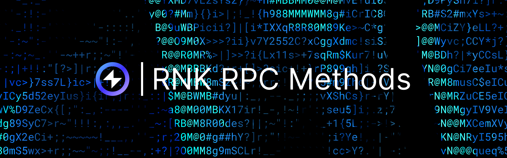

## Overview

This page documents **Reactive-specific JSON-RPC methods** available in Reactive Network's Geth version. Use them to query active event filters, individual filter details, and block-level reactive transaction sequences.

## rnk_getFilters

Returns all active event filters currently registered on Reactive Network, along with the current filter version.

#### Parameters

This method does not require any input parameters.

#### cURL

```bash
curl --location 'https://lasna-rpc.rnk.dev/' \
--header 'Content-Type: application/json' \
--data '{
  "jsonrpc": "2.0",
  "method": "rnk_getFilters",
  "params": [],
  "id": 1
}' | jq
```

#### Response

Returns an object with the following fields:

- **version** (`uint32`): The current version of the filter set. Incremented whenever filters are added or removed.
- **topicFilters** (`array[object]`): A list of active topic filters. Each filter object contains:
    - **uid** (`string`): The unique identifier of the filter, generated by the contract.
    - **chainId** (`uint64`): The origin chain ID. `0` matches any chain.
    - **contract** (`string | null`): The address of the origin contract being monitored. Null address matches any contract.
    - **topics** (`array[string | null]`): An array of up to 4 log topics (`topic_0` through `topic_3`) used for event filtering. Null entries match any topic.
    - **configs** (`array[object]`): An array of subscription configurations. Each config contains:
        - **contract** (`string`): The Reactive contract address subscribed to this filter.
        - **active** (`bool`): Whether the subscription is currently active.

```json
{
  "jsonrpc": "2.0",
  "id": 1,
  "result": {
    "version": 42,
    "topicFilters": [
      {
        "uid": "4603da7efc5d1b77f7fa5b0bfd949d6c",
        "chainId": 11155111,
        "contract": "0x1e8db093a0cc38302f5822a451809bfd692ff695",
        "topics": [
          "0x8cabf31d2b1b11ba52dbb302817a3c9c83e4b2a5194d35121ab1354d69f6a4cb",
          null,
          null,
          null
        ],
        "configs": [
          {
            "contract": "0xac9163487ca9c5189766706595cbef9b75c1c8e9",
            "active": true
          }
        ]
      }
    ]
  }
}
```

## rnk_getFilterById

Returns details of a specific event filter by its unique identifier.

#### Parameters

1. **filterId**: `string` — The unique identifier of the filter to retrieve.

#### cURL

```bash
curl --location 'https://lasna-rpc.rnk.dev/' \
--header 'Content-Type: application/json' \
--data '{
  "jsonrpc": "2.0",
  "method": "rnk_getFilterById",
  "params": [
    "4603da7efc5d1b77f7fa5b0bfd949d6c"
  ],
  "id": 1
}' | jq
```

#### Response

Returns a filter object with the following fields:

- **uid** (`string`): The unique identifier of the filter, generated by the contract.
- **chainId** (`uint64`): The origin chain ID. `0` matches any chain.
- **contract** (`string | null`): The address of the origin contract being monitored. Null address matches any contract.
- **topics** (`array[string | null]`): An array of up to 4 log topics (`topic_0` through `topic_3`) used for event filtering. Null entries match any topic.
- **configs** (`array[object]`): An array of subscription configurations. Each config contains:
    - **contract** (`string`): The Reactive contract address subscribed to this filter.
    - **active** (`bool`): Whether the subscription is currently active.

```json
{
  "jsonrpc": "2.0",
  "id": 1,
  "result": {
    "uid": "4603da7efc5d1b77f7fa5b0bfd949d6c",
    "chainId": 11155111,
    "contract": "0x1e8db093a0cc38302f5822a451809bfd692ff695",
    "topics": [
      "0x8cabf31d2b1b11ba52dbb302817a3c9c83e4b2a5194d35121ab1354d69f6a4cb",
      null,
      null,
      null
    ],
    "configs": [
      {
        "contract": "0xac9163487ca9c5189766706595cbef9b75c1c8e9",
        "active": true
      }
    ]
  }
}
```

## rnk_getBlockSequences

Returns the reactive transaction sequences processed in a given Reactive Network block. Each sequence represents a batch of reactive transactions triggered by origin-chain events.

#### Parameters

1. **blockNumber**: `uint64` — The block number for which to retrieve reactive transaction sequences.

#### cURL

```bash
curl --location 'https://lasna-rpc.rnk.dev/' \
--header 'Content-Type: application/json' \
--data '{
  "jsonrpc": "2.0",
  "method": "rnk_getBlockSequences",
  "params": [
    109252
  ],
  "id": 1
}' | jq
```

#### Response

Returns an object with the following fields:

- **stateRoot** (`string`): The Merkle state root after processing the sequences.
- **fromSeq** (`uint64`): The starting sequence number in this block.
- **toSeq** (`uint64`): The ending sequence number in this block.
- **filtersVersion** (`uint32`): The filter set version used when processing this block.
- **gasUsed** (`uint32`): The total gas consumed by reactive transactions in this block.
- **reactiveTxCount** (`uint16`): The number of reactive transactions executed in this block.
- **sequences** (`array`): The RLP-encoded reactive transaction sequences.

```json
{
  "jsonrpc": "2.0",
  "id": 1,
  "result": {
    "stateRoot": "0x8df166bb5c9843696457dbdc5ab20ca1ab9acdd8703b6f1fd1f51766f34fad7d",
    "fromSeq": 1024,
    "toSeq": 1026,
    "filtersVersion": 42,
    "gasUsed": 142857,
    "reactiveTxCount": 3,
    "sequences": "0x..."
  }
}
```