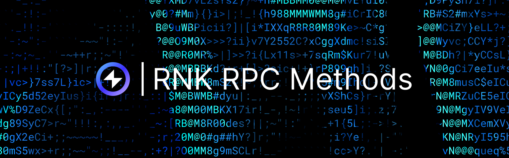

## Overview

This page provides an overview of the RPC methods specific to the Reactive Network's Geth version, essential for interacting with nodes and ReactVMs within the Reactive Network (RNK). These methods enable transaction retrieval, log access, callback information, and more. Below, you will find a detailed description of each method, including its parameters, usage examples, and responses.

## rnk_getTransactionByHash

Returns the details of a transaction for the specified ReactVM ID and transaction hash.

### Parameters

1. **rvmId**: `DATA`, 20 Bytes — The ReactVM ID associated with the transaction.
2. **txHash**: `DATA`, 32 Bytes — The hash of the transaction to retrieve.

### cURL

```bash
curl --location 'https://kopli-rpc.rnk.dev/' \
--header 'Content-Type: application/json' \
--data '{
  "jsonrpc": "2.0",
  "method": "rnk_getTransactionByHash",
  "params": [
    "0xa7d9aa89cbcd216900a04cdc13eb5789d643176a",
    "0x66d266cf051ed5070ca3b517c9001c3d6841b375cc75458daeed8bde47580632"
  ],
  "id": 1
}'
```

### Response

```json
{
   "jsonrpc": "2.0",
   "id": 1,
   "result": {
      "hash": "0x66d266cf051ed5070ca3b517c9001c3d6841b375cc75458daeed8bde47580632",
      "number": "0x21",
      "time": 1741788069,
      "root": "0xbd0cb9c8b376ad00c0c83d5c16d87a0576e027dbee3bcc1e0b96b5c30dcd51aa",
      "limit": 900000,
      "used": 34987,
      "type": 2,
      "status": 1,
      "from": "0xa7d9aa89cbcd216900a04cdc13eb5789d643176a",
      "to": "0x5142840e8007ab6e0315ffb4921f60a4d9a0d31e",
      "createContract": false,
      "sessionId": 75190,
      "refChainId": 97,
      "refTx": "0x49e38eef0a40913cccc6ffa76041e2b57e63f1768a258581911b87b5018e2f68",
      "refEventIndex": 0, 
      "data": "0x0d152c2c00000000000000000000000000000000000000000000000000000000000000200000000000000000000000000000000000000000000000000000000000000061...",
      "rData": "0x"
   }
}
```

## rnk_getTransactionByNumber

Returns the details of a transaction based on its sequence number within the specified ReactVM.

### Parameters

1. **rvmId**: `DATA`, 20 Bytes — The ReactVM ID associated with the transaction.
2. **txNumber**: `HEX` — The sequence number of the transaction to retrieve.

### cURL

```bash
curl --location 'https://kopli-rpc.rnk.dev/' \
--header 'Content-Type: application/json' \
--data '{
  "jsonrpc": "2.0",
  "method": "rnk_getTransactionByNumber",
  "params": [
    "0xa7d9aa89cbcd216900a04cdc13eb5789d643176a",
    "0x22"
  ],
  "id": 1
}'
```

### Response

```json
{
   "jsonrpc": "2.0",
   "id": 1,
   "result": {
      "hash": "0x1f1c254716b404ab2d6bde5c0a3df2a78248399306945b1e16d979ca4f4b1d30",
      "number": "0x22",
      "time": 1741868065,
      "root": "0x9ce394e5167f6c000862c31d5710ecb57efec5436a17f5a6ee62e5ab69970fa7",
      "limit": 900000,
      "used": 31374,
      "type": 2,
      "status": 1,
      "from": "0xa7d9aa89cbcd216900a04cdc13eb5789d643176a",
      "to": "0xc3e185561d2a8b04f0fcd104a562f460d6cc503c",
      "createContract": false,
      "sessionId": 86073,
      "refChainId": 11155111,
      "refTx": "0x5639909cad5584430f92407683816faec940d80c6a67bb5b28aaee5bb804a026",
      "refEventIndex": 331,
      "data": "0x0d152c2c00000000000000000000000000000000000000000000000000000000000000200000000000000000000000000000000000000000000000000000000000aa36a7...",
      "rData": "0x"
   }
}
```

## rnk_getTransactionLogs

Returns logs for a transaction based on its sequence number within the specified ReactVM.

### Parameters

1. **rvmId**: `DATA`, 20 Bytes — The ReactVM ID for which transaction logs are being queried.
2. **txNumber**: `HEX` — The transaction number for which logs are requested.

### cURL

```bash
curl --location 'https://kopli-rpc.rnk.dev/' \
--header 'Content-Type: application/json' \
--data '{
  "jsonrpc": "2.0",
  "method": "rnk_getTransactionLogs",
  "params": [
    "0xA7D9AA89cbcd216900a04Cdc13eB5789D643176a",
    "0x22"
  ],
  "id": 1
}'
```

### Response

```json
{
   "jsonrpc": "2.0",
   "id": 1,
   "result": [
      {
         "txHash": "0x1f1c254716b404ab2d6bde5c0a3df2a78248399306945b1e16d979ca4f4b1d30",
         "address": "0xc3e185561d2a8b04f0fcd104a562f460d6cc503c",
         "topics": [
            "0x8dd725fa9d6cd150017ab9e60318d40616439424e2fade9c1c58854950917dfc",
            "0x0000000000000000000000000000000000000000000000000000000000512578",
            "0x000000000000000000000000c3e185561d2a8b04f0fcd104a562f460d6cc503c",
            "0x00000000000000000000000000000000000000000000000000000000000f4240"
         ],
         "data": "0x00000000000000000000000000000000000000000000000000000000000000200000000000000000000000000000000000000000000000000000000000000064f8893f1c00000000000000000000000000000000000000000000000000000000000000000000000000000000051f4fa5b031a7ba4e1243d4f7d10fe807b70326e000000000000000000000000000000000000000000000000002386f26fc1000000000000000000000000000000000000000000000000000000000000"
      }
   ]
}
```

## rnk_getHeadNumber

Returns the latest transaction number for the specified ReactVM.

### Parameters

1. **rvmId**: `DATA`, 20 Bytes — The ReactVM ID for which the latest transaction number is requested.

### cURL

```bash
curl --location 'https://kopli-rpc.rnk.dev/' \
--header 'Content-Type: application/json' \
--data '{
  "jsonrpc": "2.0",
  "method": "rnk_getHeadNumber",
  "params": [
    "0xA7D9AA89cbcd216900a04Cdc13eB5789D643176a"
  ],
  "id": 1
}'
```

### Response

```json
{
   "jsonrpc": "2.0",
   "id": 1,
   "result": "0x22"
}
```

## rnk_getTransactions

Returns a range of transactions starting from a specified transaction number within the ReactVM.

### Parameters

1. **rvmId**: `DATA`, 20 Bytes — The ReactVM ID for which transactions are being retrieved.
2. **from**: `HEX` — The starting transaction number.
3. **limit**: `HEX` — The maximum number of transactions to retrieve.

### cURL

```bash
curl --location 'https://kopli-rpc.rnk.dev/' \
--header 'Content-Type: application/json' \
--data '{
  "jsonrpc": "2.0",
  "method": "rnk_getTransactions",
  "params": [
    "0xA7D9AA89cbcd216900a04Cdc13eB5789D643176a",
    "0x22",
    "0x1"
  ],
  "id": 1
}'
```

### Response

```json
{
   "jsonrpc": "2.0",
   "id": 1,
   "result": [
      {
         "hash": "0x1f1c254716b404ab2d6bde5c0a3df2a78248399306945b1e16d979ca4f4b1d30",
         "number": "0x22",
         "time": 1741868065,
         "root": "0x9ce394e5167f6c000862c31d5710ecb57efec5436a17f5a6ee62e5ab69970fa7",
         "limit": 900000,
         "used": 31374,
         "type": 2,
         "status": 1,
         "from": "0xa7d9aa89cbcd216900a04cdc13eb5789d643176a",
         "to": "0xc3e185561d2a8b04f0fcd104a562f460d6cc503c",
         "createContract": false,
         "sessionId": 86073,
         "refChainId": 11155111,
         "refTx": "0x5639909cad5584430f92407683816faec940d80c6a67bb5b28aaee5bb804a026",
         "refEventIndex": 331,
         "data": "0x0d152c2c000000000000000000000000000000000000000000000000000000000000002000000000000000000000000000000000000000000000000000000000000aa36a7...",
         "rData": "0x"
      }
   ]
}
```

## rnk_getRnkAddressMapping

Returns the RVM ID mapped to the specified Reactive Network contract address.

### Parameters

1. **reactNetworkContrAddr**: `DATA`, 20 Bytes — The address of the Reactive Network contract for which the RVM ID is being requested.

### cURL

```bash
curl --location 'https://kopli-rpc.rnk.dev/' \
--header 'Content-Type: application/json' \
--data '{
  "jsonrpc": "2.0",
  "method": "rnk_getRnkAddressMapping",
  "params": [
    "0x5142840e8007AB6E0315ffB4921F60A4d9A0d31e"
  ],
  "id": 1
}'
```

### Response

```json
{
   "jsonrpc": "2.0",
   "id": 1,
   "result": {
      "rvmId": "0xa7d9aa89cbcd216900a04cdc13eb5789d643176a"
   }
}
```

## rnk_getStat

Returns and compiles statistics about origin chain data.

### Parameters

This method does not require any input parameters.

### cURL

```bash
curl --location 'https://kopli-rpc.rnk.dev/' \
--header 'Content-Type: application/json' \
--data '{
  "jsonrpc": "2.0",
  "method": "rnk_getStat",
  "params": [],
  "id": 1
}'
```

### Response

```json
{
   "jsonrpc": "2.0",
   "id": 1,
   "result": {
      "origin": {
         "11155111": {
            "txCount": 13712172,
            "eventCount": 37409934
         },
         "43113": {
            "txCount": 746490,
            "eventCount": 2588831
         },
         "80002": {
            "txCount": 415959,
            "eventCount": 1969020
         },
         "84532": {
            "txCount": 18548119,
            "eventCount": 82299789
         },
         "97": {
            "txCount": 718315,
            "eventCount": 1913910
         }
      }
   }
}
```

## rnk_getVms

Returns information about all RVMs, including the number of transactions processed and the count of associated contracts.

### Parameters

This method does not require any input parameters.

### cURL

```bash
curl --location 'https://kopli-rpc.rnk.dev/' \
--header 'Content-Type: application/json' \
--data '{
  "jsonrpc": "2.0",
  "method": "rnk_getVms",
  "params": [],
  "id": 1
}'
```

### Response

```json
{
   "jsonrpc": "2.0",
   "id": 1,
   "result": [
      {
         "rvmId": "0xa7d9aa89cbcd216900a04cdc13eb5789d643176a",
         "lastTxNumber": "0x22",
         "contracts": 6
      },
      {
         "rvmId": "0x51fb60f8763957e43282eed433fdfeb2365b7ef3",
         "lastTxNumber": "0x4",
         "contracts": 4
      },
      {
         "rvmId": "0x4b4b30e2e7c6463b03cdffd6c42329d357205334",
         "lastTxNumber": "0x8",
         "contracts": 5
      },
      {
         "rvmId": "0xd06cf06d1cf132f5f0b974be13ad3bdcc633992c",
         "lastTxNumber": "0x3",
         "contracts": 3
      },
      {
         "rvmId": "0xc1d48a9173212567bd358e40c50bfe131a9fabf1",
         "lastTxNumber": "0x18",
         "contracts": 4
      }
   ]
}
```

## rnk_getVm

Returns detailed information about a specific RVM, including the latest transaction number and the number of contracts deployed within it.

### Parameters

1. **rvmId**: `DATA`, 20 Bytes — The unique identifier of the RVM for which information is requested.

### cURL

```bash
curl --location 'https://kopli-rpc.rnk.dev/' \
--header 'Content-Type: application/json' \
--data '{
  "jsonrpc": "2.0",
  "method": "rnk_getVm",
  "params": ["0xA7D9AA89cbcd216900a04Cdc13eB5789D643176a"],
  "id": 1
}'
```

### Response

```json
{
   "jsonrpc": "2.0",
   "id": 1,
   "result": {
      "rvmId": "0xa7d9aa89cbcd216900a04cdc13eb5789d643176a",
      "lastTxNumber": "0x22",
      "contracts": 6
   }
}
```

## rnk_getSubscribers

Returns a list of contracts that have subscribed to events from a specified RVM, along with their filter topics.

### Parameters

1. **rvmId**: `DATA`, 20 Bytes — The unique identifier of the RVM for which subscriber information is requested.

### cURL

```bash
curl --location 'https://kopli-rpc.rnk.dev/' \
--header 'Content-Type: application/json' \
--data '{
  "jsonrpc": "2.0",
  "method": "rnk_getSubscribers",
  "params": ["0xA7D9AA89cbcd216900a04Cdc13eB5789D643176a"],
  "id": 1
}'
```

### Response

```json
{
   "jsonrpc": "2.0",
   "id": 1,
   "result": [
      {
         "uid": "699035bf565ee8d00ec45e46b984351e",
         "chainId": 11155111,
         "contract": "0x9b9bb25f1a81078c544c829c5eb7822d747cf434",
         "topics": [
            "0x8e191feb68ec1876759612d037a111be48d8ec3db7f72e4e7d321c2c8008bd0d",
            null,
            null,
            null
         ],
         "rvmId": "0xa7d9aa89cbcd216900a04cdc13eb5789d643176a",
         "rvmContract": "0xc3e185561d2a8b04f0fcd104a562f460d6cc503c"
      },
      {
         "uid": "da0ab6b64f5d5b8b76f116cfadbd62cb",
         "chainId": 11155111,
         "contract": "0x03c47d6efd135e58896a072f6fc9f99d16ee2253",
         "topics": [
            "0x8cabf31d2b1b11ba52dbb302817a3c9c83e4b2a5194d35121ab1354d69f6a4cb",
            null,
            null,
            null
         ],
         "rvmId": "0xa7d9aa89cbcd216900a04cdc13eb5789d643176a",
         "rvmContract": "0x2afafd298b23b62760711756088f75b7409f5967"
      },
      {
         "uid": "f4fdc7c595fabf5e4dec7174f27704fc",
         "chainId": 97,
         "contract": "0xab83ab046a383d495da2b832165ef5d8310554f8",
         "topics": [
            "0x8cabf31d2b1b11ba52dbb302817a3c9c83e4b2a5194d35121ab1354d69f6a4cb",
            null,
            null,
            null
         ],
         "rvmId": "0xa7d9aa89cbcd216900a04cdc13eb5789d643176a",
         "rvmContract": "0x5142840e8007ab6e0315ffb4921f60a4d9a0d31e"
      }
   ]
}
```

## rnk_getCode

Retrieves the bytecode of a deployed contract at a specific transaction or block state for a given RVM.

### Parameters

1. **rvmId**: `DATA`, 20 bytes — The unique identifier of the RVM.
2. **contract** `DATA`, 20 bytes — The address of the smart contract.
3. **txNumberOrHash** `HEX | TAG` — Specifies the state at which the contract code is retrieved. Accepts either a block number (`HEX`) or a tag (`"latest"`, `"earliest"`, `"pending"`).

### cURL

```bash
curl --location 'https://kopli-rpc.rnk.dev/' \
--header 'Content-Type: application/json' \
--data '{
  "jsonrpc": "2.0",
  "method": "rnk_getCode",
  "params": [
    "0xA7D9AA89cbcd216900a04Cdc13eB5789D643176a",
    "0x5142840e8007AB6E0315ffB4921F60A4d9A0d31e",
    "0x21"
    ],
  "id": 1
}'
```

### Response

```json
{
   "jsonrpc": "2.0",
   "id": 1,
   "result": "0x60806040526004361061004e5760003560e01c80630ac7f5611461005a5780630d152c2c146100825780637a90b990146100a4578063b0750611146100b9578063c290d691146100cf57600080fd5b3661005557005b600080fd5b34801561006657600080fd5b5061007060035481565b60405190815260200160405180910390f35b34801561008e57600080fd5b506100a261009d3660046103b7565b6100ef565b005b3480156100b057600080fd5b506100a26101d3565b3480156100c557600080fd5b5061007060045481565b3480156100db57600080fd5b506100a26100ea3660046103fa565b610259565b60025460ff166101305760405162461bcd60e51b8152602060048201526007602482015266564d206f6e6c7960c81b60448201526064015b60405180910390fd5b662386f26fc100008160a00135106101d0576040516000602482018190529060440160408051601f198184030181529181526020820180516001600160e01b03166373027f6d60e01b1790526005546004549151929350620f4240926001600160a01b0390911691907f8dd725fa9d6cd150017ab9e60318d40616439424e2fade9c1c58854950917dfc906101c6908690610437565b60405180910390a4505b50565b600080546040516326db15bb60e21b81523060048201526001600160a01b0390911690639b6c56ec90602401602060405180830381865afa15801561021c573d6000803e3d6000fd5b505050506040513d601f19601f82011682018060405250810190610240919061046a565b6000549091506101d0906001600160a01b0316826102b7565b3360009081526001602052604090205460ff166102b15760405162461bcd60e51b8152602060048201526016602482015275417574686f72697a65642073656e646572206f6e6c7960501b6044820152606401610127565b6101d033825b804710156102fc5760405162461bcd60e51b8152602060048201526012602482015271496e73756666696369656e742066756e647360701b6044820152606401610127565b80156103b357604080516000808252602082019092526001600160a01b03841690839060405161032c9190610483565b60006040518083038185875af1925050503d8060008114610369576040519150601f19603f3d011682016040523d82523d6000602084013e61036e565b606091505b50509050806103b15760405162461bcd60e51b815260206004820152600f60248201526e151c985b9cd9995c8819985a5b1959608a1b6044820152606401610127565b505b5050565b6000602082840312156103c957600080fd5b813567ffffffffffffffff8111156103e057600080fd5b820161018081850312156103f357600080fd5b9392505050565b60006020828403121561040c57600080fd5b5035919050565b60005b8381101561042e578181015183820152602001610416565b50506000910152565b6020815260008251806020840152610456816040850160208701610413565b601f01601f19169190910160400192915050565b60006020828403121561047c57600080fd5b5051919050565b60008251610495818460208701610413565b919091019291505056fea2646970667358221220cc87404c7dcfdfc672eba57a3c905d2f39689820d2bf1b74666380f75fb293f264736f6c634300081c0033"
}
```

## rnk_getStorageAt

Retrieves the storage value at a specified key for a contract on a given RVM at a specific transaction or block state.

### Parameters

1. **rvmId**: `DATA`, 20 bytes — The unique identifier of the RVM.
2. **address**: `DATA`, 20 bytes — The address of the contract from which to retrieve the storage value.
3. **hexKey**: `DATA`, 32 bytes — The hexadecimal key for which the storage value is being queried.
4. **txNumberOrHash**: `HEX | TAG` — Specifies the block number or hash at which the storage value is queried. Accepts either a block number (`HEX`) or a tag (`"latest"`, `"earliest"`, `"pending"`).

### cURL

```bash
curl --location 'https://kopli-rpc.rnk.dev/' \
--header 'Content-Type: application/json' \
--data '{
  "jsonrpc": "2.0",
  "method": "rnk_getStorageAt",
  "params": [
    "0xA7D9AA89cbcd216900a04Cdc13eB5789D643176a",
    "0x5142840e8007AB6E0315ffB4921F60A4d9A0d31e",
    "0x0000000000000000000000000000000000000000000000000000000000000002",
    "0x21"
  ],
  "id": 1
}'
```

### Response

```json
{
   "jsonrpc": "2.0",
   "id": 1,
   "result": "0x00000000000000000000000000000000000000000000000000000000ffffff01"
}
```

## rnk_call

Performs a read-only simulation of a smart contract function call on a given RVM, without creating a transaction.

### Parameters

1. **rvmId**: `DATA`, 20 bytes — The unique identifier of the RVM.
2. **args**: `OBJECT` — The transaction arguments, including the contract method and parameters. Should include:
    - `to`: `DATA`, 20 bytes — The address of the contract.
    - `data`: `DATA` — The call data, representing the method and parameters.
    - `from`: `DATA`, 20 bytes, (optional) — The address from which the call is simulated. If omitted, the simulation assumes the call is made from an empty address (0x000...).
    - `gas`: `HEX`, (optional) — The maximum amount of gas allowed for the simulation. If omitted, a default value is used.
    - `gasPrice`: `HEX`, (optional) — The price of gas (in RVM-specific units) for the simulation. 
    - `value`: `HEX`, (optional) — The amount of tokens (e.g., Ether) to send along with the call. For non-payable functions, this should be 0.
3. **txNumberOrHash**: `HEX | TAG` — Specifies the block number or hash to use for simulating the call. Accepts either a block number (`HEX`) or a tag (`"latest"`, `"earliest"`, `"pending"`).

### cURL

```bash
curl --location 'https://kopli-rpc.rnk.dev/' \
--header 'Content-Type: application/json' \
--data '{
  "jsonrpc": "2.0",
  "method": "rnk_call",
  "params": [
    "0xa7d9aa89cbcd216900a04cdc13eb5789d643176a",
    {
      "to": "0xEE94fFc3127f0926bcE2Af5974bA9Ee426345FBB",
      "data": "0x2e64cec1"
    },
    "latest"
  ],
  "id": 1
}'
```

### Response

```json
{
   "jsonrpc": "2.0",
   "id": 1,
   "result": "0x000000000000000000000000000000000000000000000000000000000000000e"
}
```