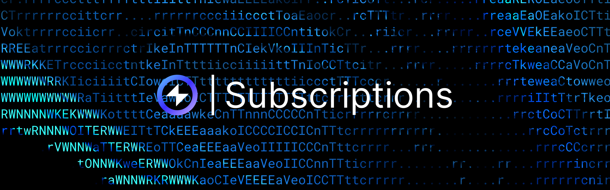

## Overview

This section explains how to configure and manage subscriptions in Reactive Smart Contracts within the Reactive Network. It covers the basics of setting up subscriptions in the contract's constructor, handling dynamic subscriptions through callbacks, and applying filtering criteria like chain ID, contract address, and event topics.

## Subscription Basics

In Reactive Smart Contracts, subscriptions are established by invoking the `subscribe()` method of the Reactive Network's system contract. This method is typically called in the contract's `constructor()` or dynamically via a callback (see [Dynamic Subscriptions](./subscriptions.md#dynamic-subscriptions)).

Since deployments occur both on the Reactive Network and in the deployer's private ReactVM, where the system contract is unavailable, the reactive contract must handle potential reverts.

```solidity
bool private vm;

constructor() {
    SubscriptionService service = SubscriptionService(service_address);
    bytes memory payload = abi.encodeWithSignature(
        "subscribe(uint256,address,uint256,uint256,uint256,uint256)",
        CHAIN_ID,
        CONTRACT_ADDRESS,
        TOPIC_0,
        REACTIVE_IGNORE,
        REACTIVE_IGNORE,
        REACTIVE_IGNORE
    );
    (bool subscription_result,) = address(service).call(payload);
    if (!subscription_result) {
        vm = true;
    }
}
```

The Reactive Network uses the subscription system to link various `uint256` fields to specific events. Subscribers can then filter events based on exact matches of these fields.

During the testnet phase, the Reactive Network provides filtering criteria based on the originating contract's chain ID, address, and all four topics. These criteria may evolve in the future.

### Using REACTIVE_IGNORE and 0

- `REACTIVE_IGNORE` is an arbitrary predefined value (`0xa65f96fc951c35ead38878e0f0b7a3c744a6f5ccc1476b313353ce31712313ad`) that allows you to subscribe to any topic.

- `0` can be used for chain ID or contract address to match any value. Ensure at least one criterion is specific to create a meaningful subscription.

### Subscription Examples

- **All Events from a Specific Contract**: Subscribe to all events from `0x7E0987E5b3a30e3f2828572Bb659A548460a3003`.

```solidity
subscribe(CHAIN_ID, 0x7E0987E5b3a30e3f2828572Bb659A548460a3003, REACTIVE_IGNORE, REACTIVE_IGNORE, REACTIVE_IGNORE, REACTIVE_IGNORE)
```

- **Specific Topic 0**: Subscribe to all Uniswap V2 Sync events.

```solidity
subscribe(CHAIN_ID, 0, 0x1c411e9a96e071241c2f21f7726b17ae89e3cab4c78be50e062b03a9fffbbad1, REACTIVE_IGNORE, REACTIVE_IGNORE, REACTIVE_IGNORE)
```

- **Specific Contract with Specific Topic 0**: Subscribe to events from `0x7E0987E5b3a30e3f2828572Bb659A548460a3003` with topic 0 `0x1c411e9a96e071241c2f21f7726b17ae89e3cab4c78be50e062b03a9fffbbad1`.

```solidity
subscribe(CHAIN_ID, 0x7E0987E5b3a30e3f2828572Bb659A548460a3003, 0x1c411e9a96e071241c2f21f7726b17ae89e3cab4c78be50e062b03a9fffbbad1, REACTIVE_IGNORE, REACTIVE_IGNORE, REACTIVE_IGNORE)
```

- **Multiple Independent Subscriptions**: Call the `subscribe()` method multiple times in the constructor to create multiple independent subscriptions.

```solidity
bool private vm;

constructor() {
    SubscriptionService service = SubscriptionService(service_address);

    // First subscription
    bytes memory payload1 = abi.encodeWithSignature(
        "subscribe(uint256,address,uint256,uint256,uint256,uint256)",
        CHAIN_ID,
        0x7E0987E5b3a30e3f2828572Bb659A548460a3003, // Specific contract address
        REACTIVE_IGNORE,
        REACTIVE_IGNORE,
        REACTIVE_IGNORE,
        REACTIVE_IGNORE
    );
    (bool subscription_result1,) = address(service).call(payload1);
    if (!subscription_result1) {
        vm = true;
    }

    // Second subscription
    bytes memory payload2 = abi.encodeWithSignature(
        "subscribe(uint256,address,uint256,uint256,uint256,uint256)",
        CHAIN_ID,
        0,
        0x1c411e9a96e071241c2f21f7726b17ae89e3cab4c78be50e062b03a9fffbbad1, // Specific topic 0
        REACTIVE_IGNORE,
        REACTIVE_IGNORE,
        REACTIVE_IGNORE
    );
    (bool subscription_result2,) = address(service).call(payload2);
    if (!subscription_result2) {
        vm = true;
    }

    // Add more subscriptions as needed
}
```

### Prohibited Subscriptions

- **Non-Equality Operations**: Subscriptions can’t match event parameters using less than (\<), greater than (\>), range, or bitwise operations. Only strict equality is supported.

- **Complex Criteria Sets**: Subscriptions can’t use disjunction or sets of criteria within a single subscription. While calling the `subscribe()` method multiple times can achieve similar results, it may lead to combinatorial explosion.

- **Single Chain and All Contracts**: Subscribing to events from all chains or all contracts simultaneously is not allowed. Subscribing to all events from only one chain is also prohibited, as it is considered unnecessary.

- **Duplicate Subscriptions**: While duplicate subscriptions are technically allowed, they function as a single subscription. Users are charged for each transaction sent to the system contract. Preventing duplicates in the system contract is costly due to EVM storage limitations, so duplicate subscriptions are permitted to keep costs manageable.

## Dynamic Subscriptions

Subscriptions in the Reactive Network are managed through a system contract, which is accessible only from the network. Events are sent to the ReactVM's contract copy, which has no direct access to the system contract. Therefore, dynamic subscriptions and unsubscriptions based on incoming events must be handled via callbacks.

The `react()` method processes incoming events and checks if `topic_0` indicates a `subscribe` or `unsubscribe` event. If so, it generates a callback to the Reactive Network to manage the subscription.


```solidity
function react(
    uint256 /* chain_id */,
    address _contract,
    uint256 topic_0,
    uint256 topic_1,
    uint256 topic_2,
    uint256 /* topic_3 */,
    bytes calldata data,
    uint256 /* block_number */,
    uint256 /* op_code */
) external vmOnly {
    if (topic_0 == SUBSCRIBE_TOPIC_0) {
        bytes memory payload = abi.encodeWithSignature(
            "subscribe(address,address)",
            address(0),
            address(uint160(topic_1))
        );
        emit Callback(REACTIVE_CHAIN_ID, address(this), CALLBACK_GAS_LIMIT, payload);
    } else if (topic_0 == UNSUBSCRIBE_TOPIC_0) {
        bytes memory payload = abi.encodeWithSignature(
            "unsubscribe(address,address)",
            address(0),
            address(uint160(topic_1))
        );
        emit Callback(REACTIVE_CHAIN_ID, address(this), CALLBACK_GAS_LIMIT, payload);
    } else {
        (uint256 amount) = abi.decode(data, (uint256));
        bytes memory payload = abi.encodeWithSignature(
            "onApproval(address,address,address,address,uint256)",
            address(0),
            address(uint160(topic_2)),
            address(uint160(topic_1)),
            _contract,
            amount
        );
        emit Callback(SEPOLIA_CHAIN_ID, address(service), CALLBACK_GAS_LIMIT, payload);
    }
}
```

[More on Subscriptions →](../education/module-1/subscriptions.md)