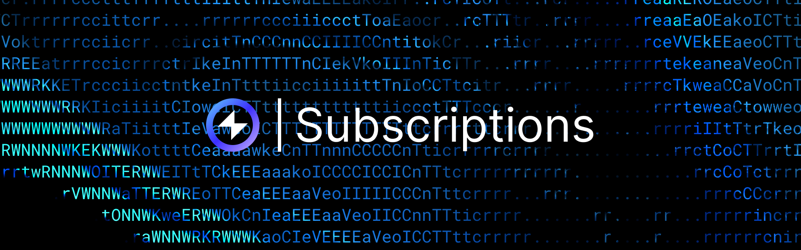

## Overview

Subscriptions define which events Reactive Contracts (RCs) listens to. RCs subscribe to events through the system contract by specifying:

- Origin chain ID
- Contract address
- Event topics

When a matching event is detected, the contract's `react()` function is triggered.

Subscriptions can be configured:

- During deployment (constructor)
- Dynamically via callbacks

## Subscription Basics

Subscriptions are created by calling `subscribe()` on the system contract. This is typically done inside the contract constructor. Since contracts deploy both on Reactive Network (RNK) and inside a ReactVM (where the system contract doesn't exist), the constructor must avoid calling `subscribe()` inside ReactVM.

[IReactive](https://github.com/Reactive-Network/reactive-lib/blob/main/src/interfaces/IReactive.sol), [AbstractReactive](https://github.com/Reactive-Network/reactive-lib/blob/main/src/abstract-base/AbstractReactive.sol), and [ISystemContract](https://github.com/Reactive-Network/reactive-lib/blob/main/src/interfaces/ISystemContract.sol) should be implemented. Here's a subscription example in the constructor from the [Basic Demo Reactive Contract](https://github.com/Reactive-Network/reactive-smart-contract-demos/blob/main/src/demos/basic/BasicDemoReactiveContract.sol):

```solidity
uint256 public originChainId;
uint256 public destinationChainId;
uint64 private constant GAS_LIMIT = 1000000;

address private callback;

constructor(
    address _service,
    uint256 _originChainId,
    uint256 _destinationChainId,
    address _contract,
    uint256 _topic_0,
    address _callback
) payable {
    service = ISystemContract(payable(_service));
    
    originChainId = _originChainId;
    destinationChainId = _destinationChainId;
    callback = _callback;

    if (!vm) {
        service.subscribe(
            originChainId,
            _contract,
            _topic_0,
            REACTIVE_IGNORE,
            REACTIVE_IGNORE,
            REACTIVE_IGNORE
        );
    }
}
```

Subscriptions filter events using:

- Chain ID
- Contract address
- Topics 0–3

:::info[Filtering Criteria]
Reactive Network provides filtering criteria based on the origin contract's chain ID, address, and all four topics.
:::

## Wildcards & Matching

### REACTIVE_IGNORE

`REACTIVE_IGNORE` is a predefined wildcard value that matches any topic value:

```json
0xa65f96fc951c35ead38878e0f0b7a3c744a6f5ccc1476b313353ce31712313ad
```

### Zero Values

Wildcards can also be specified with:

- `uint256(0)` → any chain ID
- `address(0)` → any contract

**At least one parameter must be specific.**

### Subscription Examples

#### All Events From One Contract

```solidity
service.subscribe(
    CHAIN_ID,
    0x7E0987E5b3a30e3f2828572Bb659A548460a3003,
    REACTIVE_IGNORE,
    REACTIVE_IGNORE,
    REACTIVE_IGNORE,
    REACTIVE_IGNORE
);
```

#### Specific Event Type

Example: Uniswap V2 Sync events

```solidity
service.subscribe(
    CHAIN_ID,
    address(0),
    0x1c411e9a96e071241c2f21f7726b17ae89e3cab4c78be50e062b03a9fffbbad1,
    REACTIVE_IGNORE,
    REACTIVE_IGNORE,
    REACTIVE_IGNORE
);
```

#### Specific Contract and Event

```solidity
service.subscribe(
    CHAIN_ID,
    0x7E0987E5b3a30e3f2828572Bb659A548460a3003,
    0x1c411e9a96e071241c2f21f7726b17ae89e3cab4c78be50e062b03a9fffbbad1,
    REACTIVE_IGNORE,
    REACTIVE_IGNORE,
    REACTIVE_IGNORE
);
```

#### Multiple Subscriptions

Call `subscribe()` multiple times:

```solidity
if (!vm) {

    service.subscribe(
        originChainId,
        _contract1,
        _topic0,
        REACTIVE_IGNORE,
        REACTIVE_IGNORE,
        REACTIVE_IGNORE
    );

    service.subscribe(
        originChainId,
        _contract2,
        REACTIVE_IGNORE,
        _topic1,
        REACTIVE_IGNORE,
        REACTIVE_IGNORE
    );
}
```

### Unsubscribing

Subscriptions can be removed through the system contract.

Export the wildcard constant:

```bash
export REACTIVE_IGNORE=0xa65f96fc951c35ead38878e0f0b7a3c744a6f5ccc1476b313353ce31712313ad
```

Example:

```bash
cast send \
  --rpc-url $REACTIVE_RPC \
  --private-key $REACTIVE_PRIVATE_KEY \
  $SYSTEM_CONTRACT_ADDR \
  "unsubscribeContract(address,uint256,address,uint256,uint256,uint256,uint256)" \
  $REACTIVE_CONTRACT_ADDR \
  $ORIGIN_CHAIN_ID \
  $ORIGIN_CONTRACT \
  $TOPIC_0 \
  $REACTIVE_IGNORE \
  $REACTIVE_IGNORE \
  $REACTIVE_IGNORE
```

### Subscription Limitations

#### Equality Matching Only

Subscriptions support exact matches only.

Not supported:

- `<` or `>`
- Ranges
- Bitwise filters

#### Complex Criteria Sets

Each subscription defines **one set of matching criteria**.

Not supported:

- Disjunctions (OR conditions)
- Multiple criteria sets within one subscription

Workaround:

- Use multiple `subscribe()` calls
- May lead to a **large number of subscriptions**

#### No Global Subscriptions

Not allowed:

- All chains
- All contracts
- All events on a chain

#### Duplicate Subscriptions

Duplicate subscriptions are allowed but behave as one subscription.

Each `subscribe()` transaction still costs gas.


## Dynamic Subscriptions

Subscriptions in the Reactive Network are managed through the system contract, which is accessible only from the network. Events are sent to the ReactVM's contract copy, which has no direct access to the system contract. Therefore, dynamic subscriptions and unsubscriptions based on incoming events must be handled via callbacks.

The `react()` method from the [reactive contract](https://github.com/Reactive-Network/reactive-smart-contract-demos/blob/main/src/demos/approval-magic/ApprovalListener.sol) of the [Approval Magic demo](https://github.com/Reactive-Network/reactive-smart-contract-demos/tree/main/src/demos/approval-magic) processes incoming events and checks if `topic_0` indicates a `subscribe` or `unsubscribe` event. If so, it generates a callback to the Reactive Network to manage the subscription.

### Subscribing & Unsubscribing

These functions allow the contract to subscribe or unsubscribe a subscriber address to/from the `APPROVAL_TOPIC_0` in the Reactive Network.

```solidity
    // Methods specific to reactive network contract instance
    function subscribe(address rvm_id, address subscriber) external rnOnly callbackOnly(rvm_id) {
        service.subscribe(
            SEPOLIA_CHAIN_ID,
            address(0),
            APPROVAL_TOPIC_0,
            REACTIVE_IGNORE,
            uint256(uint160(subscriber)),
            REACTIVE_IGNORE
        );
    }

    function unsubscribe(address rvm_id, address subscriber) external rnOnly callbackOnly(rvm_id) {
        service.unsubscribe(
            SEPOLIA_CHAIN_ID,
            address(0),
            APPROVAL_TOPIC_0,
            REACTIVE_IGNORE,
            uint256(uint160(subscriber)),
            REACTIVE_IGNORE
        );
    }
```

**Parameters**:

- `rvm_id`: The ID of the reactive virtual machine (RVM).
- `subscriber`: The address that will be subscribed or unsubscribed.

**Operations**:

- `subscribe`: Registers a subscriber to the `APPROVAL_TOPIC_0`.
- `unsubscribe`: Removes a subscriber from the `APPROVAL_TOPIC_0`.

### react Function & Logic

The function processes incoming log records from the ReactVM and executes different actions based on the topic in the log.

```solidity
// Methods specific to ReactVM contract instance
    function react(LogRecord calldata log) external vmOnly {
        if (log.topic_0 == SUBSCRIBE_TOPIC_0) {
            bytes memory payload = abi.encodeWithSignature(
                "subscribe(address,address)",
                address(0),
                address(uint160(log.topic_1))
            );
            emit Callback(REACTIVE_CHAIN_ID, address(this), CALLBACK_GAS_LIMIT, payload);
        } else if (log.topic_0 == UNSUBSCRIBE_TOPIC_0) {
            bytes memory payload = abi.encodeWithSignature(
                "unsubscribe(address,address)",
                address(0),
                address(uint160(log.topic_1))
            );
            emit Callback(REACTIVE_CHAIN_ID, address(this), CALLBACK_GAS_LIMIT, payload);
        } else {
            (uint256 amount) = abi.decode(log.data, (uint256));
            bytes memory payload = abi.encodeWithSignature(
                "onApproval(address,address,address,address,uint256)",
                address(0),
                address(uint160(log.topic_2)),
                address(uint160(log.topic_1)),
                log._contract,
                amount
            );
            emit Callback(SEPOLIA_CHAIN_ID, address(approval_service), CALLBACK_GAS_LIMIT, payload);
        }
    }
}
```

**Log Processing**:

- Subscribe Logic: If the log's `topic_0` matches the `SUBSCRIBE_TOPIC_0`, the function encodes a payload for the `subscribe()` method and emits a callback.
- Unsubscribe Logic: If the log's `topic_0` matches the `UNSUBSCRIBE_TOPIC_0`, the function encodes a payload for the `unsubscribe()` method and emits a callback.
- Approval Logic: For any other log, it decodes the approval amount and creates a payload for the `onApproval` method, then emits a callback to the `approval_service` on Sepolia.

**Callback Emission**: The function uses the `emit Callback` statement to send the appropriate payload and trigger the corresponding action on the Reactive chain.

[More on Subscriptions →](../education/module-1/subscriptions.md)