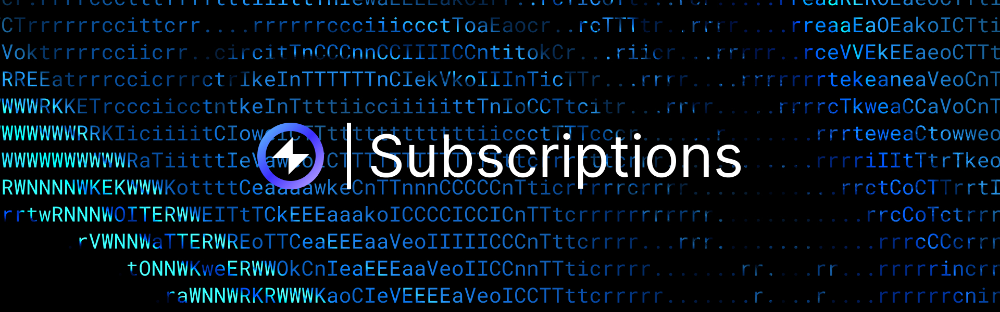

## Overview

Subscriptions define which events reactive contracts listen to. They subscribe to events through the system contract by specifying:

- Origin chain ID
- Contract address
- Event topics

When a matching event is detected, the system contract calls the contract's `react()` function.

Subscriptions can be configured:

- During deployment (constructor)
- Dynamically during `react()` execution

## Subscription Basics

Subscriptions are created by calling `subscribe()` on the system contract. This is typically done inside the contract constructor.

[IReactive](https://github.com/Reactive-Network/reactive-lib/blob/main/src/interfaces/IReactive.sol), [AbstractReactive](https://github.com/Reactive-Network/reactive-lib/blob/main/src/abstract-base/AbstractReactive.sol), and [ISystemContract](https://github.com/Reactive-Network/reactive-lib/blob/main/src/interfaces/ISystemContract.sol) should be implemented. Here's a subscription example in the constructor from the [Basic Demo Reactive Contract](https://github.com/Reactive-Network/reactive-smart-contract-demos/blob/main/src/demos/basic/BasicDemoReactiveContract.sol):

```solidity
uint256 public originChainId;
uint256 public destinationChainId;
uint64 private constant GAS_LIMIT = 1000000;

address private callback;

constructor(
    address _service,
    uint256 _originChainId,
    uint256 _destinationChainId,
    address _contract,
    uint256 _topic_0,
    address _callback
) payable {
    service = ISystemContract(payable(_service));
    
    originChainId = _originChainId;
    destinationChainId = _destinationChainId;
    callback = _callback;

    if (!vm) {
        service.subscribe(
            originChainId,
            _contract,
            _topic_0,
            REACTIVE_IGNORE,
            REACTIVE_IGNORE,
            REACTIVE_IGNORE
        );
    }
}
```

Subscriptions filter events using:

- Chain ID
- Contract address
- Topics 0–3

:::info[Filtering Criteria]
Reactive Network provides filtering criteria based on the origin contract's chain ID, address, and all four topics.
:::

## Wildcards & Matching

### REACTIVE_IGNORE

`REACTIVE_IGNORE` is a predefined wildcard value that matches any topic value:

```json
0xa65f96fc951c35ead38878e0f0b7a3c744a6f5ccc1476b313353ce31712313ad
```

### Zero Values

Wildcards can also be specified with:

- `uint256(0)` → any chain ID
- `address(0)` → any contract

At least one parameter must be specific.

### Subscription Examples

#### All Events From One Contract

```solidity
service.subscribe(
    CHAIN_ID,
    0x7E0987E5b3a30e3f2828572Bb659A548460a3003,
    REACTIVE_IGNORE,
    REACTIVE_IGNORE,
    REACTIVE_IGNORE,
    REACTIVE_IGNORE
);
```

#### Specific Event Type

Example: Uniswap V2 Sync events

```solidity
service.subscribe(
    CHAIN_ID,
    address(0),
    0x1c411e9a96e071241c2f21f7726b17ae89e3cab4c78be50e062b03a9fffbbad1,
    REACTIVE_IGNORE,
    REACTIVE_IGNORE,
    REACTIVE_IGNORE
);
```

#### Specific Contract and Event

```solidity
service.subscribe(
    CHAIN_ID,
    0x7E0987E5b3a30e3f2828572Bb659A548460a3003,
    0x1c411e9a96e071241c2f21f7726b17ae89e3cab4c78be50e062b03a9fffbbad1,
    REACTIVE_IGNORE,
    REACTIVE_IGNORE,
    REACTIVE_IGNORE
);
```

#### Multiple Subscriptions

Call `subscribe()` multiple times:

```solidity
if (!vm) {

    service.subscribe(
        originChainId,
        _contract1,
        _topic0,
        REACTIVE_IGNORE,
        REACTIVE_IGNORE,
        REACTIVE_IGNORE
    );

    service.subscribe(
        originChainId,
        _contract2,
        REACTIVE_IGNORE,
        _topic1,
        REACTIVE_IGNORE,
        REACTIVE_IGNORE
    );
}
```

### Unsubscribing

Subscriptions can be removed through the system contract.

Export the wildcard constant:

```bash
export REACTIVE_IGNORE=0xa65f96fc951c35ead38878e0f0b7a3c744a6f5ccc1476b313353ce31712313ad
```

Example:

```bash
cast send \
  --rpc-url $REACTIVE_RPC \
  --private-key $REACTIVE_PRIVATE_KEY \
  $SYSTEM_CONTRACT_ADDR \
  "unsubscribeContract(address,uint256,address,uint256,uint256,uint256,uint256)" \
  $REACTIVE_CONTRACT_ADDR \
  $ORIGIN_CHAIN_ID \
  $ORIGIN_CONTRACT \
  $TOPIC_0 \
  $REACTIVE_IGNORE \
  $REACTIVE_IGNORE \
  $REACTIVE_IGNORE
```

### Subscription Limitations

#### Equality Matching Only

Subscriptions support exact matches only.

Not supported:

- `<` or `>`
- Ranges
- Bitwise filters

#### Complex Criteria Sets

Each subscription defines **one set of matching criteria**.

Not supported:

- Disjunctions (OR conditions)
- Multiple criteria sets within one subscription

Workaround:

- Use multiple `subscribe()` calls
- May lead to a **large number of subscriptions**

#### No Global Subscriptions

Not allowed:

- All chains
- All contracts
- All events on a chain

#### Duplicate Subscriptions

Duplicate subscriptions are allowed but behave as one subscription.

Each `subscribe()` transaction still costs gas.

## Dynamic Subscriptions

Subscriptions can be created or removed dynamically during `react()` execution. Since the contract lives directly on Reactive Network, it can call `service.subscribe()` and `service.unsubscribe()` within its `react()` logic when conditions require it.

### Subscribing & Unsubscribing

These functions run on the Reactive Network contract instance and modify subscriptions through the system contract. The example below is based on the [ApprovalListener.sol](https://github.com/Reactive-Network/reactive-smart-contract-demos/blob/main/src/demos/approval-magic/ApprovalListener.sol) contract from the [Approval Magic demo](https://github.com/Reactive-Network/reactive-smart-contract-demos/tree/main/src/demos/approval-magic).

```solidity
// Methods specific to Reactive Network contract instance

function subscribe(address rvm_id, address subscriber)
    external
    rnOnly
    callbackOnly(rvm_id)
    {
        service.subscribe(
            SEPOLIA_CHAIN_ID,
            address(0),
            APPROVAL_TOPIC_0,
            REACTIVE_IGNORE,
            uint256(uint160(subscriber)),
            REACTIVE_IGNORE
        );
    }

function unsubscribe(address rvm_id, address subscriber)
    external
    rnOnly
    callbackOnly(rvm_id)
    {
        service.unsubscribe(
            SEPOLIA_CHAIN_ID,
            address(0),
            APPROVAL_TOPIC_0,
            REACTIVE_IGNORE,
            uint256(uint160(subscriber)),
            REACTIVE_IGNORE
        );
    }
```

### react() Logic

The `react()` function processes incoming events and emits callbacks when subscription changes are required.

```solidity
// Methods specific to ReactVM contract instance
function react(LogRecord calldata log) external vmOnly {
        
    if (log.topic_0 == SUBSCRIBE_TOPIC_0) {
            
        bytes memory payload = abi.encodeWithSignature(
            "subscribe(address,address)",
            address(0),
            address(uint160(log.topic_1))
        );
        
        emit Callback(
            REACTIVE_CHAIN_ID, 
            address(this), 
            CALLBACK_GAS_LIMIT, 
            payload
        );
        
    } else if (log.topic_0 == UNSUBSCRIBE_TOPIC_0) {
            
        bytes memory payload = abi.encodeWithSignature(
            "unsubscribe(address,address)",
            address(0),
            address(uint160(log.topic_1))
        );
            
        emit Callback(
            REACTIVE_CHAIN_ID, 
            address(this), 
            CALLBACK_GAS_LIMIT, 
            payload);
        
    } else {
        
        (uint256 amount) = abi.decode(log.data, (uint256));
            
        bytes memory payload = abi.encodeWithSignature(
            "onApproval(address,address,address,address,uint256)",
            address(0),
            address(uint160(log.topic_2)),
            address(uint160(log.topic_1)),
            log._contract,
            amount
        );
        
        emit Callback(
            SEPOLIA_CHAIN_ID, 
            address(approval_service), 
            CALLBACK_GAS_LIMIT, 
            payload
        );
    }
}
```

Event handling:

- **Subscribe event** → directly creates a new subscription via the system contract
- **Unsubscribe event** → directly removes a subscription via the system contract
- **Other events** → requests a callback to trigger application logic on the destination chain

[More on subscriptions →](../education/module-1/subscriptions.md)