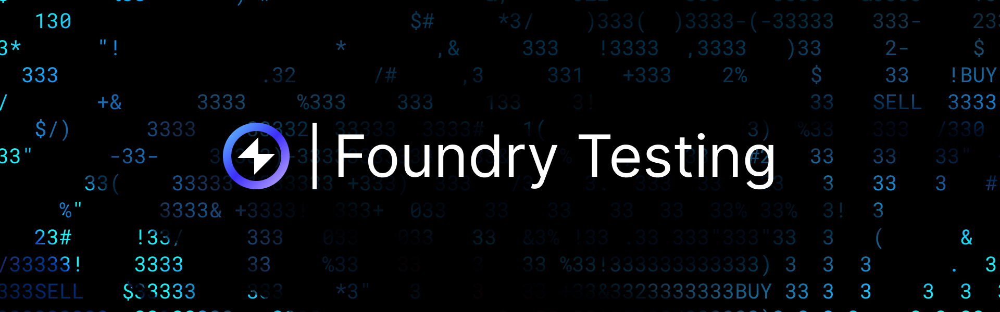

## Overview

[Reactive Test Lib](https://github.com/Reactive-Network/reactive-test-lib) allows to simulate the full Reactive Network's lifecycle from triggering events to callback execution. You can test Reactive contracts locally with Foundry. The library replaces the system contract, ReactVM, and callback proxies with mock implementations that run entirely within `forge test`.

Supported features:

- Event subscriptions (including wildcards)
- Full `react()` pipeline
- Cross-chain and same-chain callbacks
- Same-chain callbacks via `SERVICE_ADDR` (`0x8888888888888888888888888888888888888888`)
- Cron-based triggers
- Multi-step workflows (bridges, confirmations)
- Automatic chain ID resolution

Install:

```bash
forge install Reactive-Network/reactive-test-lib
```

Add to `remappings.txt`:

```json
reactive-test-lib/=lib/reactive-test-lib/src/
```

## Mocked Components

The library replaces three Reactive components with local mocks:

| Real Component  | Mock                 | Purpose                                              |
|-----------------|----------------------|------------------------------------------------------|
| System Contract | `MockSystemContract` | Subscription registry with wildcard matching         |
| ReactVM         | `ReactiveSimulator`  | Event delivery and `react()` invocation              |
| Callback Proxy  | `MockCallbackProxy`  | Cross-chain callback execution with RVM ID injection |

Chain IDs are purely logical. All execution takes place on a single EVM instance.

## Getting Started

### Base Test Contract

Inherit from `ReactiveTest`:

```solidity
import "reactive-test-lib/base/ReactiveTest.sol";
import {CallbackResult} from "reactive-test-lib/interfaces/IReactiveInterfaces.sol";

contract MyReactiveTest is ReactiveTest {
    function setUp() public override {
        super.setUp();
        // deploy contracts here
    }
}
```

`super.setUp()` performs the following setup:

1. Deploys `MockSystemContract` and writes its code to `SERVICE_ADDR` (`0x8888888888888888888888888888888888888888`)
2. Deploys `MockCallbackProxy` for cross-chain callback execution
3. Sets `rvmId` to `address(this)`
4. Sets `reactiveChainId` to `REACTIVE_CHAIN_ID` (`0x512512`) 

Any contract that calls `subscribe()` on `SERVICE_ADDR` in its constructor (including contracts extending `AbstractReactive`) will register subscriptions automatically.

### Deploying Contracts

Set up your Origin, Reactive, and Callback contracts in `setUp()`. Pass `address(proxy)` to anything that extends `AbstractCallback`:

```solidity
// Origin contract (L1) — emits events that trigger reactions
origin = new BasicDemoL1Contract();

// Callback contract — pass proxy as the authorized callback sender
cb = new BasicDemoL1Callback(address(proxy));

// Reactive contract — constructor calls subscribe() on MockSystemContract
rc = new BasicDemoReactiveContract(
address(sys),                                            // system contract
SEPOLIA_CHAIN_ID,                                        // origin chain
SEPOLIA_CHAIN_ID,                                        // destination chain
address(origin),                                         // contract to watch
uint256(keccak256("Received(address,address,uint256)")), // topic_0
address(cb)                                              // callback target
);
```

### Running a Reactive Cycle

`triggerAndReact()` executes a full cycle in a single call: emit event, match subscription, invoke react(), and execute callbacks.

```solidity
function testCallbackFires() public {
    CallbackResult[] memory results = triggerAndReact(
        address(origin),
        abi.encodeWithSignature("receive()"),
        SEPOLIA_CHAIN_ID
    );

    assertCallbackCount(results, 1);
    assertCallbackSuccess(results, 0);
    assertCallbackEmitted(results, address(cb));
}
```

Use `triggerAndReactWithValue()` to send ETH with the triggering call:

```solidity
CallbackResult[] memory results = triggerAndReactWithValue(
    address(origin),
    abi.encodeWithSignature("receive()"),
    0.01 ether,
    SEPOLIA_CHAIN_ID
);
```

## Basic Demo

The [Basic Demo](https://github.com/Reactive-Network/reactive-smart-contract-demos/tree/main/src/demos/basic) shows the simplest Reactive contract pattern. An origin contract emits an event when receiving ETH. The Reactive contract subscribes to that event and, if the value exceeds a threshold, emits a callback to the destination contract.

```solidity
contract BasicDemoTest is ReactiveTest {
    BasicDemoL1Contract origin;
    BasicDemoReactiveContract rc;
    BasicDemoL1Callback cb;

    uint256 constant SEPOLIA = 11155111;

    function setUp() public override {
        super.setUp();

        origin = new BasicDemoL1Contract();
        cb = new BasicDemoL1Callback(address(proxy));
        rc = new BasicDemoReactiveContract(
            address(sys),
            SEPOLIA,
            SEPOLIA,
            address(origin),
            uint256(keccak256("Received(address,address,uint256)")),
            address(cb)
        );
    }

    function testCallbackAboveThreshold() public {
        // 0.01 ETH > 0.001 threshold — callback fires
        CallbackResult[] memory results = triggerAndReactWithValue(
            address(origin),
            "",
            0.01 ether,
            SEPOLIA
        );

        assertCallbackCount(results, 1);
        assertCallbackSuccess(results, 0);
    }

    function testNoCallbackBelowThreshold() public {
        // 0.0005 ETH < 0.001 threshold — no callback
        CallbackResult[] memory results = triggerAndReactWithValue(
            address(origin),
            "",
            0.0005 ether,
            SEPOLIA
        );

        assertNoCallbacks(results);
    }
}
```

## Uniswap Stop Orders

The [Uniswap V2 Stop Order Demo](https://github.com/Reactive-Network/reactive-smart-contract-demos/tree/main/src/demos/uniswap-v2-stop-order) monitors a pair's reserves and triggers a swap when the price crosses a threshold. The Reactive contract subscribes to `Sync` events.

Testing requires a mock pair contract that emits the event:

```solidity
contract StopOrderTest is ReactiveTest {
    MockUniswapPair pair;
    UniswapDemoStopOrderReactive rc;
    UniswapDemoStopOrderCallback stopOrder;

    uint256 constant SEPOLIA = 11155111;
    uint256 constant SYNC_TOPIC = 0x1c411e9a96e071241c2f21f7726b17ae89e3cab4c78be50e062b03a9fffbbad1;

    function setUp() public override {
        super.setUp();

        pair = new MockUniswapPair();
        stopOrder = new UniswapDemoStopOrderCallback(address(proxy));
        rc = new UniswapDemoStopOrderReactive(
            address(pair),
            address(stopOrder),
            client,
            true,       // token0
            1e18,       // coefficient
            500         // threshold
        );
        enableVmMode(address(rc));
    }

    function testStopOrderTriggeredBelowThreshold() public {
        // Simulate a sync event with reserves that push price below threshold
        CallbackResult[] memory results = triggerAndReact(
            address(pair),
            abi.encodeWithSignature("emitSync(uint112,uint112)", 1000, 100),
            SEPOLIA
        );

        assertCallbackCount(results, 1);
        assertCallbackEmitted(results, address(stopOrder));
    }
}
```

:::info[vmOnly Modifier]
If the Reactive contract uses `vmOnly` on `react()`, call `enableVmMode(address(rc))` after deployment. This sets the internal `vm` flag to `true`. Without this call, `react()` reverts with `"VM only"`.
:::

## Self-Callbacks

Some Reactive contracts emit callbacks targeting themselves on Reactive Network rather than an external chain. The REACT Bridge follows this pattern where `ReactiveBridge` emits:

```solidity
emit Callback(reactive_chain_id, address(this), GAS_LIMIT, payload);
```

In production, `SERVICE_ADDR` delivers these callbacks. The bridge authorizes it in its constructor:

```solidity
constructor(...) AbstractCallback(address(SERVICE_ADDR)) { ... }
```

The simulator handles this automatically. When a `Callback` event's `chain_id` matches `reactiveChainId`, the callback is delivered via `vm.prank(SERVICE_ADDR)` instead of the proxy. The `authorizedSenderOnly` modifier passes correctly.

```solidity
contract SelfCallbackTest is ReactiveTest {
    ReactiveBridge rb;

    function setUp() public override {
        super.setUp();
        rb = new ReactiveBridge(
            reactiveChainId,
            SEPOLIA,
            address(bridge),
            ...
        );
        enableVmMode(address(rb));
    }

    function testSelfCallbackDelivered() public {
        // The reactive bridge's deliver() and returnMessage() are self-callbacks.
        // They are delivered via SERVICE_ADDR, not the proxy.
        CallbackResult[] memory results = triggerFullCycleWithValue(
            address(rb),
            abi.encodeWithSignature("bridge(uint256,address)", 123, recipient),
            1 ether,
            reactiveChainId,
            20
        );

        // Self-callbacks succeed because msg.sender == SERVICE_ADDR
        for (uint256 i = 0; i < results.length; i++) {
            assertCallbackSuccess(results, i);
        }
    }
}
```

## Multi-Step Protocols

Complex protocols such as [REACT Bridge](https://github.com/Reactive-Network/react-bridge) chain multiple Reactive cycles from a single user action:

```
1. ReactiveBridge.bridge() → emits SendMessage
2. react(SendMessage) → Callback to Bridge.initialMessage()
3. Bridge emits ConfirmationRequest
4. react(ConfirmationRequest) → Callback to Bridge.requestConfirmation()
5. Bridge emits Confirmation → react() → Callback to Bridge.confirm()
6. Bridge emits DeliveryConfirmation → react() → ...
```

`triggerAndReact()` executes only one cycle. For multi-step chains, use `triggerFullCycle()`:

```solidity
CallbackResult[] memory results = triggerFullCycleWithValue(
    address(reactiveBridge),
    abi.encodeWithSignature("bridge(uint256,address)", uniqueish, recipient),
    1 ether,
    reactiveChainId,
    20  // max iterations — safety limit
);
```

The simulator loops through the following steps:

1. Executes the call and captures events 
2. Matches events, calls `react()`, and collects callback specs 
3. Executes each callback and records any new events 
4. Tags new events with the callback's `chain_id` (events from a Sepolia callback become Sepolia events)
5. Feeds new events back into step 2 
6. Stops when no more callbacks are produced or `maxIterations` is reached

All `CallbackResult` entries from every iteration are returned in a single array.

## Chain Registry

When contracts span multiple logical chains, each trigger requires the correct `originChainId`. The chain registry maps addresses to chain IDs, removing the need to pass chain IDs manually:

```solidity
function setUp() public override {
    super.setUp();

    bridge = new Bridge(address(proxy), ...);
    reactiveBridge = new ReactiveBridge(reactiveChainId, SEPOLIA, address(bridge), ...);

    // Register contracts with their logical chains
    registerChain(address(bridge), SEPOLIA);
    registerChain(address(reactiveBridge), reactiveChainId);
}
```

With registrations in place, the `originChainId` argument can be omitted:

```solidity
// These resolve the chain ID from the registry automatically
CallbackResult[] memory results = triggerAndReact(
    address(bridge),
    abi.encodeWithSignature("bridge(uint256,address,uint256)", id, recipient, amount)
);

CallbackResult[] memory results = triggerFullCycle(
    address(reactiveBridge),
    abi.encodeWithSignature("bridge(uint256,address)", id, recipient),
    20
);
```

In full-cycle mode, events from callbacks are automatically tagged with destination chain IDs. The registry is primarily relevant for the initial trigger.

## Cron Contracts

Reactive contracts can subscribe to system cron events for periodic execution. The simulator provides `triggerCron()` to deliver synthetic cron events:

```solidity
import {CronType} from "reactive-test-lib/interfaces/IReactiveInterfaces.sol";
import {ReactiveConstants} from "reactive-test-lib/constants/ReactiveConstants.sol";

contract CronTest is ReactiveTest {
    BasicCronContract rc;

    function setUp() public override {
        super.setUp();
        rc = new BasicCronContract(address(sys), ReactiveConstants.CRON_TOPIC_1);
    }

    function testCronTriggersCallback() public {
        CallbackResult[] memory results = triggerCron(CronType.Cron1);
        assertCallbackCount(results, 1);
    }

    function testAdvanceBlocksAndTrigger() public {
        uint256 startBlock = block.number;
        CallbackResult[] memory results = advanceAndTriggerCron(100, CronType.Cron1);

        assertCallbackCount(results, 1);
        assertEq(block.number, startBlock + 100);
    }
}
```

Cron types: `Cron1` (every block), `Cron10`, `Cron100`, `Cron1000`, `Cron10000`.

## Assertions

`ReactiveTest` provides assertion helpers for common callback checks:

```solidity
// Exact callback count
assertCallbackCount(results, 3);

// Zero callbacks
assertNoCallbacks(results);

// A specific target received a callback
assertCallbackEmitted(results, address(myCallback));

// Callback at index succeeded / failed
assertCallbackSuccess(results, 0);
assertCallbackFailure(results, 1);
```

Each `CallbackResult` contains the following fields:

| Field        | Description                                    |
|--------------|------------------------------------------------|
| `chainId`    | Destination chain ID from the `Callback` event |
| `target`     | Address the callback executed on               |
| `gasLimit`   | Gas limit from `react()`                       |
| `payload`    | ABI-encoded call (RVM ID already injected)     |
| `success`    | Whether the call succeeded                     |
| `returnData` | Return or revert data                          |

## Mock Environment Details

### Subscription Matching

`MockSystemContract` supports the same wildcard rules as the production system contract:

| Field        | Wildcard          | Meaning      |
|--------------|-------------------|--------------|
| `chain_id`   | `0`               | Any chain    |
| `_contract`  | `address(0)`      | Any contract |
| `topic_0..3` | `REACTIVE_IGNORE` | Any topic    |

### RVM ID Injection

The production network overwrites the first 160 bits of the first callback argument with the deployer's address. Both `MockCallbackProxy` (cross-chain) and the simulator's direct delivery (same-chain) replicate this behavior. The `rvmIdOnly` modifier works correctly in tests.

To simulate a different deployer:

```solidity
rvmId = makeAddr("customDeployer");
```

### Callback Routing

Routing is determined by the `Callback` event's `chain_id`:

- **Cross-chain** (`chain_id != reactiveChainId`) — delivered through `MockCallbackProxy`
- **Same-chain** (`chain_id == reactiveChainId`) — delivered via `vm.prank(SERVICE_ADDR)`

### vmOnly and rnOnly

`MockSystemContract` is deployed to `SERVICE_ADDR`, so `detectVm()` sets `vm = false` (it detects code at that address). As a result:

- `rnOnly` functions work in constructors, `subscribe()` calls execute normally
- `vmOnly` functions need `enableVmMode(address(rc))` after deployment

## Additional Notes

- **Single EVM**: All execution takes place on a single EVM instance. Chain IDs are logical identifiers only.
- **No reactive-lib dependency**: The test lib reimplements ABI-compatible interfaces. Contracts continue importing `reactive-lib` as usual.
- **Requirements**: Solidity ≥ 0.8.20, Foundry with `vm.recordLogs()`, `reactive-lib` v0.2.0+.

[Reactive Test Lib on GitHub →](https://github.com/Reactive-Network/reactive-test-lib)
