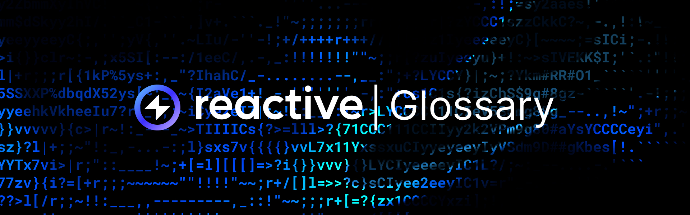

## A

**Airdrop** – the distribution of free tokens or cryptocurrencies to wallet addresses, often used by blockchain projects as a marketing strategy to raise awareness, incentivize participation, or reward existing token holders. Eligibility typically requires meeting specific criteria like owning a cryptocurrency or belonging to a specific community.

**APY (Annual Percentage Yield)** – the annual rate of return on investment, accounting for compound interest, commonly used in decentralized finance (DeFi) and blockchain-based financial products for calculating and comparing potential returns.

**Arbitrary Logic** – the implementation of customized rules or conditions within a blockchain smart contract or protocol, allowing for flexible functionalities beyond standardized operations.

**ASIC (Application-Specific Integrated Circuit)** – a specialized hardware device designed specifically for mining cryptocurrencies, offering higher efficiency compared to general-purpose computing devices.

**Atomic Swap** – a smart contract technology that enables the exchange of one cryptocurrency for another without the need for a trusted third party or centralized exchange.

**Atomicity** – a property of blockchain transactions that ensures they are indivisible and irreducible, meaning that either all parts of a transaction are executed, or none are.

**Auto-Compounding** – a feature in decentralized finance (DeFi) protocols that automatically reinvests earned yields or rewards back into the original investment, increasing the overall value and compounding returns over time without requiring manual intervention from users.

**AMMs (Automated Market Makers)** – algorithmic protocols within decentralized exchanges (DEXs) that determine asset prices using liquidity pools, enabling direct trading without traditional order books.

## B

**Beacon Chain** – a central chain in the Ethereum 2.0 upgrade that coordinates the network, manages validators, and facilitates communication between shards.

**Block Reward** – the incentive given to a miner for successfully hashing a new block and adding it to the blockchain. The reward typically consists of newly minted cryptocurrency and transaction fees.

**Bridging** – the process of enabling interoperability and transferring assets or data between different blockchain networks or protocols.

**Burning (Token Burn)** – the process of permanently removing a certain amount of cryptocurrency tokens from circulation, reducing the total supply, often used to increase scarcity and potentially boost value.

## C

**Centralized Point of Control** – a single entity or system within a network that holds authority and decision-making power over critical functions, data, or resources, contrasting with decentralized models where control is distributed among multiple participants.

**Chainlink Automation** – automating data input/output between blockchain smart contracts and external systems using Chainlink's decentralized oracle network.

**Cold Wallet** – a cryptocurrency wallet that is not connected to the internet, providing a higher level of security against online threats.

**Consensus Algorithm** – the protocol through which blockchain network participants agree on the state of the ledger, ensuring that all copies of the distributed ledger are the same. Common types include Proof of Work (PoW), Proof of Stake (PoS), Practical Byzantine Fault Tolerance (PBFT), and Proof of Authority (PoA).

**Cross-Chain Copy Trading** – automatically mirroring trades across multiple blockchain networks without manual intervention.

**Cross-Chain Ownership** – the ability to possess and manage assets that exist on multiple blockchain networks simultaneously, enabling transfer and utilization across different decentralized ecosystems.

**Custodial Wallet** – a type of cryptocurrency wallet where a third party holds and manages the private keys on behalf of the user, offering convenience at the expense of direct control.

## D

**DAO Governance** – the process of decision-making and management within a Decentralized Autonomous Organization, where stakeholders participate in voting and consensus mechanisms to determine the direction, policies, and actions of the organization without centralized control.

**dApp (Decentralized Application)** – an application built on a decentralized network that combines a smart contract and a front-end user interface, operating without centralized control.

**DeFi (Decentralized Finance)** – a financial system built on blockchain technology that aims to recreate traditional financial services in a decentralized manner, allowing for peer-to-peer transactions, lending, borrowing, and trading without intermediaries.

**Delegated Proof of Stake (DPoS)** – a consensus algorithm where stakeholders vote for a small group of delegates to validate transactions and maintain the blockchain.

**Destination Chain** - a designated ecosystem where the state transition (transaction) occurs.

**DEX Swaps** – peer-to-peer transactions of digital assets directly between users on Decentralized Exchange platforms, eliminating the need for intermediaries and providing greater control over trades and liquidity.

**Distribution Fee** – a charge imposed on the transfer or allocation of tokens or assets within a blockchain network, typically collected to cover transaction processing costs or to fund network development and maintenance.

**Dummy Smart Contract** – a simplified or placeholder smart contract used for testing, demonstration, or educational purposes, typically containing basic functionalities and data structures to simulate interactions within a blockchain network without executing complex operations or real-world transactions.

**Dust Transactions** – very small cryptocurrency transactions that are often considered spam due to their negligible value and potential to clog the network.

## E

**Elliptic Curve Cryptography (ECC)** – a type of public key cryptography based on the algebraic structure of elliptic curves, used in blockchain for securing transactions and generating addresses.

**Emitting Events** – the process of triggering and broadcasting specific occurrences or actions within a smart contract on a blockchain network.

**EOA (Externally Owned Account)** – a type of account on the Ethereum blockchain that is controlled by private keys held by individuals or entities outside the blockchain. EOAs are used for sending transactions, deploying smart contracts, and managing funds.

**ERC-20** – a standard for creating and issuing smart contracts on the Ethereum blockchain, specifically for tokens that can interact with each other.

**ERC-721** – a standard for non-fungible tokens (NFTs) on the Ethereum blockchain, allowing the creation and transfer of unique digital assets.

**Event Sources** - the various origins from which events, such as transactions, smart contract executions, or external data inputs, are generated within the blockchain ecosystem.

**EVM Events** – events generated within the Ethereum Virtual Machine when specific conditions are met, typically used to notify external applications or contracts about state changes or transactions occurring within Ethereum smart contracts.

**External Prompt** – an input or trigger from an external source, such as a user or another system, that initiates an action or process within a blockchain application or smart contract.

## F

**Fiat Gateway** – a service or platform that enables the conversion between fiat currency and cryptocurrency, allowing users to buy or sell cryptocurrencies using traditional money.

**Flash Loan** – a type of uncollateralized loan in DeFi that allows borrowers to borrow funds within a single transaction block without providing collateral, commonly used for arbitrage and trading strategies.

**Fork** – a change to the protocol of a blockchain network that results in a divergence into two separate paths. A **soft fork** is backward compatible, while a **hard fork** creates a new blockchain incompatible with the old version.

**Front-Running** – the unethical practice where an entity with insider knowledge of a pending transaction executes a similar transaction ahead of it to profit from the expected price movement.

**Fungibility** – the property of an asset whose individual units are interchangeable and indistinguishable from one another, such as traditional currencies or cryptocurrencies like Bitcoin.

## G

**Gas** – a unit of measure for computational work required to execute operations on the Ethereum network, with associated fees paid in Ether (ETH).

**Gauge Voting** – a governance mechanism in DeFi protocols where token holders vote to influence parameters or decisions related to liquidity pools, yield farming rewards, or other protocol functionalities.

**Genesis Block** – the first block in a blockchain, serving as the foundation upon which all subsequent blocks are added.

## H

**Halving** – an event in which the reward for mining new blocks is halved, reducing the rate at which new coins are generated. This is typically programmed to occur at regular intervals in certain cryptocurrencies like Bitcoin.

**Hash** – the output of a hash function, which takes an input and produces a fixed-size string of characters. Used in blockchain to secure data through encryption.

**Hash Rate** – the measure of computational power used in cryptocurrency mining, representing the number of hash operations performed per second.

**Hot Wallet** – a cryptocurrency wallet that is connected to the internet, providing easy access for transactions but with increased vulnerability to cyberattacks.

## I

**Initial Coin Offering (ICO)** – a fundraising method in which a new cryptocurrency project sells tokens to early backers in exchange for established cryptocurrencies like Bitcoin or Ether.

**Interoperability** – the ability of different blockchain networks to interact and exchange information or assets with one another.

**Inversion-of-Control** – a programming principle of Reactive Contracts, where control over execution flow is shifted from external actors to the system itself, allowing autonomous decision-making based on predefined events.

**Immutable** – a characteristic of blockchain data that prevents it from being altered or deleted once recorded, ensuring the integrity and permanence of the information.

## K

**Keypair** – a pair of cryptographic keys (private and public) used in blockchain transactions. The private key signs transactions, while the public key verifies them.

**KYC (Know Your Customer)** – a regulatory requirement for financial services to verify the identity of their clients, commonly implemented in crypto exchanges to comply with anti-money laundering (AML) regulations.

## L

**L1 (Layer One)** – the primary blockchain layer responsible for executing and validating transactions, typically featuring its consensus mechanism and native token.

**L2 (Layer Two)** – secondary frameworks or protocols built on top of an existing blockchain (Layer One) to improve scalability and speed without altering the base layer's structure.

**LayerZero** – an interoperability protocol that connects blockchains, allowing developers to build cross-chain applications, tokens, and experiences.

**Lightning Network** – a second-layer solution built on top of a blockchain (such as Bitcoin) that enables fast, low-cost transactions through off-chain payment channels.

**Liquidation Protection** – safeguards implemented within DeFi protocols to mitigate the risk of user positions being liquidated due to falling asset prices or insufficient collateral.

**Liquidity Pools** – pools of funds provided by users in DeFi platforms, used to facilitate trading and lending by providing liquidity to the market.

**Liquidity Pools Rebalancing** – the process of adjusting the allocation of assets within liquidity pools in DeFi platforms to maintain optimal liquidity and minimize risks associated with price fluctuations.

## M

**Merkle Root** – the top hash of a Merkle tree, summarizing all transactions in a block. It ensures data integrity and quick verification.

**Merkle Tree** – a data structure used in blockchain technology to efficiently and securely verify the integrity of data. It is a binary tree where each leaf node is a hash of a data block, and each non-leaf node is a hash of its children.

**Micropayments** – very small transactions facilitated by blockchain technology, often used for tipping, content monetization, or microservices.

**Multisig Protocol** – a blockchain protocol that allows multiple parties to jointly control funds or assets by requiring the authorization of a predefined number of signatories before a transaction can be executed.

## N 

**Node** – a computer that participates in a blockchain network by validating and relaying transactions and maintaining a copy of the entire blockchain ledger.

**Nonce** – a random or pseudo-random number used in cryptographic communication to ensure that old communications can't be reused in replay attacks. In mining, it's the value miners adjust to find a valid hash.

## O

**Oracles** – trusted third-party services or decentralized networks that provide external data to smart contracts on blockchain platforms, enabling the execution of conditional actions based on real-world events or information.

**Origin Chain** - an event log provider facilitating the processing and delivery of events to Reactive Contracts. 

## P

**Proof of Authority (PoA)** – a consensus algorithm that relies on a small number of trusted nodes with known identities to validate transactions and create new blocks, offering high performance and scalability.

**Proof of Stake (PoS)** – a consensus mechanism where validators are chosen to create new blocks and confirm transactions based on the amount of cryptocurrency they hold and are willing to "stake" as collateral.

**Public Key Infrastructure (PKI)** – a framework for managing public key encryption, including the creation, distribution, and verification of digital certificates.

## Q

**Quantum Computing** – an emerging field of computing with the potential to solve complex problems much faster than classical computers, posing both opportunities and threats to current cryptographic methods used in blockchain.

## R

**ReactVM** – a specialized EVM within the Reactive Network for executing Reactive Contracts, allowing transactions to run in random order across multiple threads while maintaining transaction order for each ReactVM.

**Reactive Network** – a blockchain layer supporting Reactive Contracts, where data-driven execution replaces user input, allowing conditional state changes across blockchains and efficient computation through parallelized EVM implementation using event streams.

**Reactive Contract** – a type of contract that autonomously monitors and responds to events on EVM-compatible chains, enabling decentralized automation without external prompts.

**Reactivity** – the ability of Reactive Contracts to autonomously respond to data flows, allowing conditional state changes and efficient cross-chain computation without relying on user input.

**Rollups** – a layer two scaling solution that aggregates multiple transactions into a single batch for more efficient processing on the main blockchain, reducing fees and improving throughput.

## S

**Self-Rebalancing Liquidity Pools** – liquidity pools in DeFi platforms that automatically adjust their asset allocations to maintain equilibrium and optimize liquidity without requiring manual intervention from users.

**Shard** – a smaller partition of a blockchain network that allows for parallel processing of transactions, improving scalability and throughput.

**Sharding** – a scalability method that divides a blockchain into smaller, more manageable pieces (shards) that can process transactions simultaneously.

**Sidechain** – a separate blockchain that runs in parallel to a main blockchain, allowing for the transfer of assets between chains and enabling more complex functionality without congesting the main chain.

**Soft Fork** – a backward-compatible update to a blockchain protocol that allows for more stringent rules without splitting the blockchain into two separate networks.

**Stateful** – describes a system, protocol, or smart contract on a blockchain that maintains and updates its internal state over time, typically recording changes in data or conditions.

**Stop Order** – a trade order automatically executed when an asset's price hits a specified level, commonly used for risk management in trading.

**Stop Price** – the predefined price level at which a stop order is triggered, initiating the execution of a trade to buy or sell an asset.

## T

**Tokenomics** – the study and design of the economic systems and models surrounding a cryptocurrency token, including its creation, distribution, and utility.

**Trading Pools** – pooled funds in DeFi platforms used for trading assets, providing liquidity, and facilitating decentralized exchange transactions.

**Trustlessness** – the property of a blockchain system where participants can interact and transact without needing to trust intermediaries or counterparties.

## U

**Uniswap** – a popular decentralized exchange protocol on Ethereum that uses automated market making (AMM) to facilitate trading without the need for a traditional order book.

## V

**Validator** – a participant in a blockchain network that verifies and confirms transactions, often through staking cryptocurrency in Proof of Stake systems.

**Vanity Address** – a cryptocurrency address that includes a recognizable pattern or prefix, typically generated through brute force or specialized software.

## W

**Whale Moves** – significant transactions or actions executed by large holders of cryptocurrencies or assets, referred to as "whales", which can have a notable impact on market prices or sentiment due to their substantial size.

**Wrapped Tokens** – tokens that represent another cryptocurrency on a different blockchain, allowing for interoperability and use in DeFi applications (e.g., Wrapped Bitcoin (WBTC) on Ethereum).

## Y

**Yield Farming** – a DeFi strategy where users use their assets by providing liquidity to protocols in exchange for rewards, typically in the form of additional tokens or a share of transaction fees.

## Z 

**Zero-Knowledge Proof (ZKP)** – a cryptographic method that allows one party to prove to another that a statement is true without revealing any additional information. Commonly used for enhancing privacy and security in blockchain transactions.

**zk-SNARKs** (Zero-Knowledge Succinct Non-Interactive Arguments of Knowledge) – a type of zero-knowledge proof that enables one party to prove possession of certain information without revealing the information itself or requiring interaction between prover and verifier.