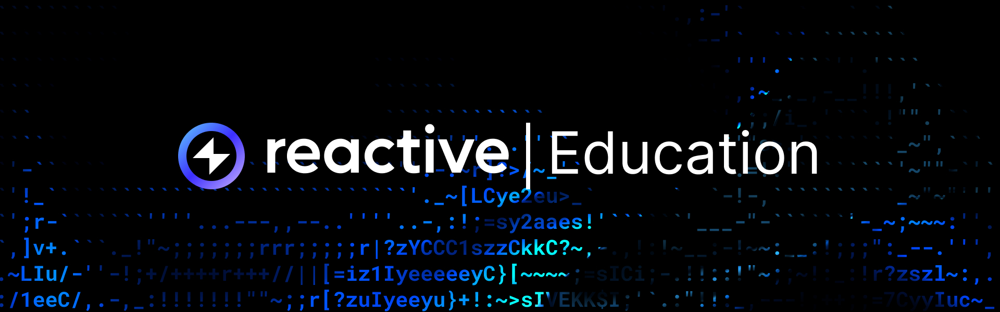

## Overview

Reactive contracts allow smart contracts to automatically respond to events on other blockchains, without anyone having to trigger them manually. If that sounds unfamiliar, you're in the right place.

This course walks you through how Reactive contracts work, step by step. You'll find detailed lectures, working code on [GitHub](https://github.com/Reactive-Network/reactive-smart-contract-demos/tree/main/src/demos), and video workshops on [YouTube](https://www.youtube.com/@0xReactive/streams). Each module pairs theory with hands-on challenges so you can learn by building, not just reading.

Start with the introduction for a closer look at what Reactive contracts can do and how they operate across EVM-compatible chains, then check the prerequisites to make sure you have the right background before moving on.

[Introduction to Reactive Contracts →](./reactive-contracts.md)

[Prerequisites →](./prerequisites.md)

## Module One

[Module 1](../module-1/index.md) covers the building blocks. You'll learn how Reactive contracts are structured, how they detect and respond to events through callbacks, and how the ReactVM execution environment fits into the picture. It also explains subscriptions (how a contract "listens" for specific events) and the role oracles play in bringing off-chain data on-chain.

[Reactive Contracts →](../module-1/reactive-contracts.md)

[How Events and Callbacks Work →](../module-1/how-events-work.md)

[ReactVM and Reactive Network →](../module-1/react-vm.md)

[How Subscriptions Work →](../module-1/subscriptions.md)

[How Oracles Work →](../module-1/how-oracles-work.md)

## Module Two

[Module 2](../module-2/index.md) puts those building blocks to use with a real protocol. You'll walk through how Uniswap V2 works under the hood (its liquidity pools and smart contract mechanics) then see how Reactive contracts can interact with it autonomously. This is where the basics start clicking into practical applications.

[How Uniswap Works →](../module-2/how-uniswap-works.md)

[Basic Reactive Functions →](../module-2/basic-reactive-functions.md)

## Use Cases

Once you understand the fundamentals, the [Use Cases](../use-cases/index.md) section shows what you can build with them. It walks through a basic demo for monitoring logs across chains with low latency, a stop order on a Uniswap V2 pool that executes automatically, and a step-by-step guide to deploying Reactive contracts using the Remix IDE.

[Basic Demo →](../use-cases/use-case-1.md)

[Uniswap V2 Stop Order Demo →](../use-cases/use-case-3.md)

[Deploying Reactive Contracts with Remix →](../use-cases/remix-ide-demo.mdx)

## Glossary

Blockchain documentation comes with a lot of specialized terminology. The glossary defines key concepts from blockchain, DeFi, and smart contract development, along with terms specific to the Reactive ecosystem. Worth bookmarking if something in the course doesn't immediately click.

[Glossary →](../glossary.md)