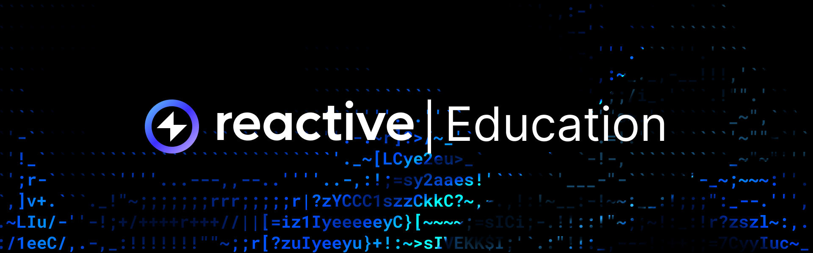

## Overview

To harness the power of Reactive Smart Contracts (RSCs), we have developed an educational course featuring detailed lectures, code snippets on GitHub, and video demonstrations. Our goal is to provide both theoretical knowledge and practical challenges, creating a community where developers can fully explore RSCs. This course covers key topics such as:

* Executing Uniswap stop orders with RSCs
* Syncing NFT ownership across multiple blockchain platforms
* Auto-harvesting staking rewards from various pools and chains

## Where to Begin 

The Introduction chapter provides an overview of Reactive Smart Contracts, highlighting their ability to autonomously respond to events on EVM-compatible chains. It also outlines the technical and knowledge prerequisites necessary for mastering these concepts.

[Introduction to Reactive Smart Contracts →](./reactive-smart-contracts.md)

[Prerequisites →](./prerequisites.md)

## Module One

[Module 1](../module-1/index.md) is designed for beginners and dedicated to the basics of Reactive Smart Contracts, the ReactVM and Reactive Network, along with the function of oracles in integrating off-chain data.

[Reactive Smart Contracts →](../module-1/reactive-smart-contracts.md)

[ReactVM and Reactive Network →](../module-1/react-vm.md)

[How Events Work →](../module-1/how-events-work.md)

[How Oracles Work →](../module-1/how-oracles-work.md)

## Module Two

[Module 2](../module-2/index.md) is created for intermediate users and explores Uniswap V2, focusing on liquidity pools and smart contract operations. It also elaborates on the basic functions of Reactive Smart Contracts that enable autonomous execution.

[How Uniswap Works →](../module-2/how-uniswap-works.md)

[Basic Reactive Functions →](../module-2/basic-reactive-functions.md)

## Use Cases

The [Use Cases](../use-cases/index.md) section explains scenarios where Reactive Smart Contracts can improve blockchain apps. It includes a basic demo for low-latency log monitoring and interaction across different chains, a guide on deploying RSCs using Remix, and a demonstration of a stop order implementation on a Uniswap V2 liquidity pool.

[Basic Demo →](../use-cases/use-case-1.md)

[Uniswap V2 Stop Order Demo →](../use-cases/use-case-3.md)

[Deploying Reactive Smart Contracts with Remix →](../use-cases/remix-ide-demo.md)

## Glossary

The Glossary provides concise definitions of key terms related to blockchain technology, decentralized finance, and smart contracts, including specific Reactive to prevent potential confusion.

[Glossary →](../glossary.md)