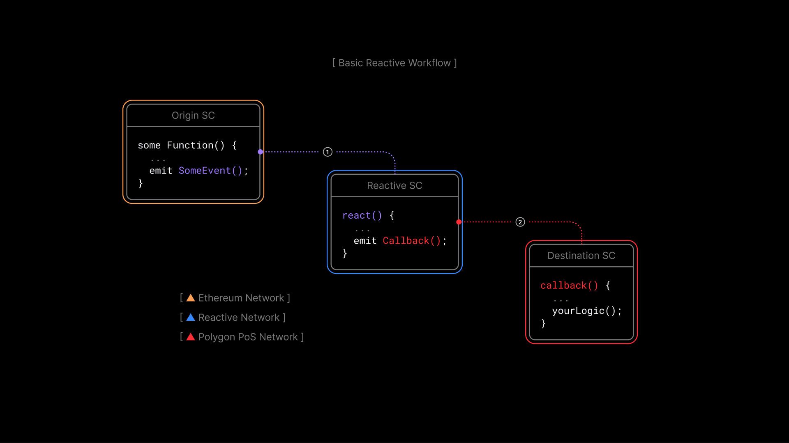

# Reactive Smart Contracts: What They Are and Why We Need Them

## Introduction to Reactive Smart Contracts

Reactive Smart Contracts (RSCs) represent a paradigm shift in how we interact with blockchain technology. Unlike
traditional smart contracts that are run by user transactions, RSCs actively monitor events on EVM-compatible chains
and react to them. They process these events according to the implemented logic and execute subsequent actions on the
blockchain autonomously. This innovation introduces a decentralized mechanism for automating responses to on-chain events
without manual actions.

## Why Reactive Smart Contracts?

In the realm of Ethereum, smart contracts have revolutionized how we conceive of executing trustless agreements.
Traditionally, these contracts spring into action only upon a user-initiated transaction This presents inherent
limitations. For one, smart contracts cannot autonomously initiate actions or respond to blockchain events without an
external prompt—be it from a user or an automated script (like a trading bot). This requires the holding of private
keys, introducing a centralized point of control.

Reactive Smart Contracts (RSCs) emerge as a solution to this constraint. RSCs are designed to autonomously react to events
in the Ethereum Virtual Machine (EVM) and trigger subsequent actions across the blockchain ecosystem. This capability
allows for the implementation of complex logic that can source information from multiple chains and enact changes or
transactions across various platforms without a central oversight.

The Advantages of RSCs:

* Decentralization and Automation: RSCs adhere to the core principle of decentralization in blockchain. They operate
independently, eliminating the need for centralized entities or constant manual intervention. This automation facilitates
seamless operations, enhancing the blockchain ecosystem's efficiency and reliability.

* Enhanced Efficiency and Functionality: By leveraging real-time data and events, RSCs significantly improve the operational
efficiency of smart contracts. They extend the functionality beyond simple transactions to support complex financial
instruments, dynamic NFT capabilities, and innovative DeFi applications that interact more naturally with the blockchain's
ever-changing state.

* Innovation in DeFi and Beyond: RSCs unlock new possibilities in decentralized finance (DeFi) and other blockchain
applications. From automated trading strategies and dynamic governance models to cross-chain functionalities, RSCs serve
as a foundation for a future where blockchain applications are more responsive, interconnected, and versatile than ever
before.

## About This Course

To equip developers with the skills and knowledge to harness the potential of RSCs, we've crafted a comprehensive course
that includes detailed documentation and hands-on tutorials. Our objective is not just to impart technical knowledge but
to foster a collaborative environment where developers can explore the full spectrum of possibilities that RSCs offer.

The course materials encompass lectures, code examples hosted on GitHub, and video demonstrations, providing a multi-faceted
learning experience. Whether you're keen on delving into the theoretical underpinnings of Reactive technology or eager to
jump straight into practical use cases, this course is designed to cater to your learning preferences.

Throughout the course, we will examine various applications of RSCs, including:

* Implementing Uniswap stop orders through RSCs
* Synchronizing NFT ownership over several chains
* Automatically collecting staking rewards from different pools and chains

## Conclusion

As we embark on this educational journey together, we look forward to not only sharing knowledge but also collaborating
with the developer community to unearth new use cases for RSCs. The potential of Reactive Smart Contracts is vast and
largely untapped. Together, we can push the boundaries of what's possible, paving the way for a more automated, efficient,
and innovative blockchain ecosystem. Join us in exploring the frontier of blockchain technology, where your creativity and
expertise can help shape the future of decentralized applications.
