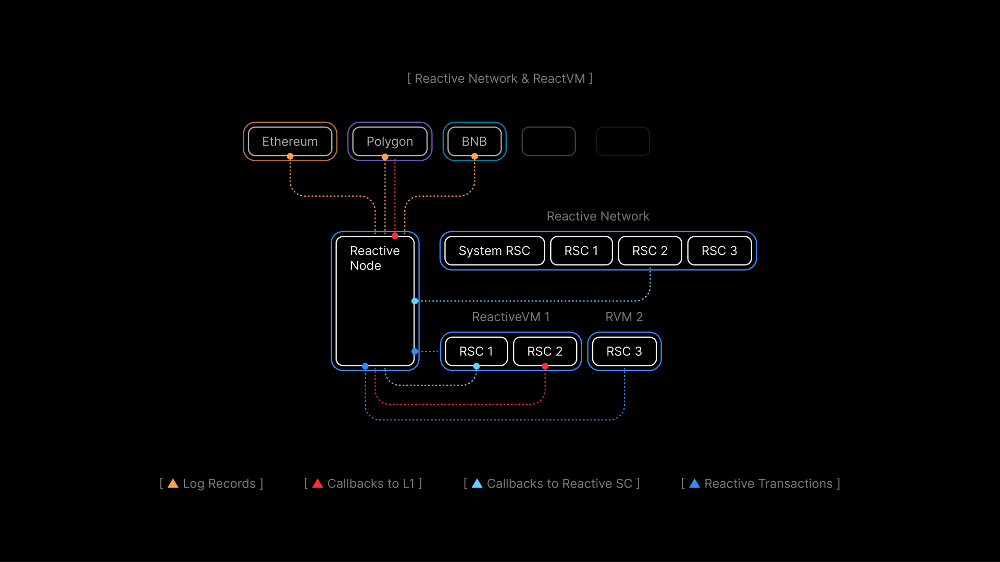

# Lesson 3: ReactVM and Reactive Network As a Dual-State Environment

## Overview

In [Reactive Contracts](./reactive-contracts), we discuss one of the basic concepts of reactive contracts (RCs) — Inversion of Control, and how events and callbacks work in RCs. This article focuses on another crucial property of RCs: the fact they exist in two instances with separate states in the Reactive Network and ReactVM. Understanding this idea is necessary for successful reactive contract development.

By the end of this lesson, you will learn to:

* Distinguish both environments where a reactive contract is executed.
* Identify the current environment.
* Manage data with two separate states.
* Understand the types of transactions RCs operate with.

## Differences Between the Reactive Network and ReactVM

Each Reactive Contract has two instances — one on the Reactive Network and the other in its separate ReactVM. It is important to note that both instances are physically stored and executed on each network node. Parallelizing RCs is an architectural decision made to ensure high performance even with big numbers of events. We will talk more about that in one of our next articles.



The Reactive Network operates as a typical EVM blockchain with the addition of system contracts that allow subscribing to and unsubscribing from origin chain events on Ethereum, BNB, Polygon, or Optimism. Each deployer address has a dedicated ReactVM.

ReactVM is a restricted virtual machine designed to process events in isolation. Contracts deployed from one address are executed in one ReactVM. They can interact with each other but not with other contracts on the Reactive Network.

Contracts within a single ReactVM can interact with the external world in two ways, both through the Reactive Network:

* They react to specified events to which they are subscribed and are executed when these events occur.

* Based on the execution of the code with the inputs from events, the ReactVM sends requests to the Reactive Network for callbacks to destination chains to perform the resulting on-chain actions.

For each RC deployed, there are two instances of it with separate states but the same code. Each method is expected to be executed in one or both environments and to interact with one or both states. This leads to the question of how we identify, within the code, which state we are currently working with.

### Identifying the Execution Context

The execution context determines whether the contract is running on the Reactive Network or within a ReactVM instance. This distinction is crucial for controlling which functions can be called in which environment. Implement [AbstractReactive](https://github.com/Reactive-Network/reactive-lib/blob/main/src/abstract-base/AbstractReactive.sol) in your project to get all the necessary functionality. 

#### How Detection Works

Instead of attempting to invoke the system contract in the constructor, the new code uses the function `detectVm()` to inspect the code size at the system contract’s address. The `0x0000000000000000000000000000000000fffFfF` address only has deployed code on the Reactive Network. If there is code at this address, we conclude that we are on the Reactive Network; if not, we are within a ReactVM instance.

```solidity
function detectVm() internal {
    uint256 size;
    // solhint-disable-next-line no-inline-assembly
    assembly { size := extcodesize(0x0000000000000000000000000000000000fffFfF) }
    vm = size == 0;
}
```

**Assembly Check**: An inline assembly snippet checks the size of the contract code at the system contract’s address.

**Setting the vm Flag**: If `size == 0`, there is no code at that address. This indicates that we are running within a ReactVM instance, so `vm` is set to `true`. Otherwise, if `size > 0`, it indicates the presence of the system contract, confirming that we are on the Reactive Network, so `vm` remains `false`.

#### Enforcing Execution Context

We use modifiers to ensure that each function can only be called in its intended environment.

```solidity
modifier rnOnly() {
    require(!vm, 'Reactive Network only');
    _;
}

modifier vmOnly() {
    require(vm, 'VM only');
    _;
}
```

**rnOnly()**: requires that `vm == false`, meaning the function can only run when the contract is deployed to the Reactive Network.

**vmOnly()**: requires that `vm == true`, meaning the function can only run within a ReactVM instance.

### Managing Dual Variable Sets for Each State

In Reactive architecture, each deployed contract can run in two operational states:

**Reactive Network State**

- Interacts directly with system contracts.
- Subscribes to events using `service.subscribe(...)`.
- Uses variables and methods required to register and manage event subscriptions.

**ReactVM State**

- Contains the business logic to react to subscribed events.
- Uses variables and methods that execute upon receiving an event.

To accommodate these states, two conceptual sets of variables are maintained — one set in the base (network-facing) contract context and another set in the ReactVM context. In this new example, the "Reactive Network" variables are inherited from our `AbstractReactive` contract, while the ReactVM variables are declared within a reactive contract itself.

### Reactive Network Variables

If a reactive contract inherits from `AbstractReactive`, the following variables and methods are available behind the scenes:

- `service` (`ISubscriptionService`) for subscribing to events.
- `vm` (bool) that indicates whether the execution is happening on the ReactVM or in the Reactive Network context.
- Additional inherited utility methods (e.g., `service.subscribe(...)`).

In the constructor of the [Uniswap Stop Order reactive contract](https://github.com/Reactive-Network/reactive-smart-contract-demos/blob/main/src/demos/uniswap-v2-stop-order/UniswapDemoStopOrderReactive.sol), you can notice that `if (!vm)` checks if we are running in the Reactive Network state. If so, the contract registers to receive events from `pair` and `stop_order`. Once subscribed, those events will later trigger our `react()` logic only when we are in the ReactVM state.

```solidity
// State specific to ReactVM instance of the contract.

bool private triggered;
bool private done;
address private pair;
address private stop_order;
address private client;
bool private token0;
uint256 private coefficient;
uint256 private threshold;

constructor(
    address _pair,
    address _stop_order,
    address _client,
    bool _token0,
    uint256 _coefficient,
    uint256 _threshold
) payable {
    triggered = false;
    done = false;
    pair = _pair;
    stop_order = _stop_order;
    client = _client;
    token0 = _token0;
    coefficient = _coefficient;
    threshold = _threshold;

    if (!vm) {
        service.subscribe(
            SEPOLIA_CHAIN_ID,
            pair,
            UNISWAP_V2_SYNC_TOPIC_0,
            REACTIVE_IGNORE,
            REACTIVE_IGNORE,
            REACTIVE_IGNORE
        );
        service.subscribe(
            SEPOLIA_CHAIN_ID,
            stop_order,
            STOP_ORDER_STOP_TOPIC_0,
            REACTIVE_IGNORE,
            REACTIVE_IGNORE,
            REACTIVE_IGNORE
        );
    }
}
```

### ReactVM Variables

Within the [Uniswap Stop Order reactive contract](https://github.com/Reactive-Network/reactive-smart-contract-demos/blob/main/src/demos/uniswap-v2-stop-order/UniswapDemoStopOrderReactive.sol), the following variables and methods are used specifically after events are received:

```solidity
bool private triggered;
bool private done;
address private pair;
address private stop_order;
address private client;
bool private token0;
uint256 private coefficient;
uint256 private threshold;
```

These variables handle the logic in the `react()` function:

```solidity
// Methods specific to ReactVM instance of the contract.
function react(LogRecord calldata log) external vmOnly {
    assert(!done);

    if (log._contract == stop_order) {
        if (
            triggered &&
            log.topic_0 == STOP_ORDER_STOP_TOPIC_0 &&
            log.topic_1 == uint256(uint160(pair)) &&
            log.topic_2 == uint256(uint160(client))
        ) {
            done = true;
            emit Done();
        }
    } else {
        Reserves memory sync = abi.decode(log.data, ( Reserves ));
        if (below_threshold(sync) && !triggered) {
            emit CallbackSent();
            bytes memory payload = abi.encodeWithSignature(
                "stop(address,address,address,bool,uint256,uint256)",
                address(0),
                pair,
                client,
                token0,
                coefficient,
                threshold
            );
            triggered = true;
            emit Callback(log.chain_id, stop_order, CALLBACK_GAS_LIMIT, payload);
        }
    }
}
```

- `triggered` prevents multiple callbacks once the threshold condition is satisfied.
- `done` signals that the final stop has occurred.
- `pair`, `stop_order`, and `client` reference external contracts and user data.
- `token0`, `coefficient`, and `threshold` define the math around when to trigger a stop.

The actual logic (checking liquidity reserves and emitting callbacks) is local to ReactVM. Since `react()` is labeled `vmOnly`, it is invoked by the underlying system **only** in the ReactVM context upon matching event logs.

## Transaction Execution

When working with a Reactive Contract (RC), there are two primary environments where transactions occur: the Reactive Network and the ReactVM. Each environment has different rules for initiating and processing transactions, as detailed below. The code is taken from [AbstractPausableReactive](https://github.com/Reactive-Network/reactive-lib/blob/main/src/abstract-base/AbstractPausableReactive.sol).

### Reactive Network Transactions

Transactions on the Reactive Network can be initiated in two ways: directly by a user or triggered by an event on the origin chain.

#### User-Initiated Transactions

Users can invoke methods on the Reactive Network’s instance of an RC to perform administrative functions or update contract state. For instance, pausing event subscriptions is done by calling the `pause()` function:

```solidity
function pause() external rnOnly onlyOwner {
        require(!paused, 'Already paused');
        Subscription[] memory subscriptions = getPausableSubscriptions();
        for (uint256 ix = 0; ix != subscriptions.length; ++ix) {
            service.unsubscribe(
                subscriptions[ix].chain_id,
                subscriptions[ix]._contract,
                subscriptions[ix].topic_0,
                subscriptions[ix].topic_1,
                subscriptions[ix].topic_2,
                subscriptions[ix].topic_3
            );
        }
        paused = true;
}
```

- `rnOnly` ensures that only the Reactive Network can call this function.
- `onlyOwner` limits the call to the contract owner.
- `service.unsubscribe()` removes the contract from listening to specific events (defined by `chain_id`, `topic_0`, etc.).

This `pause()` function prevents the RC from reacting to events by unsubscribing from them, effectively stopping further event-driven transactions until it is resumed.

The corresponding `resume()` function re-subscribes to those same events so that the RC can continue responding when new events are emitted:

```solidity
function resume() external rnOnly onlyOwner {
    require(paused, 'Not paused');
    Subscription[] memory subscriptions = getPausableSubscriptions();
    for (uint256 ix = 0; ix != subscriptions.length; ++ix) {
        service.subscribe(
            subscriptions[ix].chain_id,
            subscriptions[ix]._contract,
            subscriptions[ix].topic_0,
            subscriptions[ix].topic_1,
            subscriptions[ix].topic_2,
            subscriptions[ix].topic_3
        );
    }
    paused = false;
}
```

#### Event-Triggered Transactions

Even if a user does not directly initiate a transaction, the Reactive Network monitors events on the origin chain. When an event of interest is emitted, the Reactive Network dispatches it to all active subscribers, typically specialized ReactVM instances. This dispatch triggers further action or state changes in the subscribers.

### ReactVM Transactions

Within the ReactVM, transactions can't be called directly by users. Instead, they are triggered automatically when the Reactive Network forwards relevant events from the origin chain:

- Event emitted on origin chain
- Reactive Network dispatches event
- ReactVM receives and processes Event

When an RC running in the ReactVM receives an event, it typically calls its core reaction function `react()` to handle the event. The `react()` function contains the business logic for:

- Updating internal state based on the received event.
- Emitting callbacks to destination chains, which can then trigger transactions on those chains.

Thus, any callback or subsequent transaction to another chain is automatically initiated by the `ReactVM` in response to the received event, rather than manually triggered by a user.

We will consider other examples of `react()` functions for different use cases closely in our next lessons.

## Conclusion

In this lesson, we've explored how Reactive Contracts (RCs) function within two distinct environments: the Reactive Network and the ReactVM. Understanding the dual-state nature of RCs is crucial for their effective development. Key takeaways include:

- **Dual-State Environments:** RCs exist in two instances, each with separate states but the same code — one in the Reactive Network and one in the ReactVM. This setup allows for parallel processing and high performance.

- **Identifying Execution Context:** The environment in which the contract is executing is identified using a boolean variable (`vm`). This allows for precise control over which code and state are accessed, ensuring the correct execution flow.

- **Managing Separate States:** RCs maintain separate sets of variables for the Reactive Network and ReactVM, which are used according to the environment in which the contract is executed. This helps in maintaining clarity and avoiding conflicts between the two states.

- **Transaction Types:** The Reactive Network handles transactions initiated by users or triggered by events on the origin chain, while the ReactVM processes events and executes the `react()` function, defining the reaction logic and initiating cross-chain callbacks.

Explore more practical applications in our [use cases](../use-cases/index.md) and join our [Telegram](https://t.me/reactivedevs) group for additional guidance.

