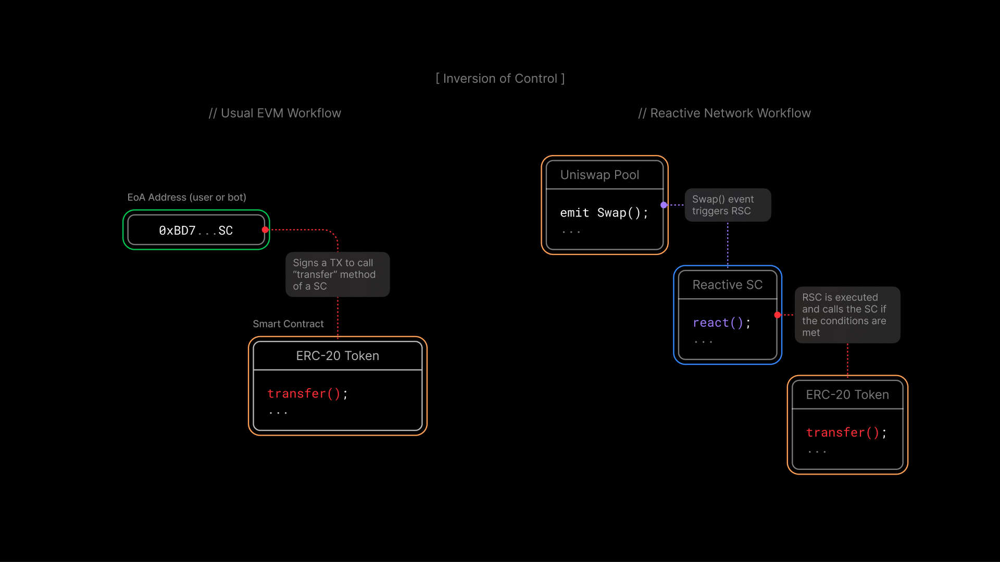

# Lesson 1: Reactive Contracts

## Overview

The [introduction](../introduction/reactive-contracts) covered what Reactive contracts are and why they exist. This lesson goes deeper into how they work: what happens inside a Reactive contract when an event is detected, how control flow differs from traditional smart contracts, and where this approach is most useful.

By the end of this lesson, you'll understand:

- How Reactive contracts differ from traditional smart contracts in practice
- What happens step by step when a Reactive contract detects an event
- Where Reactive contracts are a good fit, from oracle data aggregation to automated trading

## How Reactive Contracts Differ from Traditional Smart Contracts

The core difference is reactivity. Traditional smart contracts are passive. They only run when someone sends them a transaction from an externally owned account (EOA). Between transactions, they do nothing. Reactive contracts (RCs) are the opposite: they continuously monitor blockchains for specific events and execute predefined actions when those events occur, without waiting for anyone to trigger them.

With traditional smart contracts, control flows from the outside in. An external actor (a user or a bot) decides when to call a contract function. The contract itself has no say in when it runs.

Reactive contracts invert that. The contract itself defines which events it cares about and what to do when they happen. Execution is triggered by on-chain events, not by someone signing a transaction.

To see why this matters, consider the alternative. Without a Reactive contract, you'd need to set up a separate service (typically a bot) to monitor blockchains using centralized data providers. That bot holds private keys for the funds it manages and submits transactions from its own EOA address. It works, but it introduces a centralized point of control that can fail, be compromised, or go offline.

Inversion of Control removes that dependency. If you have a predefined sequence of actions that should follow specific on-chain events, you can run that logic in a fully decentralized way: both the inputs (events) and outputs (transactions) live on-chain. Reactive Network gives smart contracts the property they've been missing from the start: the ability to execute automatically based on other on-chain events, without a person or bot signing anything.

## What Happens Inside a Reactive Contract

When you create a Reactive contract, the first thing you define is what to watch: which chains, which contract addresses, and which events (identified by topic 0). The contract monitors those addresses and begins execution when a matching event is detected. These events can be anything that happens on-chain: token transfers, DEX swaps, loans, flash loans, governance votes, large wallet movements, or any other smart contract activity.

Once an event is detected, Reactive Network automatically runs the logic you've implemented. This might involve calculations based on the event data. Reactive contracts are stateful, meaning they can store and update values over time. You can accumulate data across multiple events and only act when the combination of historical data and a new event meets your criteria.

The result: the contract updates its state, and if your logic calls for it, initiates transactions on EVM blockchains. The entire process runs trustlessly within Reactive Network.

## Use Cases

The best way to understand Reactive contracts is to see them applied to real problems. The examples below illustrate the concepts from this lesson, and the rest of the course is structured around building these out in practice.

### Collecting Data from Multiple Oracles

Oracles are third-party services that feed external data into the blockchain: things like exchange rates, sports scores, or weather data. Reactive contracts can monitor oracle update events across multiple contracts and chains, combine the results (for example, by averaging price feeds from several sources), and act on the aggregated data.

This is more reliable than relying on a single oracle, and it's fully decentralized. The Reactive contract handles all the monitoring and aggregation on its own. A practical example: a trustless payout triggered by the outcome of a sporting event, verified against multiple independent oracle feeds.

### Uniswap Stop Order

A trading pool like Uniswap provides reliable on-chain price data. It's arguably more dependable than oracles since it's purely on-chain with no third-party dependency.

A Reactive contract can monitor swaps in a specific Uniswap pool, track the exchange rate, and execute a swap transaction when the price hits a predetermined level. The result is a fully trustless stop order running on top of an existing DEX, with no bot or off-chain service involved.

### DEX Arbitrage

Taking the previous example further, a Reactive contract can monitor multiple pools for price discrepancies and act on them automatically. Both single-chain and cross-chain approaches are possible. Single-chain arbitrage can use flash loans, while cross-chain arbitrage requires liquidity on multiple networks but opens up a wider range of opportunities.

The key advantage over the traditional approach is decentralization. There's no centralized bot racing other bots as the logic runs on-chain through Reactive Network.

### Cross-Chain Pool Rebalancing

The previous use cases build Reactive contracts on top of existing smart contracts. This one goes a step further: designing a system from the ground up to take advantage of reactive capabilities.

If you know from the start that your application can leverage Reactive Network, you can build liquidity pools that automatically rebalance across multiple exchanges. The Reactive Contract monitors liquidity levels on all relevant chains and moves funds between them as needed, adding liquidity where it's low and draining where there's excess.

## About This Course

This course is designed to give you both the theory and the hands-on experience to start building with Reactive contracts. It includes detailed lectures, code examples on GitHub, and video workshops covering everything from basic concepts to real-world deployments.

Whether you want to understand how Reactive contracts work under the hood or jump straight into building, the course adapts to either path. Explore the [use cases](../use-cases/index.md) if you want to see what's possible, or start from Module 1 to build up from the fundamentals.

Join the [Telegram](https://t.me/reactivedevs) community if you have questions or want to connect with other developers working with Reactive contracts.
