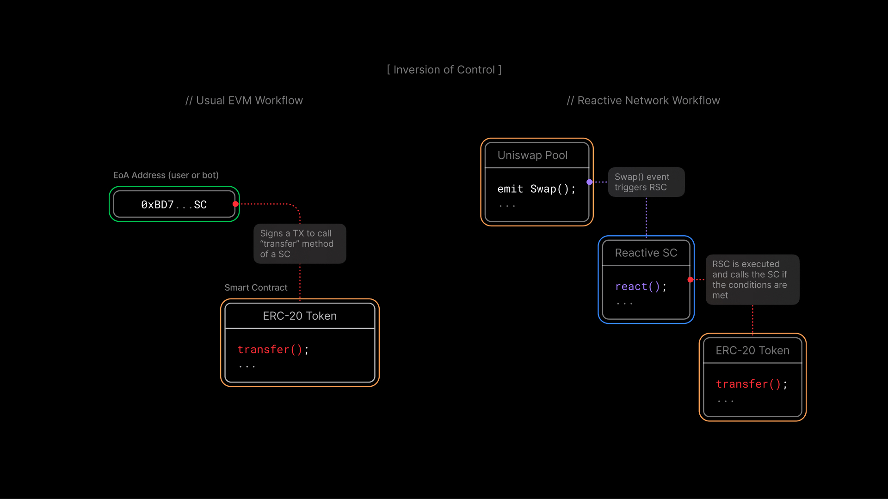

# Lesson 1: Reactive Smart Contracts

## Overview

In the [introduction article](../introduction/reactive-smart-contracts.md), we discuss the basics of Reactive Smart Contracts (RSCs), what they are, and why we need them. Let's dive deeper into the technical concepts of RSCs with some examples to illustrate those concepts.

By the end of this lesson, you will learn to:

* Understand the key differences between Reactive Smart Contracts (RSCs) and traditional smart contracts.
* Grasp the concept of Inversion of Control and its significance in RSCs.
* Recognize how RSCs autonomously monitor and react to blockchain events.
* Explore various practical use cases where RSCs can be applied, such as data collection from oracles, UniSwap stop orders, DEX arbitrage, and pools rebalancing.

## How RSCs Differ from Traditional Smart Contracts

The main distinction between RSCs and traditional smart contracts lies in their reactivity. Traditional smart contracts are passive, only executing in response to direct EOA transactions. In contrast, RSCs are reactive, continuously monitoring the blockchains for events of interest and autonomously executing predefined blockchain actions in response.

## Inversion of Control

A key concept in understanding RSCs is the Inversion of Control (IoC). Traditional smart contracts operate under a direct control model, where the execution of their functions is initiated by external actors (externally owned accounts, EOA, users, or bots). RSCs, however, invert this control by autonomously deciding when to execute based on the occurrence of predefined events. This IoC paradigm shifts how applications interact with the blockchain, enabling more dynamic and responsive systems.

Without RSC, you would need to set up a separate entity — a bot, let us say — to monitor the blockchains using existing (centralized, most probably) data solutions. This bot would hold the private keys (PKs) for the managed funds and initiate transactions on EVM chains from its EOA address. Though such systems prove to be useful, they might be suboptimal for some of the use cases and not suitable at all for others.

Inversion of Control allows us to avoid hosting additional entities that emulate humans signing transactions. If you have a predefined scenario outlining the sequence of transactions following on-chain events, you should be able to run this logic in a completely decentralized manner, as both your inputs and outputs remain on the blockchain. Reactive Network gives Smart Contracts the property they’ve been missing from the start — the ability to be executed automatically, without a person (or a bot) signing a transaction, just based on other on-chain events.

## What Happens Inside a Reactive Smart Contract

When creating a Reactive Smart Contract, the first thing you need to specify is the blockchains, the contracts, and the events (Topic 0) of interest. The RSC will be monitoring these addresses for said events and will start the execution when it sees one. These events can be simple currency or token transfers, DEX swaps, loans, flash loans, votes, whale moves, or any other smart contract activity.

Once an event of interest is detected, the Reactive Network automatically executes the logic that you’ve implemented in your RSC. This could involve doing calculations based on the data from the events. RSCs are stateful, i.e., they have a state where values can be stored and updated. So, you can accumulate the data over history in the state and then act when the combination of the historical data plus the new blockchain event meet the described criteria.

As a result of the event, the RSC updates its state, thus always keeping it up to date, and can run transactions on the EVM blockchains. The whole process runs trustlessly within the Reactive Network, ensuring automatic, fast, and reliable execution.

## Use Cases

Now, let us take a closer look at several use cases and use them to illustrate the concepts we’ve just discussed. This educational course will be structured around those use cases because we see practical application as the best way to learn the tech.

### Collecting Data from Several Oracles

For RSCs to respond to a broader spectrum of events, including off-chain occurrences, they integrate with oracles. Oracles are third-party services that feed trusted external data into the blockchain. A simple example of such data would be exchange rates or sports event outcomes. RSCs can use this data to make informed decisions and execute actions based on real-world events, extending their applicability beyond the blockchain.

Moreover, since an RSC can monitor data from different smart contracts across different EVM-compatible blockchains, it can combine data from several oracles, making the resulting data more precise and decentralized. In that case, the events that RSCs will be monitoring are the updated events of the corresponding oracles. The calculation within the RSC will be combining the data from different oracles (for example, taking the average). The resulting action might be a trustless payout based on the outcome of the basketball game.

### UniSwap Stop Order

Another example of a good data source on the blockchain would be a trading pool, such as a UniSwap pool. It would be even more reliable than the oracles since it’s pure on-chain data and we’re not relying on third parties.

In such a setup, an RSC would monitor the swaps on the specified UniSwap pool, calculating the liquidities and the exchange rate. When the exchange rate reaches a predetermined price, the RSC runs a swap transaction, thus implementing a trustless stop order on top of an existing DEX.

### DEX Arbitrage

However, we can take the previous example even further by implementing an actual arbitrage using RSCs. Our Reactive Smart Contract will be monitoring several different pools for price discrepancies and capitalize on them. Both one-chain and cross-chain approaches are possible. In the first case, we can use flash loans. In the second case, we will need to have liquidities on several chains, but we will have access to more arbitraging opportunities.

The beauty of this solution is that it will be decentralized, unlike the traditional approach with bots. This allows for many improvements that we are yet to explore — hopefully, together with you.

### Pools Rebalancing

While all the previous use cases imply building RSCs on top of the existing traditional Smart Contracts, the next one implies initially developing a DApp that relies on RSCs. If we design our system from the start, knowing that we’ll be able to use the Reactive Network technology, we can build our Ethereum Smart Contracts utilizing the functionality of RSCs.

That way, we can potentially build liquidity pools that would automatically rebalance across several exchanges. The RSC will monitor the liquidities on all chains of interest and rebalance them by adding or draining funds when needed.

## Conclusion

After reading this lesson, you should have a solid understanding of the foundational concepts and potential applications of Reactive Smart Contracts (RSCs). Key takeaways include:

- **Reactive vs. Traditional Smart Contracts:** Unlike traditional smart contracts, RSCs autonomously monitor blockchain events and execute actions without user intervention, providing a more dynamic and responsive system.

- **Inversion of Control:** RSCs invert the traditional execution model by allowing the contract itself to decide when to execute based on predefined events, eliminating the need for external triggers like bots or users.

- **Decentralized Automation:** RSCs enable fully decentralized operations, automating processes like data collection, DEX trading, and liquidity management without centralized intermediaries.

- **Cross-Chain Interactions:** RSCs can interact with multiple blockchains and sources, enabling sophisticated use cases like cross-chain arbitrage and multi-oracle data aggregation.

- **Practical Applications:** RSCs have diverse applications, including collecting data from oracles, implementing UniSwap stop orders, executing DEX arbitrage, and automatically rebalancing pools across exchanges.

Explore more practical applications in our [use cases](../use-cases/index.md) and join our [Telegram](https://t.me/reactivedevs) group to contribute to the evolving world of Reactive Smart Contracts.
