# Deploying Reactive Smart Contracts with Remix

## Overview

This guide will walk you through deploying Smart Contracts and Reactive Smart Contracts using the [Remix Development Environment](https://remix.ethereum.org/).

We will use the [Reactive Network Basic Demo](https://github.com/Reactive-Network/reactive-smart-contract-demos/tree/main/src/demos/basic) to illustrate the Reactive Network's functionality in monitoring logs emitted by contracts in the L1 Network and initiating calls back to L1 contracts. This demo involves three smart contracts: the Origin chain contract [BasicDemoL1Contract.sol](https://github.com/Reactive-Network/reactive-smart-contract-demos/blob/main/src/demos/basic/BasicDemoL1Contract.sol), the Destination chain contract [BasicDemoL1Callback.sol](https://github.com/Reactive-Network/reactive-smart-contract-demos/blob/main/src/demos/basic/BasicDemoL1Callback.sol), and the Reactive contract [BasicDemoReactiveContract.sol](https://github.com/Reactive-Network/reactive-smart-contract-demos/blob/main/src/demos/basic/BasicDemoReactiveContract.sol).

## Before You Begin

If you are new to smart contract development, familiarize yourself with [Deploy Your First Smart Contract Using Remix IDE](https://blog.reactive.network/deploy-your-first-smart-contract-using-remix-ide-2/). This guide assumes you are comfortable with the following tools:

* The [Solidity](https://soliditylang.org/) programming language
* The [MetaMask](https://metamask.io/) wallet
* The [Remix](https://remix.ethereum.org/) development environment

## Acquire Testnet Funds

You will need testnet *SepoliaETH* on *Ethereum Sepolia* and REACT tokens on the *Kopli Testnet*. To connect your MetaMask account to the *Kopli Testnet*, follow these steps:

### Step 1

Click on the **MetaMask** icon to view your account.

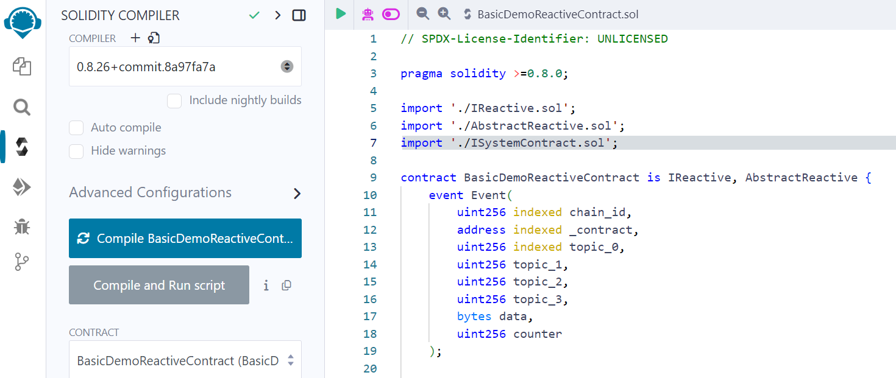

### Step 2

By default, you will be connected to the Ethereum Mainnet. Click on the *dropdown* menu and select **Add Network**. This will open the MetaMask settings page in the "Networks > **Add a network**" section.

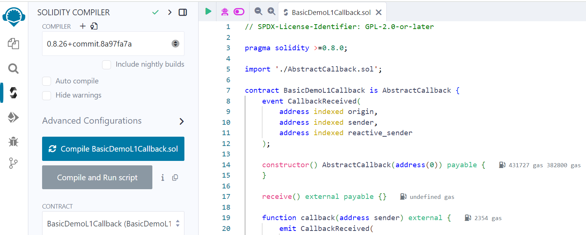

### Step 3

On the *Add a network* page, click "**Add a network manually**".

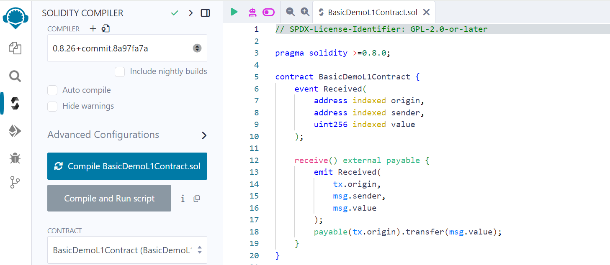

### Step 4

Enter the relevant details from the [Kopli Testnet](/kopli-testnet#get-kopli-testnet-react) into the form. Fill out the details manually and click **Save**.

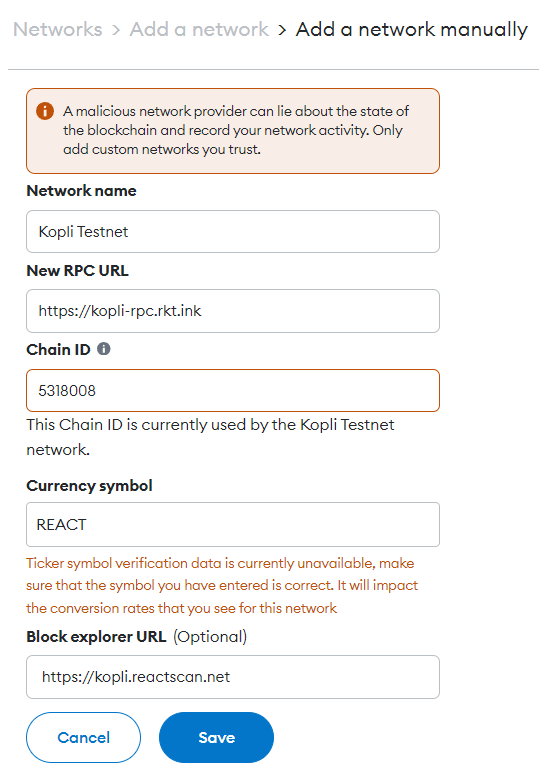

### Step 5

You will now see the Kopli Testnet in the **Select a network** list. Get your Testnet REACT tokens as guided [here](https://dev.reactive.network/docs/kopli-testnet#how-to-get-kopli-testnet-react).

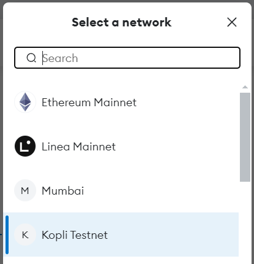

### Step 6

For the *Ethereum Sepolia* network, click on the network bar in the top left corner and toggle the **Show test networks** switch. If you don’t see Sepolia, add it manually using [this information](https://www.coingecko.com/learn/sepolia-eth).

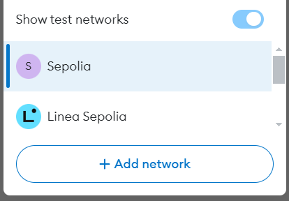

## Deploy the Origin Chain Contract

Deploy the [BasicDemoL1Contract.sol](https://github.com/Reactive-Network/reactive-bounties/blob/main/src/demos/basic/BasicDemoL1Contract.sol) contract on *Ethereum Sepolia*. For a detailed explanation of this contract, read the [Demo Code Explanation](https://dev.reactive.network/education/use-cases/use-case-1).

1. Open the [BasicDemoL1Contract.sol](https://github.com/Reactive-Network/reactive-bounties/blob/main/src/demos/basic/BasicDemoL1Contract.sol) contract in [Remix](https://remix.ethereum.org/).

2. Compile the contract.

3. Deploy the Origin chain contract on the *Ethereum Sepolia Testnet*.

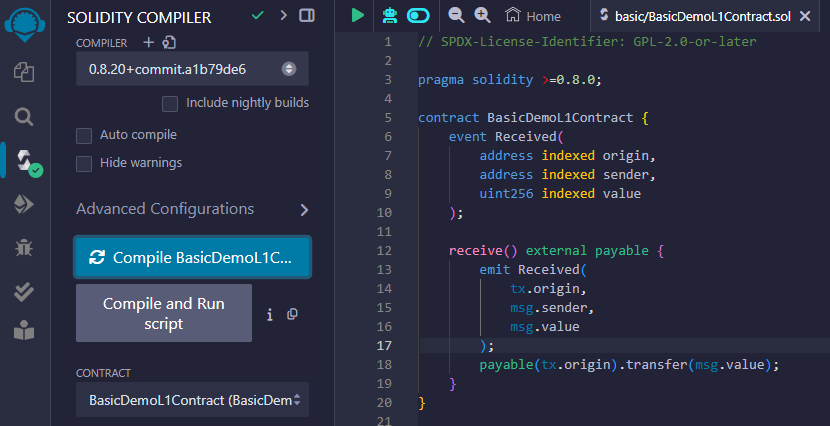

* Open MetaMask and select the *Ethereum Sepolia Testnet* network.

* In Remix, under the **Deploy & Run Transactions** tab, select *Injected Provider — MetaMask* in the **Environment** list. Remix will use the MetaMask wallet to communicate with the *Ethereum Sepolia Testnet*.

* Click the **Deploy** button. MetaMask will prompt you to confirm the transaction. Check the transaction details to ensure you are deploying the contract to the *Ethereum Sepolia Testnet*.

* After you confirm the transaction, the contract address will appear in the **Deployed Contracts** list. Copy this contract address.

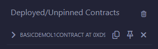

4. Check the transaction details using the contract address on [Sepolia Etherscan](https://sepolia.etherscan.io/).

## Deploy the Destination Chain Contract

Repeat the steps above to deploy the Destination chain contract [BasicDemoL1Callback.sol](https://github.com/Reactive-Network/reactive-bounties/blob/main/src/demos/basic/BasicDemoL1Callback.sol) on the *Ethereum Sepolia Testnet*.

Now you have both the Origin chain contract and Destination chain contract deployed on the Ethereum Sepolia Testnet. Let’s deploy the Reactive Smart Contract.

## Deploy the Reactive Smart Contract

1. Open the [BasicDemoReactiveContract.sol](https://github.com/Reactive-Network/reactive-bounties/blob/main/src/demos/basic/BasicDemoReactiveContract.sol) contract in [Remix](https://remix.ethereum.org/).

2. Compile the contract.

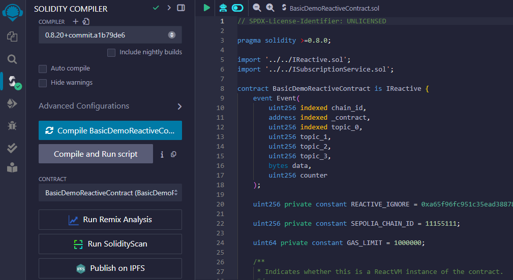

3. Deploy the Reactive smart contract on the *Kopli Testnet*.

* Open MetaMask and select the *Kopli Testnet* network.

* In Remix, under the **Deploy & Run Transactions** tab, select *Injected Provider — MetaMask* in the **Environment** list. Remix will use the MetaMask wallet to communicate with the *Kopli Testnet*.

* In the **Deploy** section, fill out the following fields:

    `service_address`: The deployed address of the subscription service contract ([System Contract Address](/kopli-testnet#kopli-testnet-information)).
    
    `_contract`: The address of the event-emitting contract you want to react to (Origin Chain Contract).
    
    `topic_0`: The `Received` event on the origin chain contract has a topic 0 value of `0x8cabf31d2b1b11ba52dbb302817a3c9c83e4b2a5194d35121ab1354d69f6a4cb`, which we are monitoring.
    
    `callback`: The address where the callback function is located for further processing when certain conditions are met (Destination Chain Contract).

  Send a transaction to the origin chain contract and observe the resulting effect on the destination chain contract.

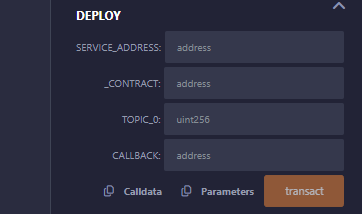

* Click the **transact** button. MetaMask will prompt you to confirm the transaction. Check the transaction details to ensure you are deploying the contract to the *Kopli Testnet*.

* After you confirm the transaction, the contract address will appear in the **Deployed Contracts** list. Copy this contract address.

4. Once the Reactive Smart Contract is successfully deployed, check the transaction details using the contract address on [Reactive Scan](https://kopli.reactscan.net/).

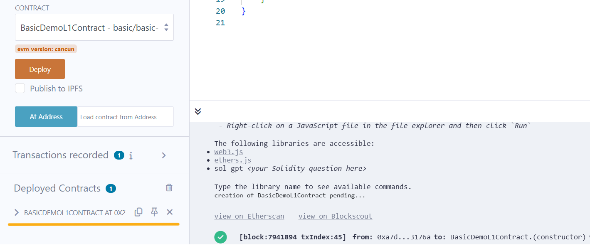

Congratulations! You've just deployed your first Reactive Smart Contract on the Reactive Network.