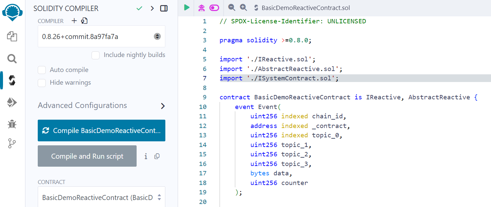

import KopliButton from "../../../src/components/kopli-button";
import DownloadButton from "../../../src/components/download-zip";

# Deploying Reactive Smart Contracts with Remix

## Overview

This guide will walk you through deploying the basic [Reactive Network Demo](https://github.com/Reactive-Network/reactive-smart-contract-demos/tree/main/src/demos/basic) using the [Remix Development Environment](https://remix.ethereum.org/). The demo includes three contracts: the origin contract [BasicDemoL1Contract.sol](https://github.com/Reactive-Network/reactive-smart-contract-demos/blob/main/src/demos/basic/BasicDemoL1Contract.sol), the destination contract [BasicDemoL1Callback.sol](https://github.com/Reactive-Network/reactive-smart-contract-demos/blob/main/src/demos/basic/BasicDemoL1Callback.sol), and the reactive contract [BasicDemoReactiveContract.sol](https://github.com/Reactive-Network/reactive-smart-contract-demos/blob/main/src/demos/basic/BasicDemoReactiveContract.sol).

## Prerequisites

Before getting started, ensure you have a basic understanding of the following:

- [Solidity](https://soliditylang.org/) – Smart contract programming language
- [MetaMask](https://metamask.io/) – Web3 wallet for interacting with the blockchain
- [Remix](https://remix.ethereum.org/) – Online Solidity IDE for smart contract development

You'll also need three smart contracts, along with their abstract contracts and interfaces, to run the demo. Download all the necessary files using the button below:

<DownloadButton />

<hr />

Additionally, you'll need **kREACT** (testnet REACT for Reactive Kopli) to complete the demo. To receive **kREACT**, send SepETH to the **Reactive faucet contract** on Ethereum Sepolia:

```bash
0x9b9BB25f1A81078C544C829c5EB7822d747Cf434
```

The exchange rate is **1/10 (0.1)**, meaning you'll receive **0.01 REACT** for every **0.1 SepETH** sent. To connect your MetaMask wallet to the **Reactive Kopli**, use the button below:

<KopliButton />

<hr />

## Origin Contract

1. Open [BasicDemoL1Contract.sol](https://github.com/Reactive-Network/reactive-smart-contract-demos/blob/main/src/demos/basic/BasicDemoL1Contract.sol) in [Remix](https://remix.ethereum.org/).

2. Compile the contract.



3. Deploy the Origin chain contract to Ethereum Sepolia.

* Open MetaMask and select Ethereum Sepolia.

* In Remix, in the **Deploy & Run Transactions** tab, select "Injected Provider — MetaMask" as your environment.

* Click the **Deploy** button. MetaMask will prompt you to confirm the transaction. Check the transaction details to ensure you are deploying the contract to Ethereum Sepolia.

* After you confirm the transaction, the contract address will appear in the **Deployed Contracts** list. Copy this contract address.

4. Check the transaction details using the contract address on [Sepolia Testnet Explorer](https://sepolia.etherscan.io/).

## Destination Contract

1. Open [BasicDemoL1Callback.sol](https://github.com/Reactive-Network/reactive-smart-contract-demos/blob/main/src/demos/basic/BasicDemoL1Callback.sol) in [Remix](https://remix.ethereum.org/). Properly import abstract contracts and interfaces: [AbstractCallback](https://github.com/Reactive-Network/reactive-smart-contract-demos/blob/main/src/AbstractCallback.sol), [AbstractPayer](https://github.com/Reactive-Network/reactive-smart-contract-demos/blob/main/src/AbstractPayer.sol), [IPayable](https://github.com/Reactive-Network/reactive-smart-contract-demos/blob/main/src/IPayable.sol), and [IPayer](https://github.com/Reactive-Network/reactive-smart-contract-demos/blob/main/src/IPayer.sol).

2. Compile the contract.


3. Deploy the Destination chain contract to Ethereum Sepolia the same way we do with the Origin chain contract.

4.Copy the contract address that will appear in the **Deployed Contracts** list.

## Reactive Contract

1. Open [BasicDemoReactiveContract.sol](https://github.com/Reactive-Network/reactive-smart-contract-demos/blob/main/src/demos/basic/BasicDemoReactiveContract.sol) in [Remix](https://remix.ethereum.org/). Properly import abstract contracts and interfaces: [AbstractReactive](https://github.com/Reactive-Network/reactive-smart-contract-demos/blob/main/src/AbstractReactive.sol), [IReactive](https://github.com/Reactive-Network/reactive-smart-contract-demos/blob/main/src/IReactive.sol), [ISystemContract](https://github.com/Reactive-Network/reactive-smart-contract-demos/blob/main/src/ISystemContract.sol), [IPayer](https://github.com/Reactive-Network/reactive-smart-contract-demos/blob/main/src/IPayer.sol), [IPayable](https://github.com/Reactive-Network/reactive-smart-contract-demos/blob/main/src/IPayable.sol), [ISubscriptionService](https://github.com/Reactive-Network/reactive-smart-contract-demos/blob/main/src/ISubscriptionService.sol),

2. Compile the contract.


3. Deploy the reactive contract to Kopli Testnet.

* Open MetaMask and select Kopli Testnet.

* In Remix, in the **Deploy & Run Transactions** tab, select "Injected Provider — MetaMask" as your Environment.

* In the **Deploy** section, fill out the following fields:

    `service address`: Reactive callback proxy address `0x0000000000000000000000000000000000FFFFFF`.
    
    `_contract`: Origin chain contract address.
    
    `topic_0`: The `Received` event on the origin chain contract `0x8cabf31d2b1b11ba52dbb302817a3c9c83e4b2a5194d35121ab1354d69f6a4cb`.
    
    `callback`: Destination chain contract address.

* Click the **transact** button. MetaMask will prompt you to confirm the transaction. Check the transaction details to ensure you are deploying the contract to the Kopli Testnet.

* After you confirm the transaction, the contract address will appear in the **Deployed Contracts** list. Copy this contract address.

4. Once the reactive сontract is successfully deployed, check the transaction details using the contract address on [Reactive Scan](https://kopli.reactscan.net/).

To receive a callback on the destination chain contract, you should send 0.1 SepETH to your Origin contract address via Metamask. Check the contract's events for a callback. 
