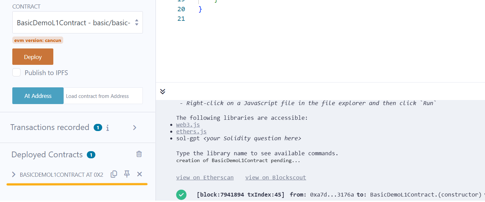
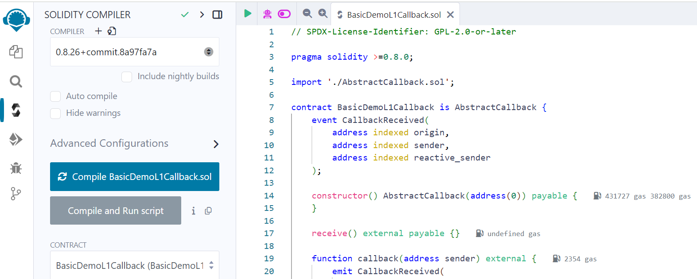

import KopliButton from "../../../src/components/kopli-button";
import DownloadButton from "../../../src/components/download-zip";

# Deploying Reactive Smart Contracts with Remix

## Overview

This guide will walk you through deploying the basic [Reactive Network Demo](https://github.com/Reactive-Network/reactive-smart-contract-demos/tree/main/src/demos/basic) using the [Remix Development Environment](https://remix.ethereum.org/). The demo includes three contracts: the origin contract [BasicDemoL1Contract.sol](https://github.com/Reactive-Network/reactive-smart-contract-demos/blob/main/src/demos/basic/BasicDemoL1Contract.sol), the destination contract [BasicDemoL1Callback.sol](https://github.com/Reactive-Network/reactive-smart-contract-demos/blob/main/src/demos/basic/BasicDemoL1Callback.sol), and the reactive contract [BasicDemoReactiveContract.sol](https://github.com/Reactive-Network/reactive-smart-contract-demos/blob/main/src/demos/basic/BasicDemoReactiveContract.sol).

## Prerequisites

Before getting started, ensure you have a basic understanding of the following:

- [Solidity](https://soliditylang.org/) – Smart contract programming language
- [MetaMask](https://metamask.io/) – Web3 wallet for interacting with the blockchain
- [Remix](https://remix.ethereum.org/) – Online Solidity IDE for smart contract development

You'll also need three smart contracts, along with their abstract contracts and interfaces, to run the demo. All contracts should remain in the same folder. Download all the necessary files using the button below:

<DownloadButton />

<hr />

Additionally, you'll need **kREACT** (testnet REACT for Reactive Kopli) to complete the demo. To receive **kREACT**, send SepETH to the **Reactive faucet contract** on Ethereum Sepolia:

```json
0x9b9BB25f1A81078C544C829c5EB7822d747Cf434
```

The exchange rate is **1/5**, meaning you'll receive **5 REACT** for **1 SepETH** sent. To connect your MetaMask wallet to the **Reactive Kopli**, use the button below:

:::info[Important]
Do not send more than 10 SepETH per request, as doing so will cause you to lose the excess amount without receiving any additional REACT. The maximum that should be sent in a single transaction is 10 SepETH, which will yield 50 REACT.
:::

<KopliButton />

<hr />

## Origin Contract

1. Open [BasicDemoL1Contract.sol](https://github.com/Reactive-Network/reactive-smart-contract-demos/blob/main/src/demos/basic/BasicDemoL1Contract.sol) in [Remix](https://remix.ethereum.org/).

2. Compile the contract.


3. Deploy the contract on any [supported origin chain](../../docs/origins-and-destinations.mdx#testnet-chains).

* Open MetaMask and select the required chain.

* In Remix, in the **Deploy & Run Transactions** tab, select "Injected Provider — MetaMask" as your environment.

* Click the **Deploy** button. MetaMask will prompt you to confirm the transaction. Check the transaction details to ensure you are deploying the contract to the right chain.

* After you confirm the transaction, the contract address will appear in the **Deployed Contracts** list. Copy this contract address. This will be the `_contract` address in the reactive contract.



4. Check the transaction details using the contract address on the relevant block explorer.

## Destination Contract

1. Open [BasicDemoL1Callback.sol](https://github.com/Reactive-Network/reactive-smart-contract-demos/blob/main/src/demos/basic/BasicDemoL1Callback.sol) in [Remix](https://remix.ethereum.org/).

2. Compile the contract.



3. Deploy the contract on any [supported destination chain](../../docs/origins-and-destinations.mdx#testnet-chains).

* Open MetaMask and select the required chain.

* In Remix, in the **Deploy & Run Transactions** tab, select "Injected Provider — MetaMask" as your environment.

* Provide 0.01 Ether (or 10,000,000,000,000,000 Wei) as the transaction value and include `_callback_sender` — a [callback proxy address](../../docs/origins-and-destinations.mdx#testnet-chains) that is unique to each chain.

* Click the **Deploy** button. MetaMask will prompt you to confirm the transaction. Check the transaction details to ensure you are deploying the contract to the right chain.

* After you confirm the transaction, the contract address will appear in the **Deployed Contracts** list. Copy this contract address. This will be the `_callback` address in the reactive contract.


4. Check the transaction details using the contract address on the relevant block explorer.

## Reactive Contract

1. Open [BasicDemoReactiveContract.sol](https://github.com/Reactive-Network/reactive-smart-contract-demos/blob/main/src/demos/basic/BasicDemoReactiveContract.sol) in [Remix](https://remix.ethereum.org/).

2. Compile the contract.


3. Deploy the contract to Reactive Kopli.

* Open MetaMask and select Reactive Kopli.

* In Remix, in the **Deploy & Run Transactions** tab, select "Injected Provider — MetaMask" as your Environment.

* In the **Deploy** section, fill out the following fields:

    `_service`: the Reactive network system contract address `0x0000000000000000000000000000000000fffFfF`.

    `_originChainId`: the origin chain ID (see [Origins & Destinations](https://dev.reactive.network/origins-and-destinations#testnet-chains)).

    `_destinationChainId`: the destination chain ID (see [Origins & Destinations](https://dev.reactive.network/origins-and-destinations#testnet-chains)).
    
    `_contract`: the origin chain contract address.
    
    `topic_0`: The `Received` event on the origin chain contract `0x8cabf31d2b1b11ba52dbb302817a3c9c83e4b2a5194d35121ab1354d69f6a4cb`.
    
    `_callback`: the destination chain contract address.

* Click the **transact** button. MetaMask will prompt you to confirm the transaction. Check the transaction details to ensure you are deploying the contract to Reactive Kopli.

* After you confirm the transaction, the contract address will appear in the **Deployed Contracts** list. Copy this contract address if needed.


4. Once the reactive сontract is successfully deployed, check the transaction details using the contract address on [Reactive Scan](https://kopli.reactscan.net/).

To receive a callback on the destination chain contract, you should send 0.01 ether to the origin chain contract via Metamask. To see the callback, check the destination contract's [events](https://sepolia.etherscan.io/address/0x26fF307f0f0Ea0C4B5Df410Efe22754324DACE08#events) on the relevant block explorer.
