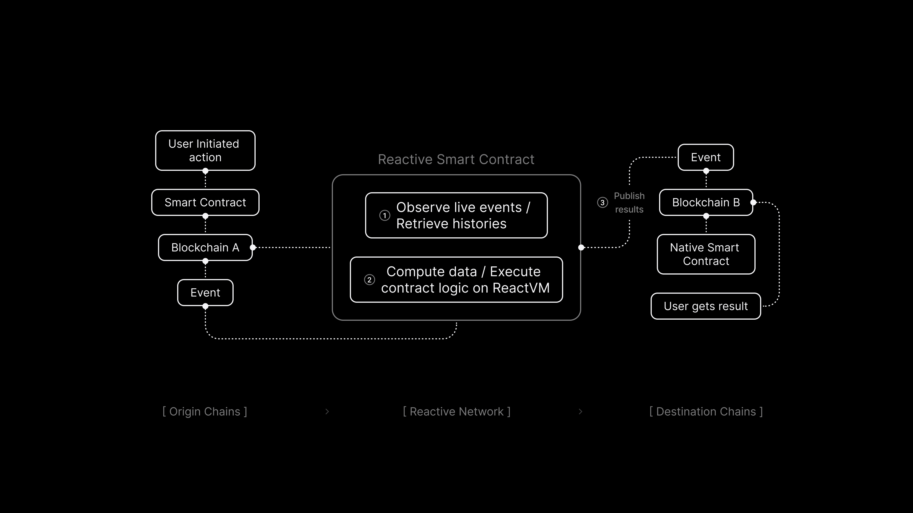

# Use Case: Basic Demo Smart Contract

## Overview

In this lesson, we’ll discuss how to build and deploy the first Reactive Smart Contract and what it does. As we’ve discussed previously, a Reactive Smart Contract tracks on an EVM chain (Ethereum, BSC, Polygon, etc.), processes the received data with the implemented logic, and then does after-effects back on the same or different chain. In this particular case, it does:

* Low-latency monitoring of logs emitted by arbitrary contracts in the Network (Sepolia testnet in this
  case).

* Calls from Reactive Network to arbitrary contracts.

There are three main contracts involved in this scenario:

* Origin chain contract
* Reactive contract
* Destination chain contract



## Origin Chain Contract

This contract, or set of contracts, presumably emits logs of some interest to the Reactive Network user. In financial applications, this could be a DEX, such as a Uniswap pool, that emits data on trades and/or exchange rates. Typically, the contract is controlled by a third party, otherwise, mediation by Reactive Network would be unnecessary.

In our demo, this contract is implemented in `BasicDemoL1Contract.sol`. It's a basic contract that accepts
native transfers, emits their log records, and returns the funds to the sender.

## Reactive Contract

Reactive Smart Contracts (RSCs) implement the logic of event monitoring and initiating calls back to L1 chain(s). RSCs are fully fledged EVM contracts that can maintain state persistence, statically or dynamically subscribe/unsubscribe to multiple different event origins, and perform callbacks by emitting specialized log records specifying the parameters of a transaction to be submitted to the destination chain.

Reactive contracts are executed in a private subnet (ReactVM) tied to a specific deployer address. This limitation restricts their ability to interact with other reactive contracts but greatly improves Reactive Network’s ability to scale.

In our demo, the reactive contract implemented in `BasicDemoReactiveContract.sol` subscribes to events emitted by`BasicDemoL1Contract.sol` upon deployment. Whenever the observed contract reports receiving more than 0.1 ether in a single transfer, the reactive contract initiates an L1 callback by emitting a log record with the requested transaction parameters and payload.

```solidity
function react(
    uint256 chain_id,
    address _contract,
    uint256 topic_0,
    uint256 topic_1,
    uint256 topic_2,
    uint256 topic_3,
    bytes calldata data,
    uint256 /* block_number */,
    uint256 /* op_code */
) external vmOnly {
    emit Event(chain_id, _contract, topic_0, topic_1, topic_2, topic_3, data, ++counter);
    if (topic_3 >= 0.1 ether) {
        bytes memory payload = abi.encodeWithSignature("callback(address)", address(0));
        emit Callback(chain_id, _callback, GAS_LIMIT, payload);
    }
}
```

In a more practical application, this contract could be monitoring an exchange rate of a given token pair, issuing a buy or sell order once the rate crosses the specified threshold, thus implementing simple stop orders.

## Destination Chain Contract

The `BasicDemoL1Callback.sol` contract should implement the part of the user's business logic. Note that while this could be under the user's direct control, it could also be a third-party contract.

In our demo, the callback contract responds to the invocation of its `callback()` method simply by emitting yet another log record.

Note that in real-world applications, the callback contract must somehow verify the validity of the call, by checking the message sender, and/or verifying the current rate when executing a stop order.

## Further Considerations

The reactive contract in this demo does not use the complete spectrum of capabilities already available in the Reactive Network, notably:

* Subscription to multiple event origins: Apart from the obvious usefulness of this capability, reactive contracts are expected to subscribe to logs of their own callback contracts to ensure state consistency across networks.

* Dynamic subscriptions and unsubscriptions.

* Persistent state: The demo contract does not maintain any meaningful state, reacting to every event in isolation.

* Arbitrary callbacks: Reactive contracts may generate arbitrary transaction payloads, while the demo contracts simply call a predetermined method of a fixed contract without any argument.

## Deployment & Testing

To deploy testnet contracts to Sepolia, follow these steps, making sure you substitute the appropriate keys, addresses, and endpoints where necessary. You will need the following environment variables configured appropriately to follow this script:

* `SEPOLIA_RPC`
* `SEPOLIA_PRIVATE_KEY`
* `REACTIVE_RPC`
* `REACTIVE_PRIVATE_KEY`
* `SYSTEM_CONTRACT_ADDR`

### Step 1

Deploy the `BasicDemoL1Contract` (origin chain contract), which emits events for the Reactive Network, using the recommended Sepolia RPC URL: `https://rpc2.sepolia.org`.

```
forge create --rpc-url $SEPOLIA_RPC --private-key $SEPOLIA_PRIVATE_KEY src/demos/basic/BasicDemoL1Contract.sol:BasicDemoL1Contract
```

Assign the deployment address to the environment variable `ORIGIN_ADDR`.

### Step 2

Deploy the `BasicDemoL1Callback` (destination chain contract), which handles callbacks by emitting the `CallbackReceived` event and logs the transaction origin, the caller, and a specified sender address whenever the callback function is called.

```
forge create --rpc-url $SEPOLIA_RPC --private-key $SEPOLIA_PRIVATE_KEY src/demos/basic/BasicDemoL1Callback.sol:BasicDemoL1Callback
```

Assign the deployment address to the environment variable `CALLBACK_ADDR`.


### Step 3

Deploy the `BasicDemoReactiveContract` (reactive contract), configuring it to listen to `ORIGIN_ADDR` and to send callbacks to `CALLBACK_ADDR`. The `Received` event on the origin chain contract has a topic 0 value of `0x8cabf31d2b1b11ba52dbb302817a3c9c83e4b2a5194d35121ab1354d69f6a4cb`, which we are monitoring.

```
forge create --rpc-url $REACTIVE_RPC --private-key $REACTIVE_PRIVATE_KEY src/demos/basic/BasicDemoReactiveContract.sol:BasicDemoReactiveContract --constructor-args $SYSTEM_CONTRACT_ADDR $ORIGIN_ADDR 0x8cabf31d2b1b11ba52dbb302817a3c9c83e4b2a5194d35121ab1354d69f6a4cb $CALLBACK_ADDR
```

### Step 4

Test the whole setup by sending some SepETH to `ORIGIN_ADDR`:

```
cast send $ORIGIN_ADDR --rpc-url $SEPOLIA_RPC --private-key $SEPOLIA_PRIVATE_KEY --value 0.11ether
```

This should eventually result in a callback transaction to `CALLBACK_ADDR` being initiated by the Reactive Network.

## Conclusion

In this lesson, we’ve discussed how Reactive Smart Contracts work and deployed a simple system with a Reactive Smart Contract. We’ve taken a look at how it works, emitting the event, tracking it, and doing the post-actions on our destination Ethereum Smart Contract with an RSC. Though this example does not implement any useful logic, it demonstrates how the tech stack works and prepares us for real use cases.