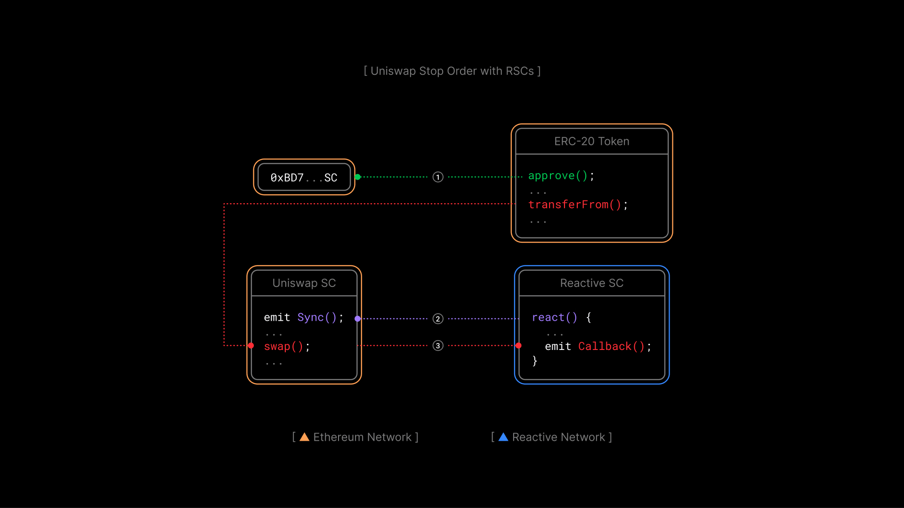

# Use Case: Uniswap V2 Stop Order Demo

## Overview

In this lesson, we’ll go through the demo of a simple Reactive smart contract that implements a
stop order upon a Uniswap V2 pool. This RSC listens for `Sync` events that we’ve discussed earlier
and runs the order on the destination contract, thus effectively implementing a stop order.

By the conclusion of this lesson, we will have covered:

* What the setup looks like - the source smart contract, the reactive smart contract, the
destination smart contract.

* How it works and what exactly the reactive smart contract does.

* How to deploy the reactive smart contract and test it.

This demo builds on the basic reactive example outlined in `src/demos/basic/README.md`. Refer to
that document for an outline of fundamental concepts and architecture of reactive applications.

The demo implements simple stop orders for Uniswap V2 liquidity pools. The application monitors
the specified Uniswap V2 pair, and as soon as the exchange rate reaches a given threshold,
initiates a sale of assets through that same pair.

## Origin Chain Contract

The stop order application subscribes to `Sync` log records produced by a given Uniswap V2 token
pair contract, normally emitted on swaps and deposition or withdrawal of liquidity from the pool.
Additionally, the reactive contract subscribes to events from its callback contract to
deactivate the stop order on completion. We expect this loopback of events from the callback
contract to be an important part of many reactive applications.

## Reactive Contract

The reactive contract for stop orders subscribes to the specified L1 pair contract. `Sync` events
received allow the reactive to compute the current exchange rate for the two tokens in the pool.
As soon as the rate reaches the threshold given on the contract's deployment, it requests a
callback to L1 to sell the assets.



Upon initiating the order's execution, the reactive contract begins waiting for the `Stop` event
from the L1 contract (which serves as both source and destination in this case), indicating the
successful completion of the order. Having received that, the reactive contract goes dormant,
reverting all calls to it. Unlike the simple contract in the basic demo, this reactive contract
is stateful.

The reactive contract is fully configurable and can be used with any Uniswap V2-compatible pair
contract. The reactive contract for this demo is implemented in `UniswapDemoStopOrderReactive.sol`.

## Destination Chain Contract

This contract is responsible for the actual execution of the stop order. The client must allocate
the token allowance for the callback contract, and ensure that they have sufficient tokens for
the order's execution. Once the Reactive Network performs the callback transaction, this contract
verifies the caller's address to prevent misuse or abuse, checks the current exchange rate against
the given threshold, checks the allowance and token balance, and then performs an exact token swap
through the Uniswap V2 router contract, returning the earned tokens to the client. Once the order
has been executed, the callback contract emits a `Stop` log record picked up by the reactive
contract as described in the section above.

The callback contract is stateless and may be used by any number of reactive stop order contracts,
as long as they use the same router contract. The callback contract is implemented in
`UniswapDemoStopOrderCallback.sol`.

## Further Considerations

While this demo covers a fairly realistic use case, it's not a production-grade implementation,
which would require more safety and sanity checks and use a more complicated flow of state
for its reactive contract. Instead, this demo is intended to demonstrate several more features of
Reactive Network compared to the basic demo, namely:

* Subscription to heterogeneous L1 events.

* Stateful reactive contracts.

* Loopback data flow between the reactive contract and the destination chain contract.

* Basic sanity checks are required in destination chain contracts, both for security reasons and
because callback execution is not synchronous with the execution of the reactive contract.

Nonetheless, a few further improvements could be made to bring this implementation closer to a
practical stop order implementation, in particular:

* Leveraging dynamic event subscription to allow a single reactive contract to handle multiple
arbitrary orders.

* Additional sanity checks and retry policy in the reactive contract.

* Support for arbitrary routers on the destination side.

* More elaborate data flow between reactive contract and destination chain contract.

* Support for alternate DEXes. 

## Deployment & Testing

This script guides you through deploying and testing the Uniswap V2 stop order demo on the Sepolia Testnet. Ensure the following environment variables are configured appropriately before proceeding with this script:

* `SEPOLIA_RPC`
* `SEPOLIA_PRIVATE_KEY`
* `REACTIVE_RPC`
* `REACTIVE_PRIVATE_KEY`
* `SYSTEM_CONTRACT_ADDR`
* `CALLBACK_SENDER_ADDR` on Sepolia

To test this live, you will need some testnet tokens and a Uniswap V2 liquidity pool for them. Use any pre-existing tokens and pair or deploy your own, e.g., the barebones ERC-20 token provided in `UniswapDemoToken.sol`. You can use the recommended Sepolia RPC URL: `https://rpc2.sepolia.org`.

### Step 1

Deploy two ERC-20 tokens. The constructor arguments are the token name and token symbol, which you can choose as you like. Upon creation, the token mints and transfers 100 units to the deployer.

```bash
forge create --rpc-url $SEPOLIA_RPC --private-key $SEPOLIA_PRIVATE_KEY src/demos/uniswap-v2-stop-order/UniswapDemoToken.sol:UniswapDemoToken --constructor-args $TOKEN_NAME $TOKEN_SYMBOL
```

Repeat the above command for the second token with a different name and symbol:

```bash
forge create --rpc-url $SEPOLIA_RPC --private-key $SEPOLIA_PRIVATE_KEY src/demos/uniswap-v2-stop-order/UniswapDemoToken.sol:UniswapDemoToken --constructor-args $TOKEN_NAME $TOKEN_SYMBOL
```

### Step 2

Create a Uniswap V2 pair (pool) using the token addresses created in Step 1. Use the `PAIR_FACTORY_CONTRACT` address `0x7E0987E5b3a30e3f2828572Bb659A548460a3003`. You should get the newly created pair address from the transaction logs on [Sepolia scan](https://sepolia.etherscan.io/) where the `PairCreated` event is emitted.

**Note:** When determining which token is `token0` and which is `token1` in a Uniswap pair, the token with the smaller hexadecimal address value is designated as `token0`, and the other token is `token1`. This means you compare the two token contract addresses in their hexadecimal form, and the one that comes first alphabetically (or numerically since hexadecimal includes both numbers and letters) is `token0`.

```bash
cast send $PAIR_FACTORY_CONTRACT 'createPair(address,address)' --rpc-url $SEPOLIA_RPC --private-key $SEPOLIA_PRIVATE_KEY $TOKEN0_ADDR $TOKEN1_ADDR
```

### Step 3

Deploy the destination chain contract to Sepolia. Use the Uniswap V2 router at `0xC532a74256D3Db42D0Bf7a0400fEFDbad7694008`, which is associated with the factory contract at `0x7E0987E5b3a30e3f2828572Bb659A548460a3003`.

The `CALLBACK_SENDER_ADDR` parameter can be omitted for the Uniswap stop order demo, as the contract executing the stop order already verifies its correctness. To skip this check, use the address `0x0000000000000000000000000000000000000000`.

Assign the `Deployed to` address from the response to `CALLBACK_CONTRACT_ADDR`.

```bash
forge create --rpc-url $SEPOLIA_RPC --private-key $SEPOLIA_PRIVATE_KEY src/demos/uniswap-v2-stop-order/UniswapDemoStopOrderCallback.sol:UniswapDemoStopOrderCallback --constructor-args $CALLBACK_SENDER_ADDR $UNISWAP_V2_ROUTER_ADDR
```

### Step 4

Transfer some liquidity into the created pool:

```bash
cast send $TOKEN0_ADDR 'transfer(address,uint256)' --rpc-url $SEPOLIA_RPC --private-key $SEPOLIA_PRIVATE_KEY $CREATED_PAIR_ADDR 10000000000000000000
```

```bash
cast send $TOKEN1_ADDR 'transfer(address,uint256)' --rpc-url $SEPOLIA_RPC --private-key $SEPOLIA_PRIVATE_KEY $CREATED_PAIR_ADDR 10000000000000000000
```

```bash
cast send $CREATED_PAIR_ADDR 'mint(address)' --rpc-url $SEPOLIA_RPC --private-key $SEPOLIA_PRIVATE_KEY $CLIENT_WALLET
```

### Step 5

Deploy the reactive stop order contract to the Reactive Network, specifying the following:

`SYSTEM_CONTRACT_ADDR`: The system contract that handles event subscriptions.

`CREATED_PAIR_ADDR`: The Uniswap pair address from Step 2.

`CALLBACK_CONTRACT_ADDR`: The contract address from Step 3.

`CLIENT_WALLET`: The client's address initiating the order.

`DIRECTION_BOOLEAN`: `true` to sell `token0` and buy `token1`; `false` for the opposite.

`EXCHANGE_RATE_DENOMINATOR` and `EXCHANGE_RATE_NUMERATOR`: Integer representation of the exchange rate threshold below which a stop order is executed. These variables are set this way because the EVM works only with integers. As an example, to set the threshold at 1.234, the numerator should be 1234 and the denominator should be 1000.

```bash
forge create --rpc-url $REACTIVE_RPC --private-key $REACTIVE_PRIVATE_KEY src/demos/uniswap-v2-stop-order/UniswapDemoStopOrderReactive.sol:UniswapDemoStopOrderReactive --constructor-args $SYSTEM_CONTRACT_ADDR $CREATED_PAIR_ADDR $CALLBACK_CONTRACT_ADDR $CLIENT_WALLET $DIRECTION_BOOLEAN $EXCHANGE_RATE_DENOMINATOR $EXCHANGE_RATE_NUMERATOR
```

### Step 6

To initiate a stop order, authorize the destination chain contract to spend your tokens. The last parameter is the raw amount you intend to authorize. For tokens with 18 decimal places, the above example allows the callback to spend one token.

```bash
cast send $TOKEN_ADDR 'approve(address,uint256)' --rpc-url $SEPOLIA_RPC --private-key $SEPOLIA_PRIVATE_KEY $CALLBACK_CONTRACT_ADDR 1000000000000000000
```

### Step 7

After creating the pair and adding liquidity, we have to make the reactive smart contract work by adjusting the exchange rate directly through the pair, not the periphery.

Liquidity pools are rather simple and primitive contracts. They do not offer much functionality or protect the user from mistakes, making their deployment cheaper. That's why most users perform swaps through so-called peripheral contracts. These contracts are deployed once and can interact with any pair created by a single contract. They offer features to limit slippage, maximize swap efficiency, and more.

However, since our goal is to change the exchange rate, these sophisticated features are a hindrance. Instead of swapping through the periphery, we perform an inefficient swap directly through the pair, achieving the desired rate shift.

```bash
cast send $TOKEN0_ADDR 'transfer(address,uint256)' --rpc-url $SEPOLIA_RPC --private-key $SEPOLIA_PRIVATE_KEY $CREATED_PAIR_ADDR 20000000000000000
```

The following command executes a swap at a highly unfavorable rate, causing an immediate and significant shift in the exchange rate:

```bash
cast send $CREATED_PAIR_ADDR 'swap(uint,uint,address,bytes calldata)' --rpc-url $SEPOLIA_RPC --private-key $SEPOLIA_PRIVATE_KEY 0 5000000000000000 $CLIENT_WALLET "0x"
```

After that, the stop order will be executed and visible on [Sepolia scan](https://sepolia.etherscan.io/).

## Conclusion

Through this lesson, we've seen the prowess of Reactive Smart Contracts (RSCs) in real-world applications,
demonstrating their ability to interact with and respond to on-chain events seamlessly. In our specific case,
we dissected how RSCs are utilized to automate stop orders on Uniswap V2, providing a clear view of their
operational mechanics and the integration with callback contracts for order completion.

We've learned about the intricate dance between source chain contracts and reactive contracts, how `Sync` events
drive the reactive mechanism, and the stateful nature of reactive contracts in managing stop orders. This
exploration not only showcases what RSCs are capable of but also equips us with practical insights into
building and deploying responsive, decentralized financial tools in the blockchain ecosystem.
